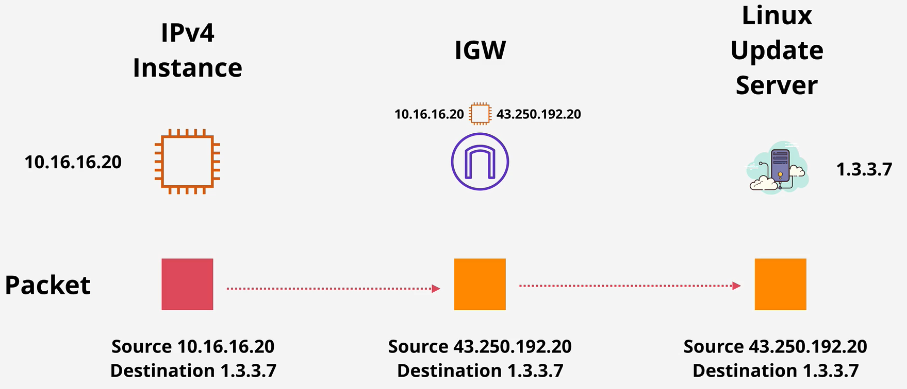
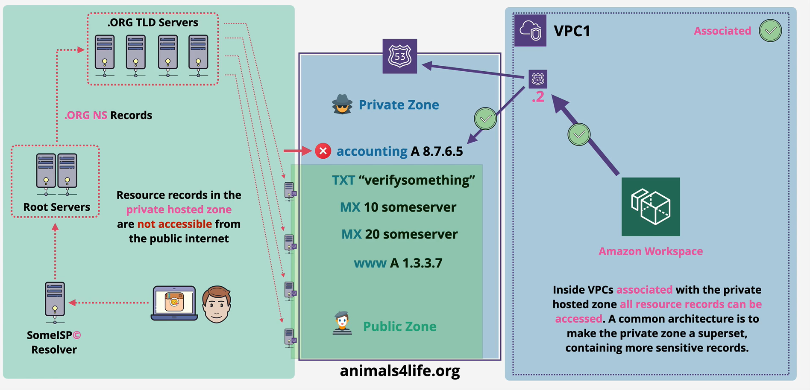
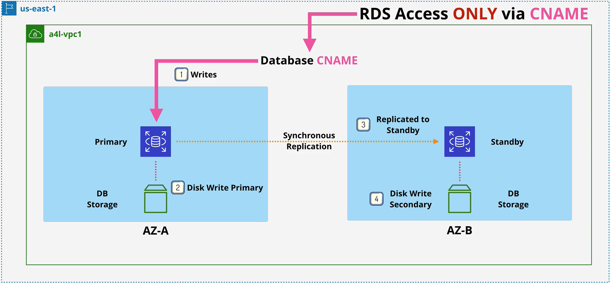
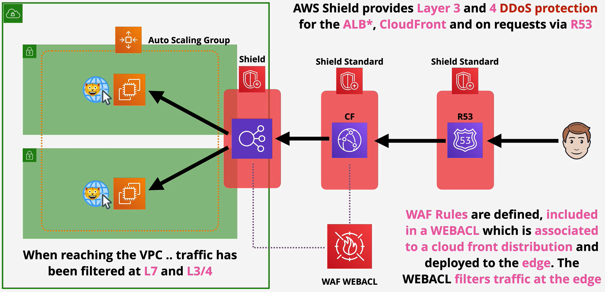

# SAA-C02 Notes

These are my own notes based on the fork from [alozano-77's repo](https://github.com/alozano-77/AWS-SAA-C02-Course). Interspersed within are marked references to SOA-C02 content.

[1. AWS-Fundamentals](#1-aws-fundamentals)

[2. IAM-Accounts-AWS-Organizations](#2-iam-accounts-aws-organizations)

[3. Simple-Storage-Service-(S3)](#3-simple-storage-service--s3-)

[4. Virtual-Private-Cloud-VPC](#4-virtual-private-cloud-vpc)

[5. Elastic-Cloud-Compute-EC2](#5-elastic-cloud-compute-ec2)

[6. Containers-and-ECS](#6-containers-and-ecs)

[7. Advanced-EC2](#7-advanced-ec2)

[8. Route-53](#8-route-53)

[9. Relational-Database-Service-RDS](#9-relational-database-service-rds)

[10. Network-Storage-EFS](#10-network-storage-efs)

[11. HA-and-Scaling](#11-ha-and-scaling)

[12. Serverless-and-App-Services](#12-serverless-and-app-services)

[13. CDN-and-Optimization](#13-cdn-and-optimization)

[14. Advanced-VPC](#14-advanced-vpc)

[15. Hybrid-and-Migration](#15-hybrid-and-migration)

[16. Security-Deployment-Operations](#16-security-deployment-operations)

[17. NoSQL-and-DynamoDB](#17-nosql-and-dynamodb)

[18. Amazon Athena](#18-amazon-athena)

[19. ElastiCache](#19-elasticache)

[20. Amazon Redshift [not in SOA-C02?]](#20-amazon-redshift--not-in-soa-c02--)

[21. TD comparison tables](#21-td-comparison-tables)

------

# 1. AWS-Fundamentals

## 1.1. Public vs Private Services


Refers to the networking only, not permissions.

- Public Internet: AWS is a public cloud platform and connected to the public internet. It is not on the public internet, but is next to it.
- AWS Public Zone: Attached to the Public Internet. S3 Bucket is hosted in the Public Zone, not all services are.
Just because you connect to a public service, that does not mean you have permissions to access it.
- AWS Private Zone: No direct connectivity is allowed between the AWS Private Zone and the public cloud unless this is configured for that service. This is done by taking a part of the private service and projecting it into the AWS public zone which allows public internet to make inbound or outbound connections.

## 1.2. AWS Global Infrastructure

### 1.2.1. Regions

AWS Region is an area of the world they have selected for a full deployment of AWS infrastructure.

Areas such as countries or states

- Ohio
- California
- Singapore
- Beijing
- London
- Paris

AWS can only deploy regions as fast as their planning allows. Regions are often not near their customers.

### 1.2.2. AWS Edge Locations

Local distribution points. Useful for services such as Netflix so they can store data closer to customers for low latency high speed transfers.

If a customer wants to access data stored in Brisbane, they will stream data from the Sydney Region through an Edge Location hosted in Brisbane.

### 1.2.3. AWS Management

Regions are connected together with high speed networking. Some services such as EC2 need to be selected in a region.
Some services are global such as IAM

### 1.2.4. Three Benefits of Regions

- Geographical Separation
  - Useful for natural disasters
  - Provide isolated fault domain
  - Regions are 100% isolated
- Geopolitical Separation
  - Different laws change how things are accessed
  - Stability from political events
- Location Control
  - Tune architecture for performance
  - Duplicate infrastructure at closer points to customers

## 1.3. Regions and AZs

**Region Name:** Asia Pacific (Sydney)
**Region Code:** ap-southeast-2

* AWS will provide between 2 and 6 AZs per region. AZs are isolated compute, storage, networking, power, and facilities.
  Components are allowed to distribute load and resilience by using multiple zones.

* AZs are connected to each other with high speed redundant networks.

### 1.3.1. Service Resilience

1.  Globally Resilient: IAM or Route 53. No way for them to go down. Data isreplicated throughout multiple regions.
2. Region Resilient: Operate as separate services in each region. Generally replicate data to multiple AZs in that region.
3. AZ Resilient: Run from a single AZ. It is possible for hardware to fail in an AZ and the service to keep running because of redundant equipment, but should not be relied on.

## 1.4. AWS Default VPC

- VPC is a virtual network inside of AWS.
- A VPC is within 1 account and 1 region which makes it regionally resilient.
- A VPC is private and isolated until decided otherwise.

* One default VPC per region. Can have many custom VPCs which are all private by default.

### 1.4.1. Default VPC Facts

VPC CIDR - defines start and end ranges of the VPC.
IP CIDR of a default VPC is always: **172.31.0.0/16**

Configured to have one subnet in each AZ in the region by default.

Subnets are given one section of the IP ranges for the default service. 
They are configured to provide anything that is deployed inside those subnets with public IPv4 addresses. 

In general do not use the Default VPC in a region because it is not flexible.

Default VPC is large because it uses the /16 range.
A subnet is smaller such as /20
The higher the / number is, the smaller the grouping.

Two /17's will fit into a /16, sixteen /20 subnets can fit into one /16.

## 1.5. Elastic Compute Cloud (EC2)

Default compute service. Provides access to virtual machines called instances.

### 1.5.1. Infrastructure as as Service (IaaS)

The unit of consumption is an instance.
An EC2 instance is configured to launch into a single VPC subnet.
Private service by default, public access must be configured.
The VPC needs to support public access. If you use a custom VPC then you must handle the networking on your own.

EC2 deploys into one AZ. If it fails, the instance fails.

Different sizes and capabilities. All use On-Demand Billing - Per second. Only pay for what you consume.

Local on-host storage or **Elastic Block Storage**

Pricing based on:

- CPU
- Memory
- Storage
- Networking

Extra cost for any commercial software the instance deploys with.

### 1.5.2. Running State

Charged for all four categories.

- Running on a physical host using CPU.
- Using memory even with no processing.
- OS and its data are stored on disk, which is allocated to you.
- Networking is always ready to transfer information.

### 1.5.3. Stopped State

Charged for EBS storage  only.

- No CPU resources are being consumed
- No memory is being used
- Networking is not running
- Storage is allocated to the instance for the OS together with any applications.

### 1.5.4. Terminated State

No charges, deletes the disk and prevents all future charges.

### 1.5.5. Hibernated State ([ref](https://docs.aws.amazon.com/AWSEC2/latest/UserGuide/Hibernate.html))

- The EBS root volume is restored to its previous state
- The RAM contents are reloaded (hibernate preserves memory, unlike stopping)
- The processes that were previously running on the instance are resumed
- Previously attached data volumes are reattached and the instance retains its instance ID

### 1.5.6. AMI (Server Image)

AMI can be used to create an instance or can be created from an instance.
AMIs in one region are not available from other regions.

Contains:

- Permissions: controls which accounts can and can't use the AMI.

  - Public - Anyone can launch it.

  - Owner - Implicit allow, only the owner can use it to spin up new instances

  - Explicit - Owner grants access to AMI for specific AWS accounts

- Root Volume: contains the **Boot Volume**

- Block Device Mapping: links the volumes that the AMI has and how they're presented to the operating system. Determines which volume is a boot volume and which volume is a data volume.


### 1.5.7. Connecting to EC2

AMI Types:

- Amazon Quick Start AMIs
- AWS Marketplace AMIs
- Community AMIs
- Private AMIs

- Windows using RDP (Remote Desktop Protocol), Port 3389
- Linux SSH protocol, Port 22

Login to the instance using an SSH key pair.
Private Key - Stored on local machine to initiate connection.
Public Key - AWS places this key on the instance.

## 1.6. S3 (Default Storage Service)

Global Storage platform. Runs from all regions and is a public service. Can be accessed anywhere from the internet with an unlimited amount of users.

This should be the default storage platform. S3 is an object storage, not file, or block storage. You can't mount an S3 Bucket.

### 1.6.1. Objects

Can be thought of a file. Two main components:

- Object Key: File name in a bucket
- Value: Data or contents of the object
  - Zero bytes to 5 TB per object

Other components:

- Version ID
- Metadata
- Access Control
- Sub resources

### 1.6.2. Buckets

- Created in a specific AWS Region.
- Data has a primary home region. Will not leave this region unless told.
- Blast Radius = Region
- Unlimited number of Objects
- Name is globally unique
- All objects are stored within the bucket at the same level.

If the objects name starts with a slash such as `/old/Koala1.jpg` the UI will present this as a folder. In actuality this is not true, there are no folders.

Default limit of 100 buckets per AWS account, can increase up to 1000 by service request.

## 1.7. CloudFormation Basics

CloudFormation templates can be used to create, update, modify, and delete infrastructure.

They can be written in YAML or JSON. An example is provided below.

```YAML
## This is not mandatory unless a description is added
AWSTemplateFormatVersion: "version date"

## Give details as to what this template does.
## If you use this section, it MUST immediately follow the AWSTemplateFormatVersion.
Description:
  A sample template

## Can control the command line UI. The bigger your template, the more likely
## this section is needed
Metadata:
  template metadata

## Prompt the user for more data. Name of something, size of instance,
## data validation
Parameters:
  set of parameters

## Another optional section. Allows lookup tables, not used often
Mappings:
  set of mappings

## Decision making in the template. Things will only occur if a condition is met.
## Step 1: create condition
## Step 2: use the condition to do something else in the template
Conditions:
  set of conditions

Transform:
  set of transforms

## The only mandatory field of this section
Resources:
  set of resources

## Once the template is finished it can return data or information.
## Could return the admin or setup address of a word press blog.
Outputs:
  set of outputs
```

## 1.8. Resources

An example which creates an EC2 instance

```YAML
Resources:
  Instance: ## Logical Resource
    Type: 'AWS::EC2::Instance' ## This is what will be created
    Properties: ## Configure the resources in a particular way
      ImageId: !Ref LatestAmiId
      Instance Type: !Ref Instance Type
      KeyName: !Ref Keyname
```

Once a template is created, AWS will make a stack. This is a living and active representation of a template. One template can create infinite amount of stacks.

For any **Logical Resources** in the stack, CF will make a corresponding **Physical Resources** in your AWS account.

It is cloud formations job to keep the logical and physical resources in sync.

A template can be updated and then used to update the same stack.

## 1.9. CloudWatch Basics

Collects and manages operational data on your behalf.

Three products in one

- **Metrics**: data relating to AWS products, apps, on-prem solutions
- **Logs**: collection, monitoring
- **Events**: event hub
  - If an AWS service does something, CW events can perform another action
  - Generate an event to do something at a certain time of day or time of week.

### 1.9.1. Namespace

* Container for monitoring data.
* Naming can be anything so long as it's not `AWS/service` such as `AWS/EC2`.
* This is used for all metric data of that service

### 1.9.2. Metric

Time ordered set of data points for these [default metrics](https://docs.aws.amazon.com/AWSEC2/latest/UserGuide/viewing_metrics_with_cloudwatch.html). 

- CPU utilisation
- Network IN/OUT
- Disk reads/writes (**not** disk utilisation)

Custom ones can be added (such as memory and disk utilisation) by installing CW agent. This is not for a specific server. This could get things from different servers.

For example, any time CPU Utilization is reported, the **datapoint** will report:

- Timestamp = 2019-12-03
- Value = 98.3

**Dimensions** could be used to get metrics for a specific instance or type of instance, among others. They separate data points for different **things** or **perspectives** within the same metric such as Instance IDs

### 1.9.3. CloudWatch Alarms

* Two valid states `ok` or `alarm`. A notification could be sent to an SNS topic or an action could be performed based on an alarm state.
* Third state is insufficient data state. Not a problem, just wait.

## 1.11. High Availability (HA), Fault-Tolerance (FT) and Disaster Recovery (DR)

### 1.11.1. High Availability (HA)

- Aims to **ensure** an agreed level of operational **performance**, usually **uptime**, for a **higher than normal period**
- Instead of diagnosing the issue, if you have a process ready to replace it, it can be fixed quickly and probably in an automated way.
- Spare infrastructure ready to switch customers over to in the event of a disaster to minimize downtime
- User disruption is not ideal, but is allowed
  - The user might have a small disruption or might need to log back in.
- Maximizing a system's uptime
  - 99.9% (Three 9's) = 8.7 hours downtime per year.
  - 99.999 (Five 9's) = 5.26 minutes downtime per year.

### 1.11.2. Fault-Tolerance (FT)

- System can **continue operating properly** in the event of the **failure of some** (one or more faults within) of its
**components**
- Fault tolerance is much more complicated than high availability and more expensive. Outages must be minimized and the system needs levels of redundancy.
- An airplane is an example of system that needs Fault Tolerance. It has more engines than it needs so it can operate through failure.

Example:

A patient is waiting for a life saving surgery and is under anesthetic. While being monitored, the life support system is dosing medicine. This type of system cannot only be highly available, even a movement of interruption is deadly.

### 1.11.3. Disaster Recovery (DR)

- Set of policies, tools and procedures to **enable the recovery** or **continuation** of **vital** technology infrastructure and systems
**following a natural or human-induced disaster**.
- DR can largely be automated to eliminate the time for recovery and errors.

This involves:

- Pre-planning
  - Ensure plans are in place for extra hardware
  - Do not store backups at the same site as the system
- DR Processes
  - Cloud machines ready when needed

This is designed to keep the crucial and non replaceable parts of the system in place. Used when HA and FT don't work.

## 1.12. Domain Name System (DNS)

DNS is a discovery service. Translates machines into humans and vice-versa. It is a huge database and has to be distributed.

Parts of the DNS system

- DNS Client: Piece of software running on the OS for a device you're using.
- Resolver: Software on your device or server which queries DNS on your behalf.
- Zone: A part of the DNS database.
  - This would be amazon.com
  - What the data is, its substance
- Zone file: physical database for a zone
  - How physically that data is stored
- Nameserver: where zone files are hosted

Steps:

Find the Nameserver which hosts a particular zone file. Query that Nameserver for a record that is in that zone file. It then passes the information back to the DNS client.

### 1.12.1. DNS Root

The starting point of DNS.
DNS names are read right to left with multiple parts separated by periods.

`www.netflix.com.`

The last period is assumed to be there in a browser when it's not present.
The DNS Root is hosted on DNS Root Servers (13). These are hosted by 12 major companies.

**Root Hints** is a pointer to the DNS Root servers provided by the OS vendor

**Process**:

1. DNS client asks DNS Resolver for IP address of a given DNS name.
2. Using the Root Hints file, the DNS Resolver communicates with one or more of the root servers to access the root zone and begin the process of finding the IP address.

The Root Zone is organized by IANA (Internet Assigned Numbers Authority). Their job is to manage the contents of the root zone. IANA is in charge of the DNS system because they control the root zone.

### 1.12.2. DNS Hierarchy

Assuming a laptop is querying DNS directly for www.amazon.com and using a root hints file to know how to access a root server and query the root zone.

- When something is trusted in DNS, it is an **authority**.
- One piece can be authoritative for root.
- One piece can be authoritative for amazon.com
- The root zone is the start and the only thing trusted in DNS.
- The root zone can delegate a part of itself to another zone or entity.
- That someone else then becomes authoritative for just the part that's delegated.
- The root zone is just a database of the top level domains.

The top level domains are the only thing immediately to the left of the root in a DNS name.

- `.com` or `.org` are generic top level domains (gTLD)
- `.uk` is a country code top level domain (ccTLD)

**Registry** maintains the zones for a TLD (e.g .ORG) **Registrar** has relationships with the .org TLD zone manager allowing domain registration

## 1.13. Route53 Fundamentals

- Registers domains
- Can host zone files on managed nameservers
- This is a global service, no need to pick a region
- Globally Resilience
  - Can operate with failure in one or more regions

### 1.13.1. Register Domains

Has relationships with all major registries (registrar)

- Route 53 will check with the top level domain to see if the name is available
- Route 53 creates a zone file for the domain to be registered
- Allocates nameservers for that zone
  - Generally four of these for one individual zone
  - This is a hosted zone
  - The zone file will be put on these four managed nameservers
- Route 53 will communicate with the `.org` registry and add the nameserver records into the zone file for that top level domain.
  - This is done with a nameserver record (NS).

### 1.13.2. Route53 Details

**Zone files** in AWS. Hosted on four managed name servers

- Can be **public** or **private** (linked to one or more VPCs)

## 1.14. DNS Record

- Nameserver (NS): Allows delegation to occur in the DNS.
- A and AAAA Records: Maps the host to a v4 or v6 host type respectively. Most of the time you will make both types of record, A and AAAA.
- CNAME Record Type: Allows DNS shortcuts to reduce admin overhead.
  - CNAMES cannot point directly to an IP address, only another name.
- MX records: How emails are sent. They have two main parts:
  - Priority: Lower values for the priority field are higher priority.
  - Value
    - If it is just a host, it will not have a dot on the right. It is assumed to be part of the same zone as the host.
    - If you include a dot on the right, it is a ***fully qualified domain name***
- TXT Record: Allows you to add arbitrary text to a domain. One common usage is to prove domain ownership.

### 1.14.1. TTL - Time To Live

This is a numeric setting on DNS records in seconds. Allows the admin to specify how long the query can be stored
at the resolver server. If you need to upgrade the records, it is smart to lower the TTL value first.

Getting the answer from an Authoritative Source is known as an **Authoritative Answer**.

If another client queries the same thing, they will get back a **Non-Authoritative** response.

---

# 2. IAM-Accounts-AWS-Organizations

## 2.1. IAM Identity Policies

Identity Policies are attached to AWS Identities which are IAM users, IAM groups, and IAM roles. These are a set of security statements that ALLOW or DENY access to AWS resources.

When an identity attempts to access AWS resources, that identity needs to prove who it is to AWS, a process known as **Authentication**. Once authenticated, that identity is known as an **authenticated identity**

### 2.1.1. Statement Components

- Statement ID (SID): Optional field that should help describe
  - The resource you're interacting
  - The actions you're trying to perform
- Effect: is either `allow` or `deny`.
  - It is possible to be allowed and denied at the same time
- Action are formatted `service:operation`. There are three options:
  - specific individual action
  - wildcard as an action
  - list of multiple independent actions
- Resource: similar to action except for format `arn:aws:s3:::catgifs`

### 2.1.2. Priority Level

- Explicit Deny: Denies access to a particular resource cannot be overruled.
- Explicit Allow: Allows access so long there is not an explicit deny.
- Default Deny (Implicit): IAM identities start off with no resource access.

### 2.1.3. Inline Policies and Managed Policies

- Inline Policy: grants access and assigned on each accounts individually.
- Managed Policy (best practice): one policy is applied to all users at once.

## 2.2. IAM Users

Identity used for anything requiring **long-term** AWS access

- Humans
- Applications
- Service Accounts

If you can name a thing to use the AWS account, this is an IAM user.

When a **principal** wants to **request** to perform an action, it will **authenticate** against an identity within IAM. An IAM user is an
identity which can be used in this way.

There are two ways to authenticate:

- Username and Password
- Access Keys (CLI)

Once the **Principal** has authenticated, it becomes an **authenticated identity**.

**Access Keys** (for IAM users only)

* Like username/password, they don't rotate.
* IAM user can have 0, 1 or 2 access keys.
* Can be created, deleted, made inactive.
* Two parts:
  * Access key ID can be retrieved any time.
  * Secret access key shown once only.
* If made inactive, any commands that use that access key will fail.

## 2.3. Amazon Resource Name (ARN)

Uniquely identify resources within any AWS accounts.

This allows you to refer to a single or group of resources.
This prevents individual resources from the same account but in different regions from being confused.

ARN generally follows the same format:

```bash
arn:partition:service:region:account-id:resource-id
arn:partition:service:region:account-id:resource-type/resource-id
arn:partition:service:region:account-id:resource-type:resource-id
```

- partition: almost always `aws` unless it is china `aws-cn`
- region: can be a double colon (::) if that doesn't matter
- account-id: the account that owns the resource
  - EC2 needs this
  - S3 does not need account-id because its globally unique
- resource-type/id: changes based on the resource

An example that leads to confusion:

- arn:aws:s3:::catgifs
  - This references an actual bucket
- arn:aws:s3:::catgifs/*
  - This refers to objects in that bucket, but not the bucket itself.

These two ARNs do not overlap

## 2.4. IAM Groups

Containers for users. **You cannot login to IAM groups** They have no credentials of their own. Used solely for management of IAM users.

Groups bring two benefits

1. Effective administrative style management of users based on the team
2. Groups can have Inline and Managed policies attached.

AWS merges all of the policies from all groups the user is in together.

- The 5000 IAM user limit applies to groups.
- There is **no all users** IAM group.
  - You can create a group and add all users into that group, but it needs to be created and managed on your own.
- No Nesting: You cannot have groups within groups.
- 300 Group Limit per account. This can be fixed with a support ticket.
- **GROUPS ARE NOT A TRUE IDENTITY THEY CAN'T BE REFERENCED AS A PRINCIPAL IN A POLICY**
- An S3 Resource cannot grant access to a group, it is not an identity.
- Groups are used to allow permissions to be assigned to IAM users.

## 2.5. Resource Policy

- A bucket can have a policy associated with that bucket.
- It does so by referencing the identity using an ARN (Amazon Reference Name).
- A policy on a resource can reference IAM users and IAM roles by the ARN.
- A bucket can give access to one or more users or one or more roles.

## 2.6. IAM limitations

- Max 5,000 IAM users per account
- IAM user can be a member of max 10 groups
- Up to 300 IAM groups per account

## 2.7. IAM Roles

A single thing that uses an identity is an IAM User.

IAM Roles are also identities that are used by large groups of individuals. If have more than 5000 principals, it could be a candidate for an IAM Role.

IAM Roles are **assumed** you become that role.

This can be used short term by other identities.

IAM Users can have inline or managed policies which control which permissions the identity gets within AWS

Policies which grant, allow or deny, permissions based on their associations.

IAM Roles have two types of policies can be attached.

- **Trust Policy:** Specifies which identities are allowed to assume the role.
- **Permissions Policy:** Specifies what the role is allowed to do.

If an identity is allowed on the **Trust Policy**, it is given a set of **Temporary Security Credentials**. Similar to access keys except they are time limited to expire. The identity will need to renew them by reassuming the role.

Every time the **Temporary Security Credentials** are used, the access is checked against the **Permissions Policy**. If you change the policy, the permissions of the temp credentials also change.

Roles are real identities and can be referenced within resource policies.

Secure Token Service (sts:AssumeRole) this is what generates the temporary security credentials (TSC).

### 2.7.1. When to use IAM Roles

**Lambda Execution Role:**

For a given lambda function, you cannot determine the number of principals which suggested a Role might be the ideal identity to use.

- Trust Policy: to trust the Lambda Service
- Permission Policy: to grant access to AWS services.

When this is run, can for example assume the sts:AssumeRole to generate keys to CloudWatch and S3.

It is better when possible to use an IAM Role versus attaching a policy. 

Some scenarios are:

**A) Emergency or out of the usual situations**

Break Glass Situation - There is a key for something the team does not normally have access to. When you break the glass, you must have a reason to do.

A role can have an Emergency Role which will allow further access if its really needed.

**B) Adding AWS into existing corp environment**

* You may have an existing identity provider (on-prem AD) you are trying to allow access to.
* This may offer SSO (Single Sign On) or over 5000 identities.
* This is useful to reuse your existing identities for AWS.
* External accounts can't be used to access AWS directly.
* To solve this, you allow an IAM role in the AWS account to be assumed by one of the AD domain controllers to allow access to AWS services like S3.
* **ID Federation** allowing an external service the ability to assume a role.

**C) Making an app with 1,000,000 users**

* **Web Identity Federation** uses IAM roles to allow broader access.
* These allow you to use an existing web identity such as google, facebook, or twitter to grant access to the app, using [Amazon Cognito](#11311-amazon-cognito).
* We can trust these web identities and allow those identities to assume an IAM role to access web resources such as DynamoDB.
* No AWS Credentials are stored on the application.
* Can scale quickly and beyond.

**D) Cross Account Access**

* You can use a role in the partner account and use that to upload objects to AWS resources.

## 2.8. AWS Organizations

Without an organization, each AWS account needs it's own set of IAM users as well as individual payment methods.
If you have more than 5 to 10 accounts, you would want to use an org.

Take a single AWS account **standard AWS account** and create an org.
The standard AWS account then becomes the **master account**. This account can be anywhere in the Organization, not necessarily at the root container.
The master account can invite other existing standard AWS accounts. They will need to approve their joining to the org.

When standard AWS accounts become part of the org, they become **member accounts**. Organizations can only have one **master accounts** and zero or more **member accounts**

### 2.8.1. Organization Root

This is a container that can hold AWS member accounts or the master account. It could also contain **organizational units** which can contain other units or member accounts.

### 2.8.2. Consolidated billing

The individual billing for the member accounts is removed and they pass their billing to the master account.
Inside an AWS organization, you get a single monthly bill for the master account which covers all the billing for each users.
Can offer a discount with consolidation of reservations and volume discounts

### 2.8.3. Create new accounts in an org

- Adding accounts in an organization is easy with only an email needed.
- You no longer need IAM users in each accounts. You can use IAM roles to change these.
- It is best to have a single AWS account only used for login.
- Some enterprises may use an AWS account while smaller ones may use the master.

### 2.8.4. Role Switching

Allows you to switch between accounts from the command line

### 2.8.5. Service Control Policies

Can be used to restrict what member accounts in an org can do.

JSON policy document that can be attached:

- To the org as a whole by attaching to the root container.
- A specific Organizational Unit
- A specific member only.

The master/management account cannot be restricted by SCPs which means this should not be used because it is a security risk.

SCPs limit what the account, **including root user** can do inside that account eg.

* Allow only certain sized EC2 instances deployed
* Prevent any usage of that account in certain regions

They don't grant permissions themselves, can only limit them. You still need to grant permissions using IAM policies on specific identities.

* Every Organization has a management account, and that management account is **never affected** by SCPs

#### 2.8.5.1 Allow List vs Deny List

Deny list is the default.

When you enable SCP on your org, AWS applies `FullAWSAccess`. This means
SCPs have no effect because nothing is restricted. It has zero influence
by themselves.

```json
{
  "Version": "2012-10-17",
  "Statement": {
    "Effect": "Allow",
    "Action": "*",
    "Resource": "*"
  }
}
```

SCPs by themselves don't grant permissions. When SCPs are enabled, there is an implicit deny.

You must then add any services you want to Deny such as `DenyS3`

```json
{
  "Version": "2012-10-17",
  "Statement": {
    "Effect": "Deny",
    "Action": "s3:*",
    "Resource": "*"
  }
}
```

**Deny List** is a good default because it allows for the use of growing services offered by AWS. A lot less admin overhead.

**Allow List** allows you to be conscience of your costs.

- To begin, you must remove the `FullAWSAccess` list
- Then, specify which services need to be allowed access.
- Example `AllowS3EC2` is below

```json
{
  "Version": "2012-10-17",
  "Statement": [
    {
        "Effect": "Allow",
        "Action": [
            "s3:*",
            "ec2:*"
        ],
    "Resource": "*"
    }
  ]
}
```

## 2.9. CloudWatch Logs

This is a public service, this can be used from AWS VPC or on premise environment.

This allows to **store**, **monitor** and **access** logging data.

- This is a piece of information data and a timestamp
- Can be more fields, but at least these two

Comes with some AWS Integrations.
Security is provided with IAM roles or Service roles
Can generate metrics based on logs **metric filter**

### 2.9.1. Architecture of CloudWatch Logs

It is a regional service `us-east-1`

Need logging sources such as external APIs or databases. This sends information as **log events**. These are stored in **log streams**. This is a sequence of log events from the same source.

**Log Groups** are containers for multiple logs streams of the same type of logging. This also stores configuration settings such as
retention settings and permissions.

Once the settings are defined on a log group, they apply to all log streams in that log group. Metric filters are also applied on the log groups.

## 2.10. CloudTrail

Concerned with who did what.

Logs API calls or activities as **CloudTrail Event**

Stores the last 90 days of events in the **Event History**. This is enabled by default and is no additional cost.

To customize the service you need to create a new **trail**.
Two types of events. Default only logs Management Events

- Management Events:
Provide information about management operations performed on resources in the AWS account. Create an EC2 instance or terminating one.

- Data Events:
Objects being uploaded to S3 or a Lambda function being invoked. This is not enabled by default and must be enabled for that trail. Includes [GetObject](https://docs.aws.amazon.com/awscloudtrail/latest/userguide/logging-data-events-with-cloudtrail.html#logging-data-events) for S3 or access.

#### 2.10.1. CloudTrail Trail

Logs events for the AWS region it is created in. It is a regional service.

Once created, it can operate in two ways

- One region trail
- All region trail
  - Collection of trails in all regions
  - When new regions are added, they will be added to this trail automatically

Most services log events in the region they occur. The trail then must be a one region trail in that region or an all region trail to log that event.

A small number of services log events globally to one region. Global services such as IAM or STS or CloudFront always log their events to `us-east-1`

A trail must have this enabled to have this logged.

AWS services are largely split into regional services or global services.

When the services log, they log in the region they are created or to `us-east-1` if they are a global service.

A trail can store events in an S3 bucket as a compressed JSON file. It can also use CloudWatch Logs to output the data.

CloudTrail products can create an organizational trail. This allows a single management point for all the APIs and management events for that org.

* **Test note:** 
  * For `--is-multi-region-trail` it will only cover the activities of the regional services (EC2, S3, RDS etc.) and not for global services such as IAM, CloudFront, AWS WAF, and Route 53. In order to satisfy the requirement, you have to add the `--include-global-service-events` parameter in your AWS CLI command.
  * By default, CloudTrail event log files are encrypted using Amazon S3 server-side encryption (SSE). You can also choose to encrypt your log files with an AWS Key Management Service (AWS KMS) key.

### 2.10.2. CloudTrail Exam PowerUp

- It is enabled by default for 90 days without S3
- Trails are how you configure S3 and CloudWatch Logs
- Management events are only saved by default
- IAM, STS, CloudFront are Global Service events and log to `us-east-1`
  - Trail must be enabled to do this
- NOT REALTIME - There is a delay ~ 15 min
- **Test note:**
  - Can enable log file validation to ensure integrity of log files after CloudTrail delivered it.
  - CloudTrail also logs unauthenticated requests to the AWS STS actions, `AssumeRoleWithSAML` and `AssumeRoleWithWebIdentity`, and logs information provided by the identity provider. You can use this information to map calls made by a federated user with an assumed role back to the originating external federated caller.

---

# 3. Simple-Storage-Service-(S3)

## 3.1. S3 Security

**S3 is private by default!** Although it resides in the AWS public zone. The only identity which has any initial access to an S3 bucket is the account root user of the account which owns that bucket.

### 3.1.1. S3 Bucket Policy

This is a **resource policy**

- controls who has access to that resource
- can allow or deny access from different accounts
- can allow or deny anonymous principals
  - this is explicitly declared in the bucket policy itself.

Different from an **identity policy**

- controls what that identity can access
- can only be attached to identities in your own account
  - no way of giving an identity in another account access to a bucket.

Each bucket can only have one policy, but it can have multiple statements.

**Test note [SOA-C02]:** `s3:GetObject` is applied to objects in the bucket, while `s3ListObject` is applied to the bucket. If GetObject is applied to the bucket instead, error **Action does not apply to any resource(s) in statement** will be thrown.

### 3.1.2. ACLs (Legacy)

A way to apply a subresource to objects and buckets. These are legacy and AWS does not recommend their use. They are inflexible and allow simple permissions.

### 3.1.3. S3 Exam PowerUp

When to use Identity Policy or Bucket Policy:

**Identity**

- Controlling high mix of different resources.
  - Not every service supports resource policies.
- Want to manage permissions all in one place, use IAM.
- Must have access to all accounts accessing the information.

**Bucket**

- Managing permissions on a specific product.
- If you need anonymous or cross account access.

**ACLs**: NEVER - unless you must.

## 3.2. S3 Static Website Hosting

Normal access is via AWS APIs. This allows access via HTTP using a web browser.

When you enable static website hosting you need two HTML files:

- index document
- error document

Static website hosting creates a **website endpoint**. This is influenced by the bucket name and region it is in. This cannot be changed. You can use a custom domain for a bucket, but then the bucket name matters. The name of the bucket must match the domain. You also need to

- Disable block public access setting
- Configure bucket policy to allow all principals "*" to access.

### 3.2.1. Offloading

Instead of using EC2 to host an entire website, the compute service can generate a HTML file which points to the resources hosted on a static bucket. This ensures the media is retrieved from S3 and not EC2.

### 3.2.2. Out-of-band pages

This may be an error page to display maintenance if the server goes offline. We could then change our DNS and move customers to a backup website on S3.

## 3.3. S3 Pricing

- Cost to store data, per GB / month fee
  - Prorated for less than a GB or month.
- Data transfer fee
  - Data in is always free
  - Data out is a per GB charge
- Each operation has a cost per 1000 operations.
  - Can add up for static website hosting with many requests.

## 3.4. Object Versioning and MFA Delete

**Without Versioning:**

- Each object is identified solely by the object key, it's name.
- If you modify an object, the original of that object is replaced.
- The attribute, **ID of object**, is set to **null**.

**With Versioning:**

- This is off by default.
- Once it is turned on, it cannot be turned off.
- Versioning can be suspended and enabled again.
- This allows for multiple versions of objects within a bucket.
- Objects which would modify objects **generate a new version** instead.

The latest or current version is always returned when an object version is not requested.

When an object is deleted, AWS puts a **delete marker** on the object and hides all previous versions. You could delete this marker to enable the item.

To delete an object, you must delete all the versions of that object using their version marker.

### 3.4.1. MFA Delete

* Enabled within version configuration in a bucket. MFA now required for:
  * Change versioning state of the bucket
  * Delete versions of an object.
* In order to change a version state or delete a particular version of an object, you need to provide the serial number of your MFA token as well as the code it generates. These are concatenated and passed with any API calls.
* **Test note:** You can add lifecycle configuration rules to expire all or a subset of objects with a specific key name prefix. For example, to remove all objects in a bucket, you can set lifecycle rule to expire objects one day after creation. If your bucket has versioning enabled, you can also configure the rule to expire non-current objects.

## 3.5. S3 Performance Optimization

### 3.5.1. Single PUT Upload

- Objects uploaded to S3 are sent as a single stream by default.
- If the stream fails, the upload fails and requires a restart of the transfer.
- Single PUT upload up to 5GB

### 3.5.2. Multipart Upload

- Data is broken up into smaller parts.
- The minimum data size is 100 MB.
- Upload can be split into maximum of 10,000 parts.
  - Each part can range between 5MB and 5GB.
  - Last leftover part can be smaller than 5MB as needed.
- Parts can fail in isolation and restart in isolation.
- The risk of uploading large amounts of data is reduced.
- Improves transfer rate to be the speed of all parts.

### 3.5.3. S3 Transfer Acceleration

- Off by default.
- Uses the network of AWS edge locations to speed up transfer.
- Bucket name cannot contain periods.
- Name must be DNS compatible.
- Benefits improve the larger the location and distance.
  - The worse the start, the better the performance benefits.

## 3.6. Encryption

### 3.6.1. Encryption at Rest

- An example is a password on a laptop
  - If the laptop is stolen, the data is already encrypted and useless.
- Commonly within cloud environments. Even if someone could find and access the base storage device, they can't do anything with it.
- Only one entity involved

### 3.6.2. Encryption in Transit

- An encryption tunnel outside the raw data.
- Anyone looking from the outside will only see a stream of scrambled data.
- Used when there are multiple parties or systems at play.

### 3.6.3. Terms

- plaintext: unencrypted data not limited to text
- key: a password
- ciphertext: encrypted data generated by an algorithm from plaintext and a key

### 3.6.4. Symmetric Encryption

The key is handed from one entity to another before the data. This is difficult because the key needs to be transferred securely. If the data is time sensitive, the key needs to be arranged beforehand.

### 3.6.5. Asymmetric Encryption

- public key: cannot decrypt data but can generate ciphertext
- private key: can decrypt data encrypted by the public key

The public key is uploaded to cloud storage. The data is encrypted and sent back to the original entity. The private key can decrypt the data.

This is secure because stolen public keys can only encrypt data. Private keys must be handled securely.

### 3.6.6. Encryption Signing

Encryption by itself does not prove who encrypted the data.

1. An entity can sign a message with their private key
2. Their public key is hosted in an accessible location.
3. The receiving party can use the public key to confirm who sent the message.

## 3.7. Key Management Service (KMS)

- Regional service
  - Every region is isolated when using KMS.
- Public service
  - Occupies the AWS public zone and can be connected to from anywhere.
- Create, store, and manage keys.
  - Can handle both symmetric and asymmetric keys.
- KMS can perform cryptographic operations itself.
- Keys never leave KMS.
- Keys use **Federal Information Processing Standard (FIPS) 140-2 (L2)** security standard.
  - Some features are compliant with Level 3.
  - All features are compliant with Level 2.

### 3.7.1. Customer Master Keys (CMK)

- Managed by KMS and used within cryptographic operations.
- AWS services, applications, and the user can all use them.
- Think of them as a container for the actual physical master keys.
- These are all backed by **physical** key material.
- You can generate or import the key material.
  - Note that CMKs made from imported key material cannot be automatically rotated. Must be manually rotated by pointing the key ID or alias to the CMK.
- CMKs can be used for up to **4KB of data**.

It is logical and contains

- Key ID: unique identifier for the key
- Creation Date
- Key Policy: a type of resource policy
- Description
- State of the Key: active or not

**Notes on deletion:**

* CMK that is pending deletion cannot be used in any cryptographic operation.
* AWS KMS does not rotate the backing keys of CMKs that are pending deletion.

### 3.7.2. Data Encryption Key (DEK)

- Generated by KMS using the CMK and `GenerateDataKey` operation.
- Used to encrypt data larger than 4KB in size.
- Linked to a specific CMK so KMS can tell that a specific DEK was generated with a specific CMK.

KMS does not store the DEK, once provided to a user or service, it is discarded. KMS doesn't actually perform the encryption or decryption of data using the DEK or anything past generating them.

When the DEK is generated, KMS provides two version.

- Plaintext Version - This can be used immediately.
- Ciphertext Version - Encrypted version of the DEK.
  - This is encrypted by the CMK that generated it.
  - In the future it can be decrypted by KMS using the CMK assuming you have the permissions.

**Workflow:**

1. DEK is generated before something is encrypted.
2. The data is encrypted with the plaintext version of the DEK.
3. Discard the plaintext data version of the DEK.
4. The encrypted DEK is stored next to the ciphertext generated earlier.
5. When needed, the DEK is decrypted with the CMK then used to decrypt the ciphertext.


### 3.7.3. KMS Key Concepts

- Customer Master Keys (CMK) are isolated to a region.
  - Never leave the region or KMS.
  - Cannot extract a CMK.
- AWS managed MKs
  - Created automatically by AWS when using a service such as S3 which uses KMS for encryption.
- Customer managed CMKS
  - Created explicitly by the customer.
  - Much more more configurable, for example the key policy can be edited.
  - Can allow other AWS accounts access to CMKS

All CMKs support key rotation.

- AWS automatically rotates the keys every 1095 days (3 years)
- Customer managed keys rotate every year.

CMK itself contains:

- Current backing key, physical material used to encrypt and decrypt
- Previous backing keys created from rotating that material

KMS can create an alias which is a shortcut to a particular CMK.
Aliases are also per region. You can create a `MyApp1` alias in all regions but they would be separate aliases, and in each region it would be pointing potentially at a different CMK.

#### 3.7.3.1. Key Policy (resource policy)

- Every CMK has one.
- Customer managed CMKs can adjust the policy.
- Unlike other policies, KMS has to be explicitly told that keys trust the AWS account that they're in.
- The trust isn't automatic so be careful when adjusting key policies.
- You always need a key policy in place so the key trusts the account and so that the account can manage it by applying IAM permission policies to IAM users in that account.
- In order for IAM to work, IAM is trusted by the account, and the account needs to be trusted by the key.
- It sets up this chain of trust from the key to the account to IAM and then to an IAM user, if they're granted any identity permissions.

### 3.7.4 KMS Key Demo

Linux/macOS commands

```bash
aws kms encrypt \
    --key-id alias/catrobot \
    --plaintext fileb://battleplans.txt \
    --output text \
    --query CiphertextBlob \
    --profile iamadmin-general | base64 \
    --decode > not_battleplans.enc
```

```bash
aws kms decrypt \
    --ciphertext-blob fileb://not_battleplans.enc \
    --output text \
    --profile iamadmin-general \
    --query Plaintext | base64 --decode > decryptedplans.txt
```

## 3.8. Object Encryption

Buckets aren't encrypted, **objects are**.
Multiple objects in a bucket can use a different encryption methods.

Two main methods of encryption S3 is capable of supporting.
Both types are encryption at rest. Data sent from a user to S3 is automatically encrypted in transit outside of these methods.

### 3.8.1 Client-Side encryption

- Objects being encrypted by the client before they leave.
- Data being sent the whole time it is sent as ciphertext.
- AWS has no way to view the data.
- The encryption burden is on the customer and not AWS.

### 3.8.2 Server-Side encryption

- Data is encrypted in transit using HTTPS
- Data inside the tunnel is still in its original unencrypted form.
- Data reaches S3 server in plain text form.
- After S3 sees the data, it is then encrypted.
- AWS will handle some or all of these processes.

### 3.8.3 SSE-C (Server-side encryption with customer provided keys)

- Customer is responsible for the keys themselves.
- S3 services manages the actual encryption and decryption
  - Offloads CPU requirements for encryption.
- Customer still needs to generate and manage the key.
- S3 will see the unencrypted object throughout this process.

**SSE-C Encryption Steps:**

1. You provide encryption key and plaintext.
2. A hash of the key is taken and attached to the object. The hash can identify if the specific key was used to encrypt the object.
4. Object is encrypted. The key is then discarded after the hash is taken.
5. The encrypted and one-way hash are stored persistently on storage.

To decrypt the object, you must tell S3 which object to decrypt and provide it with the key used to encrypt it. If the key that you supply is correct, the proper hash, S3 will decrypt the object, discard the key, and return the plaintext version of the object.

### 3.8.4 SSE-S3 AES256 (Server-side encryption w/ Amazon S3 managed keys)

AWS handles both the encryption and decryption process as well as the key generation and management. This provides very little control over how the keys are used, but has little admin overhead.

**SSE-S3 Encryption Steps:**

1. When putting data into S3, only need to provide plaintext.
2. S3 generates fully managed and rotated **master key** automatically.
3. Object generates a key specific for each object that is uploaded.
4. The master key is used to encrypt the specific object key, and the unencrypted version of that key is discarded.
5. The encrypted file and encrypted key are stored side by side in S3.

3 problems with this method:

- Not good for regulatory environment where keys and access must be controlled.
- No way to control key material rotation.
- No role separation. A full S3 admin can decrypt data and open objects.

### 3.8.5 SSE-KMS (Server-side encryption w/ customer master keys stored in AWS KMS)

Much like SSE-S3, where AWS handles both the keys and encryption process. KMS handles the master key and not S3. The first time an object is uploaded, S3 works with KMS to create an AWS managed CMK. This is the default key which gets used in the future.

Every time an object is uploaded, S3 uses a dedicated key to encrypt that object and that key is a data encryption key which KMS generates using the CMK. The CMK does not need to be managed by AWS and can be a customer managed CMK.

SSE-KMS Encryption Steps

1. S3 is provided a plaintext version of the data encryption key as well as an encrypted version.
2. The data is encrypted with the plaintext key and the key discarded.
3. The encrypted key is stored alongside the encrypted object.

When uploading an object, you can create and use a customer managed CMK. This allows the user to control the permissions and the usage of the key material. In regulated industries, this is reason enough to use SSE-KMS You can also add logging and see any calls against this key from CloudTrail.

The best benefit is the role separation. To decrypt any object, you need access to the CMK that was used to generate the unique key that encrypted them. The CMK is used to decrypt the data encryption key for that object. That decrypted data encryption key is used to decrypt the object itself. If you don't have access to KMS, you don't have access to the object.

#### Summary table
| Method      | Key Management | Encryption Processing | Extras                                |
| ----------- | -------------- | --------------------- | ------------------------------------- |
| Client-side | YOU            | YOU                   |                                       |
| SSE-C       | YOU            | S3                    |                                       |
| SSE-S3      | S3             | S3                    |                                       |
| SSE-KMS     | S3 and KMS     | S3                    | Rotation Control<br />Role Separation |

## 3.9. S3 Object Storage Classes

Objects in S3 are stored in a specific region.

### 3.9.1. S3 Standard

- Default AWS storage class that's used in S3, should be user default as well.
- S3 Standard is region resilient, and can tolerate the failure of an AZ.
- Objects are replicated to at least 3+ AZs when they are uploaded.
- 99.999999999% durability (11x 9's)
- 99.99% availability
- Offers low latency and high throughput.
- No minimums, delays, or penalties.
- Billing is storage fee, data transfer fee, and request based charge.

All of the other storage classes trade some of these compromises for another.

### 3.9.2. S3 Standard-IA

- Designed for less frequent rapid access when it is needed (almost same as S3)
- Cheaper rate to store data you will rarely need, but if you do need it, you need it quickly.
- ~54% cheaper than S3 standard.
- Minimum 128KB charge for each object.
  - Cost benefits might be negated for smaller objects.
- 30 days minimum duration charge per object.
- Retrieval fee for every GB of data retrieved from this class.
- 99.9% availability, slightly lower than standard S3.

Designed for data that isn't accessed often, long term storage, backups, disaster recovery files. The requirement for data to be safe is most important.

### 3.9.3. One Zone-IA

- Designed for data that is accessed less frequently but needed quickly.
- 80% of the base cost of Standard-IA.
- Same minimum size and duration fee as Standard-IA
- Data is only stored in a single AZ, no 3+ AZ replication.
- 99.5% availability, lower than Standard-IA

Great choice for secondary copies of primary data or backup copies. If data is easily creatable from a primary data set, this would be a great place to store the output from another data set.

### 3.9.4. S3 Glacier

- No immediate access to objects, retrieval in minutes or hours.
- Make a request to access objects then after a duration, you get access.
  - Retrieval time anywhere from 1 min - 12 hrs
- Secure, durable, and low cost storage for archival data.
- 17% of the base cost of S3 standard
- 99.999999999% durability (11x 9's)
- 99.99% availability
- 3+ AZ replication
- 40KB minimum object capacity charge
- 90 days minimum storage duration charge.

Retrieval methods:

- Expedited: 1 - 5 minutes, but is the most expensive
- Standard: 3 - 5 hours to restore.
- Bulk: 5 - 12 hours. Has the lowest cost and is good for a large set of data.

### 3.9.5. S3 Glacier Deep Archive

- Designed for long term backups and as a tape-drive replacement.
- 4.3% of the base cost of S3 standard
- 40kb minimum billable size per object
- 180 days minimum storage duration charge.
- Standard retrieval within 12 hours, bulk retrieval in 48 hours.
- Cannot use to make data public or download normally.

### 3.9.6. S3 Intelligent-Tiering

- Combination of standard and standard IA.
- Uses automation to remove overhead of moving objects.
- Additional fee of $0.0025 per 1,000 objects tracked.
- If an object is not accessed for 
  - 30 days, it will move into Standard-IA.
  - 90 days move to Archive (Glacier)
  - 180 days move to Deep Archive (Glacier Deep Archive)

This is good for objects which have unknown access pattern.

### 3.9.10. Object Lifecycle Management

Intelligent-Tiering is used for objects where access patterns is unknown.
A lifecycle configuration is a set of **rules** that consists of **actions**.

#### Priority:

Standard -> IA -> Intelligent-Tiering -> OneZone-IA -> Glacier -> Glacier Deep Archive

#### 3.9.10.1. Transition Actions

- Change the storage class over time such as:

  - Move an object from S3 to IA after 90 days
  - After 180 days move to Glacier
  - After one year move to Deep Archive

  Objects must flow downwards, they can't flow in the reverse direction.
  
- For single rules only:

  - Objects must spend 30 days in S3-Standard before transitioning automatically to S3-IA.
  - Objects must spend another separate 30 days in S3-IA before transitioning to Glacier.

  You can't transition directly to Glacier without first spending minimum duration in the intermediate stages.

#### 3.9.10.2. Expiration Actions

Once an object has been uploaded and changed, you can purge older versions after 90 days to keep costs down.

## 3.10. S3 Replication

There are two types of S3 replication available.

- Cross-Region Replication (CRR)
  - Allows the replication of objects from a source bucket to a destination bucket in **different** AWS regions.
- Same-Region Replication (SRR)
  - Allows the replication of objects from a source bucket to a destination bucket in the **same** AWS region.

Architecture for both is similar, only difference is if both buckets are in the same account or different accounts.

The replication configuration is applied to the source bucket and configures S3 to replicate from this source bucket to a destination bucket.

It also configures the IAM role to use for the replication process. The role is configured to allow the S3 service to assume it based on its trust policy. The role's permission policy allows it to read objects on the source bucket and replicate them to the destination bucket.

When different accounts are used, the role is not by default trusted by the destination account. If configuring between accounts, you must add a bucket policy on the destination account to allow the IAM role from the source account access to the bucket.

### 3.10.1. S3 Replication Options

- Which objects are replicated.
  - Default is all source objects, but can select a smaller subset of objects.
- Select which storage class the destination bucket will use.
  - Default is the same type of storage, but this can be changed.
- Define the ownership of the objects.
  - The default is they will be owned by the same account as the source bucket (may be inaccessible to dest account user)
  - If the buckets are in different accounts, the objects in the destination could be owned by the source account and not allowed access.
- Replication Time Control (RTC)
  - Adds a guaranteed level of SLA within 15 minutes interval (ie. dest buckets is never >15 min out-of-sync with source) for extra cost.
  - This is useful for buckets that must be in sync the whole time.

### 3.10.2. Important Replication Tips

- Replication is not retroactive.
  - If you enable replication on a bucket that already has objects, the old objects will not be replicated.
- Both buckets must have versioning enabled.
- It is a one way replication process only.
- Replication by default can handle objects that are unencrypted or SSE-S3.
  - With configuration it can handle SSE-KMS, but KMS requires more configuration to work.
  - It cannot replicate objects with SSE-C because AWS does not have the keys (held by user) necessary.
- Source bucket owner needs permissions to objects. If you grant cross-account access to a bucket. It is possible the source bucket account will not own some of those objects.
- Will not replicate system events (eg. objects created by lifecycle management), glacier, or glacier deep archive.
- No deletes are replicated.

### 3.10.3. Why use replication

- SRR - Log Aggregation
- SRR - Sync production and test accounts
- SRR - Resilience with strict sovereignty requirements
- CRR - Global resilience improvements
- CRR - Latency reduction

## 3.11. S3 Presigned URL

A way to give another person or application access to a object inside an S3 bucket using your credentials in a safe way.

IAM admin can make a request to S3 to generate a presigned URL by providing:

- security credentials
- bucket name
- object key
- expiry date and time
- indicate how the object or bucket will be accessed

S3 will create a presigned URL and return it. This URL will have encoded inside it the details that IAM admin provided. It will be configured to expire at a certain date and time as requested by the IAM admin user.

### 3.11.1. S3 Presigned URL Exam PowerUp

- You can create a presigned URL for an object you have do not have access to. The object will not allow access because your user does not have access.
- When using the URL the permission that you have access to, match the identity that generated it at the moment the item is being accessed.
- If you get an access deny it means the ID never had access, or lost it.
- Don't generate presigned URLs with an IAM role.
  - The role will likely expire before the URL does.

## 3.12. S3 Select and Glacier Select

This provides a ways to retrieve parts of objects and not the entire object. If you retrieve a 5TB object, it takes time and consumes 5TB of data. Filtering at the client side doesn't reduce this cost because it already downloads it.

S3 and Glacier select lets you use SQL-like statements to select part of the object which is returned in a filtered way.
The filtering happens at the S3 service itself saving time and data.

Works on file types:

- CSV, JSON, Parquet, BZIP2.

### 3.12.1. [Provisioned Capacity](https://docs.aws.amazon.com/amazonglacier/latest/dev/downloading-an-archive-two-steps.html)

Provisioned capacity helps ensure that your retrieval capacity for expedited retrievals is available when you need it. Each unit of capacity provides that at least three expedited retrievals can be performed every five minutes and provides up to 150 MB/s of retrieval throughput.

## 3.13. S3 Events notification

- Notifications generated when events occur in a bucket like
  - Object creation (Put, Post, Copy, CompleteMultiPartUpload)
  - Object delete (*, Delete, DeleteMarkerCreated)
  - Object restore from Glacier or Deep Archive (Post (Initiated), Completed)
  - S3 replication missing 15min threshold, failed replication (OperationMissedThreshold, OperationFailedReplication)
- Can be sent to SNS, SQS, Lambda with Resource policy tagged allowing S3 principal access
- Prefer EventBridge over S3 Events since it supports more types of events and services
- **Test note:** You can only add 1 SQS or SNS at a time for Amazon S3 events notification. If you need to send the events to multiple subscribers, you should implement a message fanout pattern with Amazon SNS and Amazon SQS.

## 3.14. S3 Access Logs

Consists of source bucket (which is logged) and target bucket (where logs are stored).

- Source bucket and object access are logged
- Target bucket needs ACL to allow "S3 Log delivery group"
- Best-effort log delivery (a few hrs to take effect)
- Logs delivered as log files
  - Records newline-delimited
  - Attributes space-delimited
- Can use single target bucket for many source targets
- Similar in format to Apache log files

---

# 4. Virtual-Private-Cloud-VPC

## 4.1. VPC Sizing and Structure

VPC Consideration

- What size should the VPC be. This will limit the use.
- Are there any networks we can't use?
- Be mindful of ranges other VPCs use or are used in other cloud environments
- Try to predict the future uses.
- VPC structure with tiers and resilience (availability) zones
- VPC min /28 network (16 IP)
- VPC max /16 (65456 IP)
- Avoid common range 10.0 or 10.1, include up to 10.10
  - Suggest starting of 10.16 for a nice clean base 2 number.

Reserve 2+ network ranges per region being used per account.
Think of the highest region you will operate in and add extra as a buffer.

An example using 4 AWS accounts.

- Regions with 2 ranges in each Region
  - 3 regions in US
  - 1 region in Europe
  - 1 region in AUS
- Total of 40 ranges, 10 ranges for each account.

### 4.1.1. How to size VPC (example)

* A subnet is located in one availability zone.
* Try to split each subnet into tiers (web, application, db, spare).
* Since each Region has at least 3 AZ's, it is a good practice to start splitting the network into 4 different AZs.
* This allows for at least one subnet in each AZ, and one spare.
* Taking a /16 subnet and splitting it 16 ways will make each a /20.

### 4.1.2. Custom VPC

- Regional Isolated and Resilient Service.
  - Operates from all AZs in that region
- Allows isolated networks inside AWS.
- Nothing IN or OUT of a VPC without explicit configuration.
  - Isolated blast radius. Any problems are limited to that VPC or anything connected to it.
- Flexible configuration
- Hybrid networking to allow connection to other cloud or on-prem networking.
- Default or Dedicated Tenancy. This refers to how the hardware is configured.
  - Default allows on a per resource decision later on.
  - Dedicated locks any resourced created in that VPC to be on dedicated hardware which comes at a cost premium.

#### 4.1.2.1. Custom VPC Facts

IPv4 private and public IPs

- Allocated 1 mandatory private IPv4 CIDR blocks
  - Min /28 prefix (16 IP)
  - Max /16 prefix (65,536 IP)
- Can add secondary IPv4 Blocks after creation.
  - Max of 5, can be increased with a support ticket
  - When thinking of VPC, it has a pool of private IPv4 addresses and can use public addresses when needed.

Single assigned IPv6 /56 CIDR block

- Still being matured, not everything works the same as IPv4.
- With increasing use of IPv6, this should be added as a default
- Range is either allocated by AWS as in you have no choice on which range to use, or you can select to use your own IPv6 addresses which you own.
- IPv6 does not have private addresses, they are all routed as public by default.

### 4.1.3. DNS provided by Route 53

Available on the base IP address of the VPC + 2.
If the VPC is `10.0.0.0` then the DNS IP will be `10.0.0.2`

Two options that manage how DNS works in a VPC:

- **enableDnsHostnames** 
  - If true (default disabled), instances with public IPs in a VPC are given public DNS hostnames.
  
- **enableDnsSupport**
  - If true (default enabled), instances in the VPC can use the DNS IP address.

### 4.1.4. VPC Subnets

- AZ Resilient subnetwork of a VPC.
  - If the AZ fails, the subnet and services also fail.
  - High availability needs multiple components into different AZs.
- 1 subnet can only have 1 AZ, however 1 AZ can have zero or many subnets.
- IPv4 CIDR is a subset of the VPC CIDR block.
  - Cannot overlap with any other subnets in that VPC
- Subnet can optionally be allocated IPv6 CIDR block.
  - (256 /64 subnets can fit in the /56 VPC)
- Subnets can communicate with other subnets in the VPC by default.
- **Test notes:**

  * Need to add new IPv4 subnet first before creating IPv6 subnet.
  * Default IP addressing system is IPv4. Can support dual-stack mode or IPv4 only, but not IPv6 only.
  * Can't disable IPv4 support since this is default.

#### 4.1.4.1. Reserved IP addresses

There are five IP addresses within every VPC subnet that you cannot use. Whatever size of the subnet, the IP addresses are five less than you expect.

If using `10.16.16.0/20` (`10.16.16.0` - `10.16.31.255`)

- Network address: `10.16.16.0`
- Network + 1: `10.16.16.1` - VPC Router
- Network + 2: `10.16.16.2` - Reserved for DNS
- Network + 3: `10.16.16.3` - Reserved for future AWS use
- Broadcast Address: `10.16.31.255` (Last IP in subnet)

#### 4.1.4.2. DHCP Options Set

This is how computing devices receive IP addresses automatically. There is one options set applied to a VPC at one time and this configuration flows through to subnets.

- This can be changed, can create new ones, but you cannot edit one.
- If you want to change the settings
  - You can create a new one
  - Change the VPC allocation to the new one
  - Delete the old one

#### 4.1.4.3. IP allocation Options

- Auto Assign public IPv4 address
  - This will create a public IP address in addition to their private IP address which is assigned automatically.
  - This is needed to make a subnet public.
- Auto Assign IPv6 address
  - For this to work, the subnet and VPC need an allocation of addresses.

### 4.1.5. VPC Routing and Internet Gateway

VPC Router is a highly available device available in every VPC which moves traffic from somewhere to somewhere else.
Router has a network interface in every subnet in the VPC. Routes traffic between subnets.

* Route tables defines what the VPC router will do with traffic when data leaves that subnet.
  A VPC is created with a main route table. If you don't associate a custom route table with a subnet, it uses the main route table of the VPC.

* If you do associate a custom route table you create with a subnet, then the main route table is disassociated. A subnet can only have one route table associated at a time, but a route table can be associated by many subnets.

#### 4.1.5.1. Route Tables

When traffic leaves the subnet that this route table is associated with, the VPC router reviews the IP packets looking for the destination address. The traffic will try to match the route against the route table. If there are more than one routes found as a match, the prefix is used as a priority (longer prefix, more specific takes priority)

The higher the prefix, the more specific the route, thus higher priority. If the target says local, that means the destination is in the VPC itself. Local route can never be updated, they're always present and the local route always takes priority. This is the exception to the prefix rule.

#### 4.1.5.2. Internet Gateway

A managed service that allows gateway traffic between the VPC and the internet or AWS Public Zones (S3, SQS, SNS, etc.)

- Regional resilient gateway attached to a VPC.
- One IGW will cover all AZ's in a region the VPC is using.
- A VPC can have either:
  - No IGW and be entirely private or 1 IGW
  - Conversely an IGW can be created and attached to no VPC.
- Runs from within the AWS public zone.

#### 4.1.5.3. Using IGW


This gives the instance a public IPv4 address (can connect to it from internet)

**Steps:**

1. Create IGW
2. Attach IGW to VPC
3. Create custom route table
4. Associate route table with subnet you want to make public
5. Add default routes in RT to point to IGW
6. Subnet allocate public IPv4 (and 6 is needed) addresses

In this example, an EC2 instance has:

- Private IP address of 10.16.16.20
- Public address of 43.250.192.20



##### The packet arrives at the internet gateway.


If the instance uses an IPv6 address, that public address is good to go. The IGW does not translate the packet and only pushes it to a gateway.

#### 4.1.5.4. Bastion Host / Jumpbox

It is an instance in a public subnet inside a VPC. These are used to allow incoming management connections. Once connected, you can then go on to access internal only VPC resources. Used as a management point or as an entry point for a private only VPC.

This is an inbound management point. Can be configured to only allow specific IP addresses or to authenticate with SSH. It can also integrate with your on premise identification service.

**Test notes:** Don't need a large EC2 instance for bastion hosts. A small one will do.

## 4.2. Network Access Control List (NACL)

* Network Access Control Lists (NACLs) are a type of security filter (like firewalls) which can filter traffic as it enters or leaves a subnet.

* All VPCs have a default NACL, this is associated with all subnets of that VPC by default.
  NACLs are used when traffic enters or leaves a subnet. Since they are attached to a subnet and not a resource, they only filter
  data as it crosses in or out. If two EC2 instances in a VPC communicate, the NACL does nothing because it is not involved.

* NACLs have an inbound and outbound sets of rules.

* When a specific rule set has been called, the one with the lowest rule number first. As soon as one rule is matched, the processing stops for that particular piece of traffic.

* The action can be for the traffic to **allow** or **deny** the traffic.

Each rule has the following fields related to traffic

- type
- protocol: tcp, udp, or icmp
- port range
- Inbound rule: Source - who traffic is from
- Outbound rule: Destination - who traffic is destined to

Examples:

- ssh: tcp port 22
- http: tcp port 80
- https: tcp port 443
- ping traffic: icmp

If all of those fields match, then the first rule will either allow or deny.

The rule at the bottom with `*` is the **implicit deny** This cannot be edited and is defaulted on each rule list. If no other rules match the traffic being evaluated, it will be denied.

### 4.2.1. NACLs example below

- Bob wants to view a blog using https(tcp/443)
- We need a NACL rule to allow TCP on port 443.
- All IP communication has two parts
  - Initiation
  - Response
- Bob is initiating a connection to the server to ask for a webpage
- Server will respond with an **Ephemeral** port
- Bob talks to the webserver connecting to a port on that server (tcp/443)
- Bob's PC tells the server it can talk to back to Bob with a specific port ranging 1024-65535
- When using NACLs, you must add an outbound port for the response traffic as well as the inbound port. This is the ephemeral port.
- If the webserver is not managing the apps server, it may communicate back on a different port.
- This back and forth communication can be hard to configure for.

### 4.2.2 NACL Exam PowerUp

- NACLs are stateless (initiation/response are seen as different)
- NACLs are attached to subnets and only filter data as it crosses the subnet boundary. Two EC2 instances in the same subnet will not check against the NACLs when moving data.
- Can explicitly allow and deny traffic. If you need to block one particular thing, you need to use NACLs.
- They only see IPs, ports, protocols, and other network connections. No logical resources can be used with them.
- NACLs cannot be assigned to specific AWS resources, only subnets.
- NACLs can be used with security groups to add explicit deny (Bad IPs/nets)
- One subnet can only be assigned to one NACL at a time.

NACLs are processed in order starting at the lowest rule number until it gets to the catch all. A rule with a lower rule number will be processed before another rule with a higher rule number. If it is denied a rule, it stops processing there.

## 4.3. Security Groups

- SGs are boundaries which can filter traffic.
- Attached to a resource (eg. EC2 instance) and not a subnet.
- SGs have two sets of rules like NACLs (inbound, outbound)
- SGs are stateful, seeing response as part of the same stream as initiation so only 1 rule needed.
- Understand AWS logical resources so they're not limit to IP traffic only.
  - Can have a source and destination referencing the instance and not the IP.
- Default SG is created in a VPC to allow all traffic.
  - Does so by referencing itself. Anything this SG is attached to is matched by this rule.
- SGs have a hidden implicit **Deny**, and explicit Allow but no explicit Deny.
- SG cannot explicit deny anything so NACLs are used in conjunction with SGs to do explicit denies.

### 4.3.1. SGs vs NACL

- NACLs are used when products cannot use SGs, e.g. NAT Gateways.
- NACLs are used when adding explicit deny, such as bad IPs or bad actors.
- SGs is the default almost everywhere else because they are stateful.
- NACLs are associated with a subnet and only filter traffic that crosses that boundary. If the resource is in the same subnet, it will not do anything, so use SG to filter traffic between two EC2 instances in the same subnet.

### 4.4. Network Address Translation (NAT) Gateway

Set of different processes that can address IP packets by changing their source or destination addresses.


**IP masquerading**, hides CIDR block behind one IP. This allows many IPv4 addresses to use one public IP for **outgoing** internet access. Incoming connections don't work.

- Must run from a public subnet to allow for public IP address.
  
  - Internet Gateway subnets configure to allocate public IPv4 addresses and default routes for those subnets pointing at the IGW.
  
- Uses Elastic IPs (Static IPv4 Public)
  - Don't change
  - Allocated to your account
  
- AZ resilient service , but HA in that AZ.
  
  - If that AZ fails, there is no recovery.
  
- For a fully region resilient service, you must deploy one NATGW in each AZ with a Route Table in each AZ with NATGW as target.

  #### Alternative to NAT Gateway is NAT instance

  |    Attribute    |                         NAT Gateway                          |                         NAT Instance                         |
  | :-------------: | :----------------------------------------------------------: | :----------------------------------------------------------: |
  |  Availability   | Highly available. NAT gateways in each AZ are implemented with redundancy. Create NATGW in each AZ to ensure zone-independent architecture. |       Use script to manage failover between instances.       |
  |    Bandwidth    |                   Can scale up to 45 Gbps                    |            Depends on bandwidth of instance type.            |
  |   Maintenance   |           Managed by AWS. No maintenance required.           |     Managed by you, like a VM for software, OS updates.      |
  |   Performance   |         Software optimized for handling NAT traffic.         |          A generic Amazon Linux AMI to perform NAT.          |
  |      Cost       | Charged on num of NATGWs, duration of usage and traffic through NATGWs. |           Charged as per EC2 instance attributes.            |
  |  Type and size  | Uniform offering, you don't need to decide on type or size.  |            Choose suitable instance type and size            |
  | Security groups | Can't be associated with NATGWs, associate SGs with resources behind NATGW to control inbound/outbound traffic. | Associate with your NAT instance and the resources behind NAT instance to control inbound/outbound traffic. |
  |      NACLs      | Use network ACL to control the traffic to/from subnet your NATGW resides in. | Use network ACL to control the traffic to/from subnet your NATGW resides in. |
  |    Flow logs    |               Use flow logs to capture traffic               |               Use flow logs to capture traffic               |
  | Port forwarding |                        Not supported                         | Manually customise configuration to support port forwarding. |
  | Bastion servers |                        Not supported.                        |                  Can use as bastion server                   |

- NAT not required for IPv6, all IPv6 addresses are publicly routable.

- NATGWs cannot work with IPv6. To make IPv6 publicly routable
  - ::/0 route + IGW for bi-directional connectivity.
  - ::/0 route + egress-only IGW - outbound only.

---

# 5. Elastic-Cloud-Compute-EC2

EC2 provides Infrastructure as a Service (IaaS Product)

## 5.1. Virtualization 101

Servers are configured in three sections without virtualization.

- CPU hardware
- Kernel
  - Operating system
  - Runs in **privileged mode** and can interact with the hardware directly.
- User Mode
  - Runs applications.
  - Can make a **system call** to the Kernel to interact with the hardware.
  - If an app tries to interact with the hardware without a system call, it will cause a system error and can crash the server or at minimum the app.

### 5.1.1. Emulated Virtualization - Software Virtualization

Host OS operated on the HW and included a hypervisor (HV).
SW ran in privileged mode and had full access to the HW.
Guest OS wrapped in a VM and had devices mapped into their OS to emulate real HW. Drivers such as graphics cards were all SW emulated to allow the process to run properly.

The guest OS still believed they were running on real HW and tried to take control of the HW. The areas were not real and only allocated space to them for the moment.

The HV performs **binary translation**. System calls are intercepted and translated in SW on the way. The guest OS needs no modification, but slows down a lot.

### 5.1.2. Para-Virtualization

Guest OS are modified and run in HV containers, except they do not use slow binary translation. The OS is modified to change the **system calls** to **user calls**. Instead of calling on the HW, they call on the HV using **hypercalls**. Areas of the OS call the HV instead of the HW.

### 5.1.3. Hardware Assisted Virtualization

The physical HW itself is virtualization aware. The CPU has specific functions so the HV can come in and support. When guest OS tries to run privileged instructions, they are trapped by the CPU and do not halt the process. They are redirected to the HV from the HW.

What matters for a VM is the input and output operations such as network transfer and disk IO. The problem is multiple OS try to access the same piece of hardware but they get caught up on sharing.

### 5.1.4. SR-IOV (Singe Route IO virtualization)

Allows a network or any card to present itself as many mini cards. As far as the HV is concerned, they are real dedicated cards for their use. No translation needs to be done by the HV. The physical card handles it all. In EC2 this feature is called **Enhanced Networking**.

**Test notes:** 

* Amazon EC2 provides enhanced networking capabilities through the Elastic Network Adapter (ENA). It supports network speeds of up to 100 Gbps for supported instance types. Elastic Network Adapters (ENAs) provide traditional IP networking features that are required to support VPC networking.
* An Elastic Fabric Adapter (EFA) is simply an Elastic Network Adapter (ENA) with added capabilities. It provides all of the functionality of an ENA, with additional OS-bypass functionality. OS-bypass is an access model that allows HPC and machine learning applications to communicate directly with the network interface hardware to provide low-latency, reliable transport functionality. 
  * Not supported on Windows instances.

## 5.2. EC2 Architecture and Resilience

EC2 instances are virtual machines run on EC2 hosts which are in single AZs.

Tenancy:

- **Shared** - Instances are run on shared hardware, but isolated from other customers.
- **Dedicated** - Instances are run on hardware that's dedicates to a single customer. Dedicated instances may share hardware with other instances from the same AWS account that are not Dedicated instances.
- **Dedicated host** - Instances are run on a physical server fully dedicated for your use. Pay for entire host, don't pay for instances.
  - See [this](https://stackoverflow.com/questions/64309679/aws-dedicated-host-vs-dedicated-instance-why-the-first-is-more-expensive-than) for dedicated instances vs dedicated hosts.
- AZ resilient service. They run within only one AZ system.
  - You can't access them cross zone.

EC2 host contains

- Local hardware such as CPU and memory
- Also have temporary instance store
  - If instance moves hosts, the storage is lost.
- Can use remote storage, Elastic Block Store (EBS).
  - EBS allows you to allocate volumes of persistent storage to instances within the same AZ.
- 2 types of networking
  - Storage networking
  - Data networking

**Test notes:** You are limited to running On-Demand Instances per your vCPU-based [On-Demand Instance limit](https://docs.aws.amazon.com/AWSEC2/latest/UserGuide/ec2-on-demand-instances.html#ec2-on-demand-instances-limits), purchasing 20 Reserved Instances, and requesting Spot Instances per your [dynamic Spot limit](http://docs.aws.amazon.com/AWSEC2/latest/UserGuide/using-spot-limits.html) per region. New AWS accounts may start with limits that are lower than the limits described here.

If you need more instances, complete the [Amazon EC2 limit increase request form](https://aws.amazon.com/support/createCase?type=service_limit_increase&serviceLimitIncreaseType=ec2-instances) with your use case, and your limit increase will be considered. Limit increases are tied to the region they were requested for.

### 5.2.1 EC2 Networking (ENI)

When instances are provisioned within a specific subnet within a VPC
A primary elastic network interface is provisioned in a subnet which maps to the physical hardware on the EC2 host. Subnets are also within one specific AZ. Instances can have multiple network interfaces, even within different subnets so long as they're within the same AZ.

An instance runs on a specific host. If you restart the instance it will stay on that host until either:

- The host fails or is taken down by AWS
- The instance is stopped and then started, different than restarted.

The instance will be relocated to another host in the same AZ. Instances cannot move to different AZs. Everything about their hardware is locked within one specific AZ. A migration is taking a **copy** of an instance and moving it to a different AZ.

In general instances of the same type and generation will occupy the same host. The only difference will generally be their size.

### 5.2.2. EC2 Strengths

Long running compute needs. Many other AWS services have run time limits.

Server style applications

- things waiting for network response
- burst or steady-load
- monolithic application stack
  - middle ware or specific run time components
- migrating application workloads or disaster recovery
  - existing applications running on a server and a backup system to intervene

## 5.3. EC2 Instance Types

- **General Purpose** (T, M) - default steady state workloads with even resources
- **Compute Optimized** (C) - Media processing, scientific modeling and gaming
- **Memory Optimized** (R, X) - Processing large in-memory data sets
- **Accelerated Computing** (P, G, F) - Hardware GPU, FPGAs
- **Storage Optimized** (H, I, D) - Large amounts of super fast local storage.
  Massive amounts of IO per second. Elastic search and analytic workloads.

### 5.3.1. Naming Scheme

R5dn.8xlarge - whole thing is the instance type. When in doubt give the
full instance type

- 1st char (R): Instance family.
- 2nd char (5): Instance generation. Generally always select the newest generation.
- char after period (8): Instance size. Memory and CPU considerations.
  - Often easier to scale system with a larger number of smaller instance sizes.
- 3rd char - before period: additional capabilities
  - a: amd cpu
  - d: NVMe storage
  - n: network optimized
  - e: extra capacity for ram or storage

## 5.4. EC2 Storage

- **Instance Store**
  - Direct (local) attached storage
  - Super fast
  - Ephemeral storage or temporary storage
- **Elastic Block Store (EBS)**
  - Network attached storage
  - Volumes delivered over the network
  - Persistent storage lives on past the lifetime of the instance

### 5.4.1. Three types of storage

- Block Storage: Volume presented to the OS as a collection of blocks. No structure beyond that. These are mountable and bootable. The OS will create a file system on top of this, NTFS or EXT3 and then it mounts it as a drive or a root volume on Linux. Spinning hard disks or SSD. This could also be delivered by a physical volume. Has no built in structure. You can mount an EBS volume or boot off an EBS volume. Eg. EBS

- File Storage: Presented as a file share with a structure. You access the files by traversing the storage. You **cannot** boot from storage, but you can mount it.

- Object Storage: It is a flat collection of objects. An object can be anything with or without attached metadata. To retrieve the object, you need to provide the key and then the value will be returned. This is not mountable or bootable. It scales very well and can have simultaneous access. Eg. S3

### 5.4.2. Storage Performance

- IO Block Size: Determines how to split up the data.
- IOPS: How many reads or writes a system can accommodate per second.
- Throughput: End rate achieved, expressed in MB/s (megabyte per second).

`Block Size * IOPS = Throughput`

This isn't the only part of the chain, but it is a simplification. A system might have a throughput cap. The IOPS might decrease as the block size increases.

### 5.4.3. Elastic Block Storage (EBS)

- Allocate block storage **volumes** to instances.
- Volumes are isolated to one AZ.
  - The data is highly available and resilient for that AZ.
  - All of the data is replicated within that AZ. The entire AZ must have a major fault to go down.
- Can snapshot backup to S3 which makes it region-resilient and allows data migration across AZs.
- The snapshots can also be copied across regions for global resilience.
- **Test notes:** 
  - EBS volumes [support live configuration changes](https://docs.aws.amazon.com/AWSEC2/latest/UserGuide/requesting-ebs-volume-modifications.html) while in production which means that you can modify the volume type, volume size, and IOPS capacity without service interruptions.
  - You can use [Amazon Data Lifecycle Manager](https://docs.aws.amazon.com/AWSEC2/latest/UserGuide/snapshot-lifecycle.html) to automate the creation, retention, and deletion of EBS snapshots and EBS-backed AMIs.


- Two physical storage types available (SSD/HDD)
- Varying level of performance (IOPS, T-put)
- Billed as GB/month.
  - If you provision a 1TB for an entire month, you're billed as such.
  - If you have half of the data, you are billed for half of the month.
- Four types of volumes, each with a dominant performance attribute.
  - General purpose SSD (gp2)
  - Provisioned IOPS SSD (io1)
    - maximum IOPS such as databases
  - T-put optimized HDD (st1)
    - maximum t-put for logs or media storage
  - Cold HDD (sc1)

#### 5.4.3.1. General Purpose SSD (gp2)

* Volume size: 1 GB - 16 TB

* Uses a performance bucket architecture based on the IOPS it can deliver. The GP2 starts with 5.4M IOPS allocated. It is all available instantly.

* You can consume the capacity quickly or slowly over the life of the volume. The capacity is filled back based upon the volume size. Min of 100 IOPS added back to the bucket per second.

* Above that, there are 3 IOPS/GiB of volume size. The max is 16,000 IOPS. This is the **baseline performance**

* Default for boot volumes and should be the default for data volumes. Can only be attached to one EC2 instance at a time.

#### 5.4.3.2. General Purppose SSD (gp3)

- Baseline 3,000 IOPS & 125 MB/s regardless of volume size
- Also ranges from 1GB to 16 TB.
- 20% cheaper than GP2
- Can pay for better performance up to 16,000 IOPS or 1,000 MB/s.
- Offers 1000 MB/s, 4x faster max throughput.

#### 5.4.3.3. Provisioned IOPS SSD (io1/2)

* Can configure IOPS separately from volume size. You pay for capacity and the IOPs set on the volume. This is good if your volume size is small but need a lot of IOPS.

* 50:1 IOPS to GiB Ratio  64,000 is the max IOPS per volume assuming 16 KiB I/O. 
  * IO2 offers up to 256,000 IOPS or 4000 MB/s throughput.

* Good for latency sensitive workloads such as MongoDB. Multi-attach allows them to attach to multiple EC2 instances at once.

**Test note:** Designed to meet the needs of I/O-intensive workloads, particularly database workloads, that are sensitive to storage performance and consistency. Small, random I/O operations.

#### 5.4.3.4. HDD Volume Types

- Mechanical storage type
- Great value
- Great for high throughput vs IOPs
- 125 GB - 16 TB
- **Cannot** be used for EC2 boot volumes.
- Good for streaming data on a hard disk.
  - Media conversion with large amounts of storage.
- Frequently accessed high throughput intensive workload
  - log processing
  - data warehouses
- The access patterns should be sequential
  - Massive inefficiency for small reads and writes
- **Test note**: More suitable for workloads with large, sequential I/O operations

**Two types**

- **st1 - Throughput optimized**
  - Designed for frequent access, throughput-access and sequential.
  - Size: 125 GB - 16 TB
  - Starts at 1 TiB of credit per TiB of volume size.
  - 40 MB/s baseline per TiB
  - Burst of 250 MB/s per TiB
  - Max throughput of 500 MB/s
  
- **sc1 - Cold HDD**
  - Designed for less frequently accessed data, it fills slower.
  - 12 MB/s baseline per TiB
  - Burst of 80 MB/s per TiB
  - Max throughput of 250 MB/s
  
  | Features                       | SSD                                                          | HDD                                                          |
  | :----------------------------- | :----------------------------------------------------------- | :----------------------------------------------------------- |
  | Best for workloads with:       | small, random  I/O operations                                | large, sequential I/O operations                             |
  | Usable as bootable volume?     | Yes                                                          | No                                                           |
  | Suitable use cases             | - Best for transactional workloads <br />- Critical business apps that requires sustained IOPS <br />- Large DB workloads such as MongoDB, Oracle, MS-SQL... | - Best for large streaming workloads requiring consistent fast throughput at low price <br />- Big data, data warehouses, log processing <br />- Throughput-oriented storage for large volumes of data infrequently accessed |
  | Cost                           | Moderate/High                                                | Low                                                          |
  | Dominant Attribute Performance | IOPS                                                         | Throughput (MiB/s)                                           |

#### 5.4.3.5. EBS Exam Power Up

- Volumes are created in an AZ, isolated in that AZ.
- If an AZ fails, the volume is impacted.
- Highly available and resilient in that AZ. The only reason for failure is if the whole AZ fails.
- Generally one volume to one instance, except **io1** with multi-attach
- Has a GB/m fee regardless of instance state.
- EBS maxes at 80k IOPS per instance and 64k vol (io1)
- Max 2375 MB/s per instance, 1000 MiB/s (vol) (io1)

### 5.4.4. EC2 Instance Store

- Local **block storage** attached to an instance.
- Physically connected to **one** EC2 host.
  - They are isolated to that one specific host.
  - Instances on that host can access them.
- Highest storage performance in AWS (up to 2M IOPS for some instances)
- Included in instance price, use it or lose it since you already paid for it.
- Can be attached **ONLY at launch**. Cannot be attached later.

Each instance has a collection of volumes that are locked to that specific host. If the instance moves, the data is lost.

Instances can move between hosts for many reasons:

- If an instance is stopped and started, that migrates hosts.
- If a host undergoes AWS maintenance, it will be wiped.
- If you change the type of an instance, these will be lost.
- If a physical hardware fails, then the data is gone.
- Rebooting instances doesn't change host. Data stored will still remain. (Seen in DEMO)

The number, size, and performance of instance store volumes vary based on the type of instance used. Some instances do not have any instance store volumes at all.

#### 5.4.4.1. Instance Store Exam PowerUp

- Instance store volumes are local to EC2 host.
- Can only be added at launch time. Cannot be added later.
- Any data on instance store data is lost if it gets moved, or resized.
- Highest data performance in all of AWS.
- You pay for it anyway, it's included in the price.
- TEMPORARY

### 5.4.5. EBS vs Instance Store

If the read/write can be handled by EBS, that should be default.

**When to use EBS**

- Highly available and reliable in an AZ. Can self correct against HW issues.
- Persist independently from EC2 instances.
  - Can be removed or reattached.
  - You can terminated instance and keep the data.
- Multi-attach feature of **io1**
  - Can create a multi shared volume.
- Region resilient backups.
- GP2/3 - Up to 16,000 IOPS
- IO1/2 - Up to 64,000 IOPS and 1,000 MiB/s per volume
- RAID0 + EBS - Require up to 260,000 IOPS 

**When to use Instance Store**

- Great value, they're included in the cost of an instance.
- More than 260,000 IOPS
- If you need temporary storage, or can handle volatility.
- Stateless services, where the server holds nothing of value.
- Rigid lifecycle link between storage and the instance.
  - This ensures the data is erased when the instance goes down.

**Exam keywords:**

- Cheap => st1 or sc1
- Throughput/streaming => st1
- Bootable => Not HDD
- Up to 16,000 IOPS => gp2/3
- 16,000 - 64,000 (256,000) IOPS => io1/2
- A lot of RAID 0 EBS volumes => up to 260,00 IOPS
- Higher than 260,000 => Instance stores

### 5.4.6. EBS Snapshots, restore, and fast snapshot restore

- Efficient way to backup EBS volumes to S3. The data becomes region resilient.
- Can be used to migrate data between hosts.

* Snapshots are incremental volume copies to S3. The first is a **full copy** of `data` on the volume. This can take some time. EBS won't be impacted, but will take time in the background. Future snaps are incremental, consume less space and are quicker to perform.

* Even if you delete an incremental snapshot, it moves data to ensure subsequent snapshots will work properly; self-sufficient.

* Volumes can be created (restored) from snapshots. Snapshots can be used to move EBS volumes between AZs. Snapshots can be used to migrate data between volumes.

#### 5.4.6.1. Snapshot and volume performance

- When creating a new EBS volume without a snapshot, the performance is available immediately.
- When restoring from S3, performs **Lazy Restore**
  - If you restore a volume, it will transfer it slowly in the background.
  - If you attempt to read data that hasn't been restored yet, it will immediately pull it from S3, but this will achieve lower levels of performance than reading from EBS directly.
  - You can force a read of every block all data immediately using `dd` to speed up.

Fast Snapshot Restore (FSR) allows for immediate restoration. You can create 50 of these FSRs per region (add up all the snapshots per AZs). When you enable it on a snapshot, you pick the snapshot specifically and the AZ that you want to be able to do instant restores to. Each combination of Snapshot and AZ counts as one FSR set. You can have 50 FSR sets per region. FSR is not free and can get expensive with lost of different snapshots.

#### 5.4.6.2. Snapshot Consumption and Billing

* Billed using a GB/month metric. Eg. 20 GB stored for half a month, represents 10 GB-month.

* This is *used data*, not allocated data. If you have a 40 GB volume but only use 10 GB, you will only be charged for the allocated data. This is *not* how EBS itself works where you are charged for the entire volume instead of actual usage.

* The data is incrementally stored which means doing a snapshot every 5 minutes will not necessarily increase the charge as opposed to doing one every hour.

### 5.4.7. EBS Encryption

When you don't have EBS encryption, the volume is not encrypted. The physical hardware itself may be performing at rest encryption, but that is a separate thing.

When you set up an EBS volume initially, EBS uses KMS and a customer master key. This can be the EBS default (CMK) which is referred to as `aws/ebs` or it could be a customer managed CMK which you manage yourself.

That key is used by EBS when an encrypted volume is created. The CMK generates an encrypted **data encryption key (DEK)** which is stored with the volume with on the physical disk. This key can only be decrypted using KMS when a role with the proper permissions to decrypt that DEK.

When the volume is first used, EBS asks KMS to decrypt the key and stores the decrypted key in memory on the EC2 host while it's being used. At all other times it's stored on the volume in encrypted form.

When the EC2 instance is using the encrypted volume, it can use the decrypted data encryption key to move data on and off the volume. It is used for all cryptographic operations when data is being used to and from the volume.

When data is stored at rest, it is stored as ciphertext.

If the EBS volume is ever moved, the key is discarded.

If a snapshot is made of an encrypted EBS volume, the same data encryption key is used for that snapshot. Anything made from this snapshot is also encrypted in the same way.

Every time you create a new EBS volume from scratch, it creates a new data encryption key.

When you create an encrypted EBS volume and attach it to a supported instance type, the following types of data [are encrypted](https://docs.aws.amazon.com/AWSEC2/latest/UserGuide/EBSEncryption.html):

- Data at rest inside the volume
- All data moving between the volume and the instance
- All snapshots created from the volume
- All volumes created from those snapshots

#### 5.4.7.1. EBS Encryption Exam Power Up

- AWS accounts can be set to encrypt EBS volumes by default.
  - It will use the default CMK unless a different one is chosen.
  - Each volume uses 1 unique DEK (data encryption key)
  - Snapshots and future volume use the same DEK
- Volumes can't be changed to plaintext once encrypted
  - You could mount an unencrypted volume and copy things over but you can't change the original volume.
- The OS itself isn't aware of the encryption, there is no performance loss.
  - The volume itself is encrypted using AES256
  - This occurs between the EC2 host and the EBS system itself.
  - The OS does not see any encryption. It simply writes data out and reads data in from a disk, hence there is no performance impact.
  - If an exam question says it uses another encryption algo that isn't AES256, or it suggests you need an OS to encrypt or hold the keys, then you need to perform full disk encryption at the operating system level. This encryption can occur on top of EBS encryption or without it; they're two separate things.
    - Note that using full-disk encryption inside an OS *will* incur a CPU performance penalty
- **Encryption by default** is a Region-specific setting. If you enable it for a Region, you cannot disable it for individual volumes or snapshots in that Region.

## 5.5. EC2 Network Interfaces, Instance IPs and DNS

An EC2 instance starts with at least one ENI - elastic network interface. An instance may have ENIs in separate subnets, but everything must be within one AZ.

When you launch an instance with Security Groups, these are on the network interface and not the instance.

### 5.5.1. Elastic Network Interface (ENI)

Has these properties

- MAC address
- Primary IPv4 private address
  - From the range of the subnet the ENI is within.
  - Will be static and not change for the lifetime of the instance
    - Eg.`10.16.0.10`
  - Given a DNS name that is associated with the address.
    - Eg. `ip-10-16-0-10.ec2.internal`
    - Only resolvable inside the VPC and always points at private IP address
- 0 or more secondary private IP addresses
- 0 or 1 public IPv4 address
  - The instance must manually be set to receive an IPv4 address or spun into a subnet which automatically allocates an IPv4.
  - This is a dynamic IP that is not fixed.
  - If you stop an instance the address is removed.
  - When you start up again, it is given a brand new IPv4 address.
  - Restarting the instance will not change the IP address.
  - Changing between EC2 hosts will change the address.
  - This will be allocated a public DNS name. 
  - In the VPC, the Public DNS name will resolve to the primary private IPv4 address of the instance.
  - Outside of the VPC, the DNS will resolve to the public IP address.
  - This allows one single DNS name for an instance, and allows traffic to resolve to an internal address inside the VPC and the public will resolve to a public IP address.
- 1 elastic IP per private IPv4 address
  - Can have 1 public elastic interface per private IP address on this interface. This is allocated to your AWS account.
  - Can associate with a private IP on the primary interface or secondary interface. If you are using a public IPv4 and assign an elastic IP, the original IPv4 address will be lost. There is no way to recover the original address.
  - If you remove the elastic IP address it'll gain a completely new public IPv4 address.
  - Elastic IPs are not billable if attached to running instances; only charged when not in use.
- 0 or more IPv6 address on the interface
  - These are by default public addresses.
- Security groups
  - Applied to network interfaces.
  - Will impact all IP addresses on that interface.
  - If you need different IP addresses impacted by different security groups, then you need to make multiple interfaces and apply different security groups to those interfaces.
- Source / destination checks
  - If traffic is on the interface, it will be discarded if it is not from going to or coming from one of the IP addresses

Secondary interfaces function in all the same ways as primary interfaces except you can detach interfaces and move them to other EC2 instances.

#### 5.5.1.2 ENI Exam PowerUp

- Legacy software can be licensed using a MAC address.
  - If you provision a secondary ENI to a specific license, you can move around the license to different EC2 instances.
- Multi homed (subnets) management and data.
- Different security groups are attached to different interfaces.
- The OS never sees the IPv4 public address.
- You always configure the private IPv4 private address on the interface.
- IPv4 Public IPs are Dynamic, stopping and starting will change it, while restarting won't.
- Public DNS for a given instance will resolve to the primary private IP address in a VPC, outside the VPC it resolves to the public address. The former is done so the intra-VPC connection never leaves the VPC.

## 5.6. Amazon Machine Image (AMI)

Images of EC2 instances that can launch more EC2 instance.

- When you launch an EC2 instance, you are using an Amazon provided AMI.
- Can be Amazon or community provided
- Marketplace (can include commercial software)
  - Will charge you for the instance cost and an extra cost for the AMI
- AMIs are regional with a unique ID. Can only be used in the region its in.
- Controls permissions
  - Default only your account can use it.
  - Can be set to be public.
  - Can have specific AWS accounts on the AMI.
- Can create an AMI from an existing EC2 instance to capture the current config.

### 5.6.1. AMI Lifecycle

1. Launch: EBS volumes are attached to EC2 devices using block IDs.

   - BOOT /dev/xvda
   - DATA /dev/xvdf

2. Configure: customize the instance from applications or volume sizes.

3. Create Image or AMI

    - AMI contains:
      - Permissions: who can use it, is it public or private
      - EBS snapshots are created from attached EBS volumes
        - Snapshots are referenced inside the AMI using block device mapping.
        - Table of data that links the snapshot IDs that you've just created when making that AMI and it has for each one of those snapshots, a device ID that the original volumes had on the EC2 instance.
    
4. Launch: When launching an instance, the snapshots are used to create new EBS volumes in the AZ of the EC2 instance and contain the same block device mapping.

### 5.6.2. AMI Exam PowerUps

- AMI can only be used in one region
- AMI Baking: creating an AMI from a configured instance + installed application.
- An AMI cannot be edited. If you need to update an AMI, launch an instance, make changes, then create new AMI.
- Can be copied between regions
- Remember permissions by default are your account only
- Billing is for the storage capacity for the EBS snapshots the AMI references.

## 5.7. EC2 Pricing Models

**Test notes:** There's are limits on how many EC2 instances you can launch

* You are limited to running On-Demand Instances per your vCPU-based [On-Demand Instance limit](https://docs.aws.amazon.com/AWSEC2/latest/UserGuide/ec2-on-demand-instances.html#ec2-on-demand-instances-limits), purchasing 20 Reserved Instances, and requesting Spot Instances per your [dynamic Spot limit](http://docs.aws.amazon.com/AWSEC2/latest/UserGuide/using-spot-limits.html) per region. New AWS accounts may start with limits that are lower than the limits described here.

### 5.7.1. On-Demand Instances

- Hourly rate based on OS, size, options, etc
- Billed in seconds (60s min) or hourly
  - Depends on the OS
- Default pricing model
- No long-term commitments or upfront payments
- New or uncertain application requirements
- Short-term, spiky, or unpredictable workloads which can't tolerate disruption.

### 5.7.2. Spot Instances

- Up to 90% off on-demand, but depends on the spare capacity.
- You can set a maximum hourly rate in a certain AZ in a certain region.
- If the max price you set is above the spot price, you pay only that spot price for the duration that you consume that instance As the spot price increases, you pay more.
- Once this price increases past your maximum, it will terminate the instance.
- Great for data analytics when the process can occur later at a lower use time.

### 5.7.3. Reserved Instance

- Up to 75% off on-demand.
- The trade off is commitment.
- Buying capacity in advance for 1 or 3 years  (no 2 years option)
- Once reserved, you pay regardless of whether you use it.
- Flexibility on how to pay
  - All up front (cheapest, no per-s cost)
  - Partial upfront 
  - No upfront (least discount)
- Reserved in region, or AZ with capacity reservation.
- Reserved instances takes priority for AZ capacity.
- Cannot reserve capacity to multiple regions.

- Great if you have a known stead state usage, email usage, domain server or when you need to reserve capacity in a given region or AZ.
- Cheapest option with no tolerance for disruption.
- If you provision an instance larger than what is reserved, you still get a discount on the larger instance than on-demand.
- Reserve Instances can be listed for sale in the [Reserved Instance Marketplace](https://aws.amazon.com/ec2/purchasing-options/reserved-instances/marketplace/).
- [Convertible Reserved Instances](https://docs.aws.amazon.com/whitepapers/latest/cost-optimization-reservation-models/standard-vs.-convertible-offering-classes.html):
  - Not as discounted as Standard Reserved
  - Enables you to *exchange* one or more Convertible Reserved Instances for another Convertible Reserved Instance with a different configuration, including instance family, operating system, and tenancy.
  - Can't be sold on the Reserved Instance Marketplace.
- **Scheduled reserved instance** allow you to commit to specific time windows (eg. 5pm every Friday)
  - Not all instance types supported
  - Minimum purchase of 1,200 hrs per year and 1 year minimum
- **Capacity reservation**
  - Don't need to reserve 1 or 3 years beforehand.
  - Able to book instance reservation in AZ but at on-demand price
  - Pay regardless of whether you use it

### 5.7.4. Dedicated instances

* Similar to dedicated hosts where no other users instances run on it, but you don't pay for the host.
* Extra charges for instances but dedicated hardware.
  * One-off hourly fee for any regions where dedicated instances used.

## 5.8. Instance Status Checks and Autorecovery

Every instance has two high level status checks

- System Status Checks
  - System power
  - Network connectivity
  - Host SW/HW issues.
- Instance Status Checks
  - File system
  - Instance networking
  - Kernel problems

Autorecovery can kick in and help,

- Recover this instance by 
  - Rebooting
  - Moving everything to new host in same AZ, keeping everything else the same.
- Stop this instance
- Terminate this instance
  - Useful in a cluster with HA configured.
- Reboot this instance

Instances can also have termination protection permissions (disableApiTermination) configured, preventing anyone without permissions from terminating it.

## 5.9. Horizontal and Vertical Scaling

### 5.9.1. Vertical Scaling

As customer load increases, the server may need to grow to handle more data. The server can increase in capacity, but this will require a reboot.

- Often times vertical scaling can only occur during planned outages.
- Larger instances also carry a **$ premium** compared to smaller instances.
- Instance size is an upper cap on performance.
- No application modification is needed.
  - Works for all applications, even monoliths (all code in one app)

### 5.9.2. Horizontal Scaling

As the customer load increases, this adds additional capacity. Instead of one running copy of an application, you can have multiple versions running on each server. This requires a load balancer.

> A load balancer is an _appliance_ that sits in between your servers -- in this case instances -- and your customers.

When customers try to access an application, the load balancer ensures the servers get equal parts of the load.

- Sessions are everything.
  - When you log into youtube, netflix or your email, the state of your interaction with that application is called a *session*.
- With horizontal scaling you can shift between instances equally.
- This requires either *application support* or *off-host* sessions.
  - If you use off-host sessions, then your session data is stored in another place, an external database.
  - This means that the servers are what's called **stateless**, they are just dump instances of your application.
  - The application does care which instance you are connected to because your session is externally hosted somewhere else.

#### 5.9.2.1. Benefits of Horizontal Scaling

- No disruption while scaling up or down.
- No real limits to scaling.
- Uses smaller instances is less expensive.
- Allows for better granularity.

## 5.10. Instance Metadata

> A service EC2 provides to instances. It is data about the instance that can be used to configure or manage a running instance. It is a way an instance or anything running inside an instance can access information about the environment it wouldn't be able to access otherwise.

- Accessible inside all instances using the same access method.

Memorize [instance metadata](http://169.254.169.254/latest/meta-data/) -> `http://169.254.169.254/latest/meta-data/`

Meta-data contains information on the:

- environment the instance is in.
- You can find out about the networking or user-data among other things.
- This is not authenticated or encrypted. Anyone who can gain access to the instance can see the meta-data. This can be restricted by local firewall
- whether the Spot EC2 instance will be terminated

Can use [this Bash script](http://s3.amazonaws.com/ec2metadata/ec2-metadata) to work with the metadata API

---

# 6. Containers-and-ECS

## 6.1. Elastic Container Service (ECS) Concepts

- Accepts containers and instructions you provide. It orchestrates where and how to run the containers. It is a managed container-based compute service.

ECS runs into two modes: 1. Using EC2; 2. Using Fargate.

- ECS allows you to create a cluster.
  - Clusters are where containers run from.
- Container images will be located on a registry.
  - AWS provides a registry called **Elastic Container Registry** (ECR).
  - Dockerhub can be used as well.
- **Container definition** tell ECS where your container is. It tells ECS which port your container uses (e.g. port 80, which is http). Container definition gives ECS just enough info about a single container.
  - A pointer to which image to use and the ports that will be exposed.
- **Task definitions** store the resources used by the task such as **task role**, an IAM role that allows the task access to other AWS resources, task resources.

> Task roles are the best practice way for giving containers within ECS permissions to access AWS products and services.

- Task does not scale on its own and it is not highly available.

See the [AWS documentation on container definition](https://docs.aws.amazon.com/AmazonECS/latest/APIReference/API_ContainerDefinition.html) and [task definition](https://docs.aws.amazon.com/AmazonECS/latest/APIReference/API_TaskDefinition.html) for more information.

* ECS **Service** is configured via Service Definition and represents how many copies of a task you want to run for scaling and HA.

## 6.2. ECS Cluster Types

ECS Cluster manages:

- Scheduling and Orchestration
- Cluster manager
- Placement engine

### 6.2.1. EC2 mode

- ECS cluster is created within a VPC. It benefits from the multiple AZs that are within that VPC. You specify an initial size which will drive an **auto scaling group** (ASG).
- ECS using EC2 mode is not a serverless solution, the EC2 hosts provisioned can be connected to.
- The container instances are not delivered as a managed service, they are managed as normal EC2 instances. You can use spot pricing or prepaid EC2 servers.
- There are charges for the EC2 hosts even without any containers running.

Read [this](https://stackoverflow.com/questions/40575584/what-is-the-difference-between-amazon-ecs-and-amazon-ec2) to understand difference between EC2 and ECS.


### 6.2.2. Fargate mode

- Removes more of the management overhead from ECS, no need to manage EC2. **Fargate shared infrastructure** allows all customers to access from the same pool of resources. Fargate deployment still uses a cluster with a VPC where AZs are specified.
- For ECS tasks, they are injected into the VPC. Each task is given an elastic network interface which has an IP address within the VPC. They then run like a VPC resource.
- You only pay for the container resources you use.


* **Test notes:** You can place an ALB and NLB in front of your AWS Fargate cluster.

### 6.2.3. EC2 vs ECS(EC2) vs ECS Fargate

If you already are using containers, use **ECS**.

**EC2 mode** is good for a large workload if you are price conscious. This allows for spot pricing and prepayment of managing EC2-based ECS hosts, provided you can minimise admin overhead of managing the hosts.

**Fargate** is great if you:

- Have a large workload but are overhead conscious.
- Have small or burst style workloads.
- Use batch or periodic workloads.

---

# 7. Advanced-EC2

## 7.1. Bootstrapping EC2 using User Data

* Bootstrapping is a process where scripts or other config steps can be run when an instance is first launched. This allows an instance to be brought to service in a particular configured state.
* In systems automation, bootstrapping allows the system to self configure. In AWS this is **EC2 Build Automation**.
* This could perform some software installs and post install configs.
* Bootstrapping is done using **user data** and is injected into the instance in the same way that meta-data is. It is accessed using the meta-data IP.
  * <http://169.254.169.254/latest/user-data>
* Anything you pass in is executed by the instance OS **only once on launch!** It is for launch time configuration only. Updating it and rebooting the instance doesn't execute it.
* EC2 doesn't validate the user data. You can tell EC2 to pass in trash data/malicious commands and the data will be injected.

### 7.1.1. Bootstrapping Architecture

An AMI is used to launch an EC2 instance in the usual way to create an EBS volume that is attached to the EC2 instance. This is based on the block mapping inside the AMI.

Now the EC2 service provides some user data through to the EC2 instance. There is SW within the OS designed to look at the metadata IP for any user data. If it sees any user data, it executes this on launch of that instance.

This is treated like any other script the OS runs. At the end of running the script, the instance will be in:

- Running state and ready for service.
- Bad config but still likely running.
  - The instance will probably still pass its checks.
  - It will not be configured as you expected.

#### 7.1.1.1. User Data - Key Points

* EC2 doesn't know what the user data contains, it's just a block of data. The user data is not secure, anyone who logins can see what gets passed in. Don't put in passwords or long term credentials.

* **User data is limited to 16 KB in size**. Anything larger than this will need to pass a script to download the larger set of data.

* User data can be modified if you stop the instance, change the user data, then restart the instance. This won't be executed since the instance has already started.
* User data must be in base64. When you pass it through CloudFormation need to use the ` Fn::Base64: !Sub |` function to convert to base64 . If entered via EC2 console, option to convert to base64 is already there.
* Logs on EC2 instance found in 
  * /var/log/cloud-init.log
  * /var/log/cloud-init-output.log (Commands history)

#### 7.1.1.2. Boot-Time-To-Service-Time

How quickly after you launch an instance is it ready for service? This includes the time for EC2 to configure the instance and any software downloads that are needed for the user. When looking at an AMI, this can be measured in minutes.

AMI baking will front load the time needed by configuring as much as possible.

- Use AMI backing for any part of the process that is time intensive.
- Use bootstrap for the final configuration.

This way you reduce the post-launch time and thus the boot-time-to-service.

## 7.2. AWS::CloudFormation::Init

**cfn-init** is a helper script installed on EC2 OS. This is a simple configuration management system.

- User Data is procedural and run by the OS line by line.
- cfn-init can be procedural, but can also be desired state.
  - Can specify particular versions of packages. It will ensure things are configured to that end state.
  - Can manipulate OS groups and users.
  - Can download sources and extract them using authentication.

This is executed as any other command by being passed into the instance as part of the user data and retrieves its directives from the CloudFormation stack and you define this data in the CloudFormation template called `AWS::CloudFormation::Init`.

### 7.2.1. cfn-init explained

* Starts off with a **CloudFormation template**. This has a logical resource within it which is to create an EC2 instance.
  This has a specific section called `Metadata`. This then passes in the information passed in as `UserData`. cfn-init gets variables passed into the user data by CloudFormation template.
* It knows the desired state and can work towards a final configuration. This can monitor the user data and change things as the EC2 data changes, unlike user-data which only works once.
* Check **/var/log/cfn-init-cmd.log** for commands used.


### 7.2.2. CreationPolicy and Signals

If you pass in user data, there is no way for CloudFormation to know if the EC2 instance was provisioned properly. It may be marked as complete, but the instance could be broken.

A **CreationPolicy** is something which is added to a logical resource inside a CloudFormation template. You create it and supply a timeout value. This waits for a signal from the resource itself (`cfn-signal`) before moving to a create complete state.

```yaml
Fn::Base64: !Sub |
  #!/bin/bash -xe
  yum -y update
  /opt/aws/bin/cfn-init -v --stack ${AWS::StackId} --resource EC2Instance --configsets wordpress_install --region ${AWS::Region}
  /opt/aws/bin/cfn-signal -e $? --stack ${AWS::StackId} --resource EC2Instance --region ${AWS::Region}
```

## 7.3. EC2 Instance Roles

IAM roles are the best practice ways for services to be granted permissions. EC2 instance roles are roles that an instance can assume and anything running in that instance has the permissions that role grants.

Starts with an IAM role with a permissions policy. EC2 instance role allows the EC2 service to assume that role.

The **instance profile** is the item that allows the permissions to get inside the instance. When you create an instance role in the console, an instance profile is created with the same name.

When IAM roles are assumed, you are provided temporary roles based on the permission assigned to that role. These credentials are passed through instance via **meta-data**.

EC2 and the secure token service ensure the credentials never expire.

##### Key facts

- Credentials are inside meta-data
  - iam/security-credentials/role-name
  - automatically rotated - always valid
  - Resources need to check the meta-data periodically
- Should always use roles compared to storing long term credentials
- CLI tools use role credentials automatically

## 7.4. AWS Systems Manager Parameter Store

Passing secrets into an EC2 instance is bad practice because anyone who has access to the meta-data has access to the secrets.

Parameter store allows for storage of **configuration** and **secrets**

1. Strings
2. StringList
3. SecureString

Parameter Store:

- Can store license codes, database strings, and full configs and passwords.
- Allows for hierarchies and versioning.
  - /wordpress/
    - DBuser
    - DBpassword
- Can store plaintext and ciphertext.
  - This integrates with **KMS** to encrypt passwords.
  - Note that permissions to interact with parameter store is *separate* from permissions to interact with KMS. You can retrieve data but it remains encrypted unless you specify decryption and you have perms.
- Allows for public parameters such as the latest AMI parameter to be stored and referenced during EC2 creation
- Is a public service so any services needs access to the public sphere or to be an AWS public service.
- Applications, EC2 instances, lambda functions can all request access to parameter store.
- Tied closely to IAM, can use
  - Long term credentials such as access keys.
  - Short term use of IAM roles.

## 7.5. System and Application Logging on EC2

* CloudWatch and CloudWatch Logs cannot natively capture data inside an instance.
* CloudWatch Agent (similar to Nagios agent) is required for OS visible data. It sends this data into CW For CW to function, it needs configuration and permissions in addition to having the CW agent installed. The CW agent needs to know what information to inject into CW and CW Logs. 
  * CW Agent can also be installed on on-prem servers to allow data to be pushed to the CW dashboard.

Log examples:

- /var/log/secure
- /var/log/httpd/access_log

* The agent also needs some permissions to interact with AWS. This is done with an IAM role as best practice. The IAM role has permissions to interact with CW logs. The IAM role is attached to the instance which provides the instance and
  anything running on the instance, permissions to manage CW logs.

* The data requested is then injected in CW logs. There is one log group for each individual log we want to capture. There is one log stream for each group for each instance that needs management.  We can use parameter store to store the configuration for the CW agent.

## 7.6. EC2 Placement Groups

### 7.6.1. Cluster Placement -> Pack Instances Close Together

* Designed so that instances within the same cluster are physically close together.

* Achieves the highest level of performance possible inside EC2.

* Best practice is to launch all of the instances within that group at the same time.
  If you launch with 9 instances and AWS places you in a place with capacity for 12, you are now limited in how many you can add eg. you can't double to 18.

* **Cluster placements need to be part of the same AZ**. Cluster placement groups are generally the same rack, but they can even be the same EC2 host.

* All members have direct connections to each other. They can achieve **10 Gbps single stream** vs 5 Gbps normally. They also have the lowest latency and max packets-per-second (PPS) possible in AWS.

* No resilience. If the hardware fails, the entire cluster will fail.

#### 7.6.1.1. Cluster Placement Exam PowerUp

- **Clusters can't span AZs**. The first AZ used will lock down the cluster.
- They can span VPC peers.
- Requires a supported instance type.
- Best practice to use the same type of instance (not mandatory).
- Best practice to launch all instances at once (not mandatory). You might get a capacity error if you try to launch additional instances.
- This is the only way to achieve **10Gbps SINGLE stream performance**, other data metrics which can achieve 10Gbps assume multiple streams.
- Use cases: Performance, fast transfer speeds, and low consistent latency.

### 7.6.2. Spread Placement -> Keep Instances Separated

* Keep instances separated. This provides the highest level of resilience and availability.
* Spread groups can span multiple AZs. Information will be put on separate racks with their own network or power supply. There is a limit of 7 instances per AZ. The more AZs in a region, the more instances inside a spread placement group.


#### 7.6.2.1. Spread Placement Exam PowerUp

- Provides the highest level of availability and resilience.
  - Each instance by default runs from a different rack.
- **7 instances per AZ is a hard limit**. The eighth instance in the same AZ will not launch.
- Not supported for dedicated instances or hosts.

- Use case: small number of critical instances that need to be kept separated from each other. Several mirrors of an application; different nodes of an application; etc.

### 7.6.3. Partition Placement -> Groups of Instances Spread Apart

* Groups of instances spread apart.

* Each partition in an AZ has its own set of racks; power and networking. No sharing of infra between partitions.

* If a problem occurs with one rack's networking or power, it will at most take out one partition of instances.

* The main difference is you can launch as many instances in each partition as you desire.

* When you launch an instance you can allow AWS decide or you can specifically decide which partition it goes into.


#### 7.6.3.1. Partition Placement Exam PowerUp

- 7 *partitions* maximum for each AZ.
- Instances can be placed into a specific partition, or AWS can pick.
- This is not supported on dedicated hosts.
- Great for HDFS, HBase, and Cassandra

## 7.7. EC2 Dedicated Hosts

* EC2 host allocated to you in its entirety.
* You pay for the host itself which is designed for a family of instances, instead of the instance ie no instance charges.
* You can pay for a host on-demand, reservation with 1 or 3 year terms (upfront, partial or no upfront)
* The host hardware has physical sockets and cores. 
  * This allows some software licenses to charge based on certain hardware specs even if you don't use them directly.
* The host hardware specs dictate the number and types of instances that can run on it.
* Hosts are designed for a specific size and family. If you purchase one host, you configure what type of instances you want to run on it. With the older VM system you cannot mix and match. New Nitro hypervisor allows for mixing and matching host size.
* Host affinity links instances to host; stopping and starting instances remain on same host

### 7.7.1. Dedicated Hosts Limitations

- AMI Limits, some versions can't be used eg. RHEL, SUSE Linux, Windows not supported.
- Amazon RDS instances are not supported
- Placement groups are not supported for dedicated hosts.
- Hosts can be shared with other organization accounts using **Resource Access Manager (RAM)**
- **Role separation:**
  - Accounts able to access shared dedicated hosts can only see and create their own instances, and can't see others. 
  - Host owner can see all instances running on them but can control only those they created.
- This is mostly used for licensing problems related to ports.

## 7.8. Enhanced Networking

* Enhanced networking uses SR-IOV.
  * The physical network interface is aware of the virtualization.
  * Each instance is given exclusive access to one part of a physical networkinterface card.

* There is no charge for this and is available on most EC2 types.
* It allows for higher IO and lower host CPU usage
* This provides more bandwidth and higher packet per seconds, consistent lower latency.

## 7.9. EBS Optimized

* Historically network on EC2 was shared with the same network stack used for both data networking and EBS storage networking.
* EBS optimized instance means that some stack optimizations have taken place and dedicated capacity has been provided for that instance for EBS usage.
* Most new instances support this and have this enabled by default for no charge.

**Test notes:** In order to achieve the 64,000 IOPS for a provisioned IOPS SSD, you must provision a Nitro-based EC2 instance. The maximum IOPS and throughput are guaranteed only on Instances built on the Nitro System provisioned with more than 32,000 IOPS. Other instances guarantee up to 32,000 IOPS only.

---

# 8. Route-53

## 8.1. Public Hosted Zones

A hosted zone is a DNS database for a given section of global DNS data.
A public hosted zone is a type of R53 hosted zone which is hosted on R53 provided public DNS name servers. When creating a hosted zone, AWS provides at least 4 DNS name servers which host the zone.

This is globally resilient service due to multiple DNS servers.

Hosted zones are created automatically when you register a domain using R53.

Hosted zones can be created separately. If you want to register a domain elsewhere and use R53 to host the zone file and records for that domain, then you can specifically create a hosted zone and point at an externally registered domain at that zone.
There is a monthly fee to host each hosted zone within R53 and a fee for any queries made to that service.

Hosted Zones are what the DNS system references via delegation and name server records. A hosted zone, when referenced in this way by the DNS system, is known as being authoritative for a domain. It becomes the single source of truth for a domain.

VPC instances are already configured (if enabled) with the VPC +2 address as their DNS resolver - this allows querying of R53 public and internet hosted DNS zones from instances within that VPC.

## 8.2. Private Hosted Zones

Same as public hosted zones except these are not public. They are associated with VPCs and are only accessible within those VPCs via the R53 resolver.

It's possible to use a technique called **Split-view** for public and internal use with the same zone name. A common architecture is to make the public hosted zone a subset of the private hosted zone containing only those records that are meant to be accessed from the Internet, while inside VPCs associated with the private hosted zone all resource records can be accessed.



## 8.3. CNAME vs R53 Alias

* CNAME maps a name to another.
* However, you can't use CNAME to map a [naked domain](https://www.pcmag.com/encyclopedia/term/naked-domain) eg. computerlanguages.com
* AWS services such as ELBs use only a DNS name, and can't use CNAME to point to these resources.
* ALIAS maps names to AWS resources, and can be used for both naked or normal records, with no charges. Pick as default since no costs.
* ALIAS are a DNS resource subtype ie. A ALIAS, CNAME ALIAS. If the resource which is pointed to has a record of that type, use the same subtype eg. ELB has A record so choose A record ALIAS.
* ALIAS is unique to AWS Route 53, not necessarily available outside AWS.
* ALIAS is cheaper to use than CNAME

## 8.4. Route 53 Health Checks

Simple routing doesn't support health checks for DNS results returned.

Route checks will allow for periodic health checks on specified (Web) servers. If one of the servers has a bug, this will be removed from the list. If the bug gets fixed, the health check will pass and the server will be added back into a healthy state.

Health checks are separate from, but are used by records inside R53. You don't create health checks inside records themselves.

These are performed by a fleet of global health checkers. If you think they are bots and block them, this could cause alarms.

Checks occur every 30 seconds by default. This can be increased to 10 seconds for additional costs. These checks are per health checker. Since there are many you will automatically get one every few seconds. The 10 second option will complete multiple checks per second.

There could be one of three checks

- TCP checks: R53 tries to establish TCP with end point within 10 (fast) or 30 seconds (standard).
- HTTP/HTTPS: Same as TCP but within 4 seconds. The end point must respond with a 200 or 300 status code within 3 seconds of checking.
- HTTP/HTTPS String matching: Same as above, the HTTP body must have a specified string within the first 5120 bytes. This is chosen by the user.

It will be deemed healthy or unhealthy.

There are three types of health checks.

- Endpoint checks
- CloudWatch alarms - Monitors the same metric CW alarm monitors.
- Checks of checks (calculated)

## 8.5. Route 53 Routing Policies

### 8.5.1. Simple

- Route traffic to a single resource. Client queries the resolver which has one record. It will respond with 3 values and these get forwarded back to the client. The client then picks one of the three at random. This is a single record only. No health checks.

### 8.5.2 Failover

* Two records of the same name and the same type. One is set to be the primary and the other is the secondary. 
* Route 53 knows the health of both instances. 
* As long as the primary is healthy, it will respond with this one. If the health check with the primary fails, the backup will be
  returned instead. This is set to implement active-passive failover. The [differences](https://acloud.guru/forums/aws-csa-2019/discussion/-Lp56r1R5uwW3OzvPj2Z/Active-Active%20Failover%20vs%20Active-Passive%20Failover) are:
  * [Active-active](https://docs.aws.amazon.com/Route53/latest/DeveloperGuide/dns-failover-types.html#dns-failover-types-active-active): Multiple identical instances, R53 will stop including the ones that fail health checks in responses.
  * [Active-passive](https://docs.aws.amazon.com/Route53/latest/DeveloperGuide/dns-failover-types.html#dns-failover-types-active-passive): Passive instances don't get any traffic until the active one fails and R53 excludes them.

### 8.5.3 Weighted

- Multiple records for same name.
- Each assigned a weight.
- Probability of returned record = record wt / total wt
- If unhealthy record selected, process repeated until healthy selected.


### 8.5.4. Latency-based

- One record for the same name in each region
- Responses to client request will depends on where the client is from; will record from region with lowest latency.

### 8.5.5 Geolocation

- Returns records based on geographical location of client, not proximity.
- Returns records based on this order 1) state , 2) country , 3) continent , 4) default (if no matches)
- Used for regional restrictions or to serve language specific content

### 8.5.6 Multi-value 

* Up to 8 healthy records returned to client, if >8, just 8 are randomly selected. Client chooses  one to connect to resource. Health checks are done to mark out those which are not responsive.

### 8.5.7 Geoproximity

- Geographical bias can be applied to countries
- Eg. Saudi user can be directed to Australian rather than UK resource if Australian bias is large enough.

- Use when you want to route traffic based on the location of your resources and, optionally, shift traffic from resources in one location to resources in another. [[Ref](https://docs.aws.amazon.com/Route53/latest/DeveloperGuide/routing-policy.html)]
  
  

## 8.6. Route 53 Interoperability

* Can be used to do both domain hosting, domain registrar (registering records with TLD registry) or either one.

### 8.6.1. Domain registrar only

* Rare usage, because R53's main value is in hosting domains rather than just registering them.


### 8.6.2 Domain hosting only

* Used more often, mostly when there is legacy arrangement with 3rd party registrar to register domains or when you already registered legacy ones.


---

# 9. Relational-Database-Service-RDS

## 9.1. Database Refresher

Systems to store and manage data.

## 9.1. Relational (SQL)

- Structured Query Language (SQL) is a feature of most RDS.
- Structure to the data known as a **schema**.
  - Defined in advance.
  - Defines names of things
  - Valid values of things
  - Types of data which is stored and where
- Fixed relationship between tables.
  - This is defined before data is entered into the database.

Every row in a table must have a value for the **primary key**. There must be a value stored for every attribute in the table.

SQL systems are relational so we generally define relationships between tables as well. This is defined with a **join table**.
A join table has a **composite key** which is a key formed of two parts. Composite keys together must be unique.

Keys in different tables are how the relationships between the tables are defined.

The Table schema and relationships must be defined in advance which can be hard to do.

## 9.2. Non-Relational (NoSQL)

Not a single thing, and is a catch all for everything else. There is generally no schema or a weak one.

### 9.2.1. Key-Value databases

- This is just a list of keys and value pairs.
- So long as every key is unique, there is no real schema or structure needed.
- These are really fast and highly scalable.
- This is also used for **in memory caching**.

### 9.2.2. Wide Column Store

DynamoDB is an example of wide column store database.

Each row or item has one or more keys.
One key is called the partition key.
You can have additional keys other than the partition key called the sort or range key.

It can be **single key** (only partition key) or **composite key** (partition key and sort key).

Every item in a table can also have attributes, but they don't have to be the same between values. The only requirements is that every item inside the table has to use the same key structure and it has to have a unique key.

### 9.2.3. Documents

Documents are generally formatted using JSON or XML.

This is an extension of a key-value store where each document is interacted with via an ID that's unique to that document, but the value of the document contents are exposed to the database allowing you to interact with it.

Good for order databases, or collections, or contact stale databases.

Great for nested data items within a document structure such as user profiles.

### 9.2.4. Row Database (MySQL)

Often called OLTP (Online Transactional Processing Databases).

If you needed to read the price of one item you need that row first. If you wanted to query all of the sizes of every order, you will
need to check for each row.

Great for things which deal in rows and items where they are constantly accessed, modified, and removed.

### 9.2.5. Column Database (Redshift)

Instead of storing data in rows on disk, they store it based on columns. The data is the same, but it's grouped together on disk, based on column so every order value is stored together, every product item, color, size, and price are all grouped together.

This is bad for transactional style processing, but great for reporting or when all values for a specific size are required.

### 9.2.6. Graph

Relationships between things are formally defined and stored along in the database itself with the data.
They are not calculated each and every time you run a query. These are great for relationship driven data.

Nodes are objects inside a graph database. They can have properties. Edges are relationships between the nodes. They have a direction.

Relationships themselves can also have attached data, so name value pairs. We might want to store the start date of any employment relationship.

Can store massive amounts of complex relationships between data or between nodes in a database.

## 9.3. Acid vs Base transaction models

CAP theorem forces DBMS to choose between two of the following Consistency, Availability and Partition Tolerant.

### 9.3.1 ACID

* **Atomic** - All or no components of a transaction pass/fails
  * Eg. Banks transfers need both debit and credit actions to succeed or money gets created/destroyed.
* **Consistent** - Transactions need to move the DB from one valid state to another as per rules; no intermediate stages violating rules.
* **Isolated** - Multiple simultaneous transactions don't interfere with each other ie. as though they were executed sequentially.
* **Durable** - Committed transactions persist, stored on non-volatile memory, resilient to power outages and crashes.

Most RDBs use ACID. Banks use them but rigid rules limit scalability.

### 9.3.2 BASE

* **Basically Available** - Read/write available as much as possible w/o consistency guarantees.
* **Soft state** - DBMS doesn't enforce consistency; offloads it to devs to handle.
* **Eventual consistency** - If you wait long enough, reads will eventually be consistent.

* BASE DBMS are highly scalable.
* Eg. of BASE DBMS - AWS DynamoDB.

### 9.3.3. Exam Powerups

* BASE -> May assume NoSQL DBMS.
* ACID -> May assume SQL DBMS
* NoSQL or DynamoDB together with ACID, might refer to DynamoDB transactions.

## 9.4. Databases on EC2

It is always a bad idea to do this.

- Splitting an instance over different AZs
  - Adds reliability consideration between the AZs
  - Adds a cost to transfer data between AZs

### 9.4.1. Reasons running DB on EC2 might make sense

- Need access to the OS of the Database.
  - You should question if a client requests this, it rarely is needed.
- Advanced DB Option tuning (DBROOT) via OS shell.
  - AWS provides options to tune many of these parameters anyways.
  - Could be the DBMS vendor asking for this.
- DB or DB version that AWS doesn't provide.
- You might need a specific version of an OS and DB that AWS doesn't provide.

### 9.4.2. Reasons why you really shouldn't run a database on EC2

- **Admin overhead** is intense to manage the EC2 host.
- Backup and Disaster Management adds complexity.
- EC2 is running in one AZ. If the zone fails, access to the database fails.
- Will miss out on features from AWS DB products.
- EC2 is ON or OFF, there is no way to scale easily.
- **Replication** can be tricky to manage on your own.
- Performance will be slower than other AWS options.

## 9.5. Relational Database Service (RDS)

- Database-as-a-service (DBaaS)
  - More like DatabaseServer-as-a-service.
  - Managed Database Instance for one or more databases.
- No need to manage the HW or server itself.
- Handles engines such as MySQL, MariaDB, PostgreSQL, Oracle, Microsoft SQL.
  - **Test note:** Oracle RAC is currently [not supported](https://aws.amazon.com/rds/oracle/faqs/) on RDS.

Also Amazon Aurora. This is so different from normal RDS, it is a separate product.

### 9.5.1. RDS Database Instance

* Runs one of a few types of database engines and can contain multiple user created databases. Create one when you provision the instance, but multiple ones can be created after.

* When you create a database instance, the way you access it is using a database host-name, a CNAME, and this resolves to the database instance itself.

* RDS uses standard database engines so you can access an RDS instance using the same tooling as if you were accessing a self-managed database.

The database can be optimized for:

1. db.m5 general
2. db.r5 memory
3. db.t3 burst

There is an associated size and AZ selected.

When you provision an instance, you provision dedicated storage to that instance. This is EBS storage located in the same AZ.
RDS is vulnerable to failures in that AZ.

The storage can be allocated with SSD or magnetic.

* io1 - lots of IOPS and consistent low latency
* gp2 - same burst pool architecture as it does on EC2, used by default
* magnetic - compatibility mostly for long term historic uses

Billing is per instance and hourly rate for that compute. You are billed for storage allocated (GB/mth, including IOPS if you use io1)

**Test note:** RDS events only provide operational events such as DB instance events, DB parameter group events, DB security group events, and DB snapshot events. Monitoring data-modifying events (`INSERT`, `DELETE`, `UPDATE`) can be achieved thru native functions or stored procedures

### 9.5.2. RDS Multi AZ (High-Availability)

This is an option that you can enable on RDS instances.
Secondary hardware is allocated inside another AZ. This is referred to as the standby replica or standby replica instance. The standby replica has its own storage in the same AZ as it's located.

RDS enables synchronous replication from the primary instance to the standby replica.

RDS Access ONLY via database CNAME. The CNAME will point at the primary instance. You cannot access the standby replica for any reason via RDS. The standby replica cannot be used for extra capacity.

**Synchronous Replication** means:

1. Database writes happen.
2. Primary database instance commits changes.
3. Same time as the write is happening, standby replication is happening.
4. Standby replica commits writes.



If any error occurs with the primary database, AWS detects this and will failover within 60 to 120 seconds to change to the new database. This provides HA but not fault tolerance as there will be some impact during change. Note that the DB instance doesn't switch back to AZ-A afterwards.

**Exam note:** Synchronous replication mean multi-AZ.

### 9.5.3. RDS Exam PowerUp

- Multi-AZ feature is not free tier, extra infrastructure for standby.
  - Generally 2x price.
- Standby replica cannot be accessed directly unless a fail occurs.
   - Can't be used for scaling. It's an availability improvement not performance one.
- Failover is highly available (60-120s), not fault tolerant.
- Offers only high availability and minimizes disruptions associated with software updates, backups, and instance type changes not performance improvement or scalability. (Beware of questions that try to trick you into choosing options that say Multi-AZ can improve performance.)
- Same region only (other AZs in the same VPC).
- Backups are taken from standby instance removes performance impacts.
- Failover can happen for a number of reasons.
  - Full AZ outage
  - Primary RDS failure
  - Manual failover for testing
  - If you change the type of a RDS instance, it will failover as part of changing that type.

### 9.5.4. RDS Backup and Restores

#### 9.5.4.1. RPO - Recovery Point Objective

- Time between the last backup and when the failure occurred.
- Amount of maximum data loss.
- Influences technical solution and cost.
- Business usually provides an RPO value.

#### 9.5.4.2. RTO - Recovery Time Objective

- Time between the disaster recovery event and full recovery.
- Influenced by process, staff, tech and documentation.


#### 9.5.4.3. RDS Backups

* Automatic backups and manual snapshots
* Backs up to AWS-managed S3 bucket (not visible to user)
* Backups only from single AZ instance or standby instance ie. primary instance never used.

##### Manual snapshots

* First snap is full copy of the data used on the RDS volume (very slow). From then on, the snapshots are incremental and only store the change in data.

* During snapshot, brief interruption to the flow of data between the DB instance and the storage. Impacts performance on single AZ. If on Multi-AZ, the snapshot occurs on the standby replica.

##### Automatic snapshots

* **Manual snapshots don't expire**, you have to clean them yourself, even after the RDS instance is deleted.
* Automatic Snapshots can be configured to make things easier.
  * Configure backup interval (and hence RPO)
* In addition to automated backup, every 5 minutes database transaction logs are saved to S3. Transaction logs store the actual data which changes inside a database. RPO is hence 5 min.
  * After restore, 5 min interval transactions are replayed over the snapshot to bring it up to 5 min.
* Automatic cleanups can be anywhere from *0 to 35* days. This means you can restore to any point in that time frame.
  This will use both the snapshots and the translation logs.
* Setting to 0 disables automatic snapshots. Note you can't set to 0 if there are read replicas.
* The only way to maintain backups is to create a final snapshot which will not expire automatically.

#### 9.5.4.4. RDS Backup Exam PowerUp

- When performing a restore, RDS creates a new RDS with a new endpoint address (need to re-point app to new RDS instance). It doesn't replace the old DB instance.
- When restoring a manual snapshot, you are setting it to a single point in time. This influences the RPO value.
- Automated backups are different, they allow restoration to any 5 min period ago.
- Backups are restored and transaction logs are replayed to bring DB to desired point in time.
- Restores aren't fast, think about RTO.

### 9.5.5. RDS Read-Replicas

Kept in sync using **asynchronous replication**

* Written fully to the primary and standby instance first.
* Once its stored on disk, it is then pushed to the replica.
* This means there could be a small lag
* These can be created in the same region or a different region.
* This is known as **cross region replication**. AWS handles all of the encryption, configuration, and networking without intervention.
* **Exam note:** Asynchronous RDS usually implies RR.

#### 9.5.5.1. Why do these matter

**(READ Replicas) Performance Improvements**

- Up to 5 direct read-replicas per DB instance.
- Each provides an additional instance of read performance.
  - This allows you to scale out read operations for an instance.
- Read-replicas can chain (RR of RR), but will lag.
- Can provide global performance improvements.
- Provides global resilience by using cross region replication.
- They don't improve RTO (until promoted)

**(Read Replicas) Availability Improvements**

- Snapshots & backups improve recovery-point-objective (time difference between the last backup and the occurrence of a failure).
- Provide near 0 RPO; RTOs still remain a problem.
- If the primary instance fails, can promote a read-replica (RR) quickly to take over thus resulting in a low RTO (the time between a failure and full recovery).
- Once it is promoted, it allows for read and write.
- Only works for failures, not data corruption.
  - Read-replicas will replicate data corruption.
  - In this case you must default back to snapshots and backups.
- Promotion cannot be reversed.
- RRs are read only until promoted.
- Offers global availability improvements and global resilience.

### 9.5.6. RDS Data Security

#### 9.5.6.1. RDS Encryption

**In-transit:**

* SSL/TLS in transit can be made mandatory between client and RDS instance.

**At-rest:**

* Supports EBS volume encryption with KMS, handled by EBS host.
  * Encryption transparent to RDS, it just writes in plain text.
* Use either your own CMK or AWS CMK to generate DEKs (data encryption keys).
* Storage, Logs, Snapshots, Replicas are encrypted
* Encryption **can't** be removed once added.
* RDS MS-SQL and Oracle supports TDE (transparent data encryption) which occurs within the DB engine itself (not by host like EBS encryption)
  * RDS Oracle supports integration with CloudHSM (managed by user, completely without AWS involved).


**Test notes:** Although RDS snapshots are stored in an S3 bucket, you can't [view the bucket used](https://stackoverflow.com/a/46445232/7908040) or choose to encrypt the bucket. The [only way](https://aws.amazon.com/premiumsupport/knowledge-center/encrypt-rds-snapshots/) is to copy the snapshot to the target region, enable encryption, encrypt it and restore the RDS-DB from there

#### 9.5.6.2. RDS IAM Authentication

* Can configure RDS for IAM user authentication
* Attach policy to Users or Roles that IAM identity can be mapped to local RDS user.
* Generates a 15 min token that can be used to authenticate to DBMS.
* For authentication only, not authorisation.


### 9.5.7. Enhanced Monitoring

CloudWatch gathers metrics about CPU utilization from the hypervisor for a DB instance, and Enhanced Monitoring gathers its metrics from an agent on the instance. As a result, you might find differences between the measurements, because the hypervisor layer performs a small amount of work. The differences can be greater if your DB instances use smaller instance classes, because then there are likely more virtual machines (VMs) that are managed by the hypervisor layer on a single physical instance. 

> Enhanced Monitoring metrics are useful when you want to see how different processes or threads on a DB instance use the CPU.

## 9.6. Amazon Aurora

Aurora architecture is VERY different from RDS.

It uses a **cluster** which is:

- A single primary instance and 0 or more replicas.
- Spread across a few AZs.
- The replicas within Aurora can be used for reads during normal operation.
  - Provides benefits of RDS multi-AZ and read-replicas.
- Aurora doesn't use local storage for the compute instances.
  - An Aurora cluster has a shared cluster volume, available to all instances in cluster.
  - Provides faster provisioning.
  - Improved availability.
  - Better performance.

Aurora cluster functions across a number of availability zones.

There is a primary instance and a number of replicas. The read applications from applications can use the replicas.

There is a shared storage of **max 64 TiB** across all replicas. This uses 6 copies across AZs.


All instances have access to these storage nodes. This replication happens at the storage level. No extra resources are consumed during replication.

By default the primary instance is the only one who can write. The replicas will have read access.

Automatically detect hardware failures and repairs that area of disk with replicas and recreates that data with no corruption.

With Aurora you can have **up to 15 replicas** and any of them can be a failover target. The failover operation will be quicker because it doesn't have to make any storage modifications.

- Cluster shared volume is based on SSD storage by default.
  - Provides high IOPS and low latency.
  - Can't select magnetic storage.
- Aurora cluster does not specify the amount of storage needed, billing based on high water mark.
- High water mark billing (highest storage ever used in a cluster)
  - Storage which is freed up can be re-used.
  - If you reduce a lot of storage, you will need to create a brand new cluster and migrate data from the old cluster to the new cluster to lower costs.
- Storage is for the cluster and not the instances which means Replicas can be added and removed without requiring storage, provisioning, or removal.
- **Test notes:** If you do not have an Amazon Aurora Replica (i.e. single instance) and are not running Aurora Serverless, Aurora will attempt to create a new DB Instance in the same Availability Zone as the original instance. This replacement of the original instance is done on a best-effort basis and may not succeed, for example, if there is an issue that is broadly affecting the Availability Zone.

### 9.6.1. Aurora Endpoints

Aurora clusters like RDS use endpoints, so these are DNS addresses which are used to connect to the cluster. Unlike RDS, Aurora clusters have multiple endpoints that are available for an application.

#### 9.6.1.1. Cluster endpoint always points at the primary instance.

- This is used for read and write applications.

#### 9.6.1.2. Reader endpoint

- Will point at primary instance if no replicas.
- Will load balance across all available replicas for read operations.
- Automatically updates to load balance for read after every replica added.

#### 9.6.1.3. Instance endpoint [[Ref](https://docs.aws.amazon.com/AmazonRDS/latest/AuroraUserGuide/Aurora.Overview.Endpoints.html#Aurora.Endpoints.Instance)]

- To diagnose capacity or performance issues that affect one specific instance in an Aurora cluster. While connected to a specific instance, you can examine its status variables, metrics, and so on. Doing this can help you determine what's happening for that instance that's different from what's happening for other instances in the cluster.

#### 9.6.1.4. Custom endpoint [[Ref](https://aws.amazon.com/about-aws/whats-new/2018/11/amazon-aurora-simplifies-workload-management-with-custom-endpoints/)]

- Allows distribute and load balance workloads across different sets of database instances in your Aurora cluster.
- For example, you may provision a set of Aurora Replicas to use an instance type with higher memory capacity in order to run an analytics workload. A custom endpoint can then help you route the analytics workload to these appropriately-configured instances, while keeping other instances in your cluster isolated from this workload.

### 9.6.2. Aurora Pricing

- No free-tier option
- Aurora doesn't support micro instances
- Beyond RDS singleAZ (micro) Aurora provides best value.
- Compute is billed per second with a 10 minute minimum.
- Storage is billed using the high watermark for the lifetime using GB-Month.
  - Additional IO cost per request made to the cluster shared storage.
- 100% DB size in backups are included for free.
  - 100 GB cluster will have 100 GB of storage for backups.

### 9.6.3. Aurora Restore, Clone and Backtrack

* Backups in Aurora work in the same way as RDS.
* Restores create a brand new cluster.
* **Backtrack** must be enabled on a per cluster basis. This allows you to roll back your data base to a previous point in time. This helps for data corruption.
  * You can adjust the window backtrack will work for. New feature.
* Fast clones make a new database much faster than copying all the data. It references the original storage and only stores the differences between the two. It uses a tiny amount of storage and only stores data that's changed in the clone or changed in the original after you make the clone.
* **Test note:** Auto scaling for Aurora (MySQL and PostgreSQL) [dynamically adjusts](https://docs.aws.amazon.com/AmazonRDS/latest/AuroraUserGuide/Aurora.Integrating.AutoScaling.html) the number of Aurora Replicas, scaling in and out in response to connectivity or workload changes.

### 9.6.4. Aurora Serverless

* Provides a version of Aurora database product without managing the resources. You still create a cluster, but it uses ACUs or Aurora Capacity Units. Similar to Fargate for ECS.
* For a cluster, you can set a min and max ACU based on the load and can even go down to 0 and paused. In this case you would only be billed for storage consumed.
  * In demo you can see the capacity drop to 0 after the Wordpress instance is not visited.
* Billing is based on resources used on a per-second basis.
* Same resilience as Aurora (6 copies across AZs).
* ACUs are stateless and shared across many AWS customers without local storage. They can be allocated to your Aurora Serverless cluster rapidly when required. Once ACUs are allocated to a cluster, they have access to cluster storage in the same way as an Aurora Provisioned cluster.
* When an application interacts with the DB they are actually communicating with the proxy fleet. The proxy fleet brokers an application with the ACU and ensures you can scale in and out without worrying about usage. This is managed by AWS on your behalf.
* Only need to pick min and max values for ACUs.
* **Test notes:** If you are running Aurora Serverless and the DB instance or AZ become unavailable, Aurora will automatically recreate the DB instance in a different AZ.

#### 9.6.4.1. Aurora Serverless - Use Cases

- Infrequently used applications.
  - Eg. low volume blog site.
  - You only pay for resources as you consume them on a per second basis.
- New applications with unpredictable workloads.
- Great for variable workloads such as sales cycles. It can scale in and out based on demand
- Good for development and test databases, can scale back when not needed.
- Great for multi-tenant applications.
  - Billing a user a set dollar amount per month per license.
  - If your incoming load is directly tied to more revenue this makes sense.

### 9.6.5. Aurora Global Database

Introduces the idea of secondary regions with up to 16 read only replicas. Replication from primary region to secondary regions happens at the storage layer and typically occurs within one second.

- Great for *cross region disaster recovery and business continuity*.
- Global read scaling
  - Low latency performance improvements for international customers.
- The application can perform read operations against the read replicas.
- Replication takes ~1s to happen between regions (good for 1s RPO)
- It is one way replication; primary to secondary only.
- No additional CPU usage is needed, it happens on the storage layer.
- Secondary regions can have 16 replicas.
  - All can be promoted to Read or Write in a DR situation.
- Maximum of 5 secondary regions.


### 9.6.6. Aurora Multi-Master Writes

Allows an aurora cluster to have multiple instances capable of reads and writes.

Single-master Mode

- 1 R/W and 0 or more read only replicas
- Cluster endpoint is normally used to write
- Read endpoint is used for load balancing

Aurora Multi-master has no endpoint or load balancing. An application can connect with one or all of the instances inside a multi-master cluster.

#### 9.6.6.1. Write operation

1. R/W node receives write request from app.
2. Node proposes data be committed to all storage nodes in cluster
3. Quorum of nodes to agree, based on no-conflict principle with other nodes also possibly writing.
   1. If it rejects write request, it returns error to application.
4. If succeeds, the write is replicated to every storage node in cluster.
5. It is then replicated to all the instance nodes in the cluster to update their in-memory cache.

If a writer goes down in a multi-master cluster, the application will shift all future load over to a new writer with little if any disruption. App also needs to load-balance across all write instances.

## 9.7. Database Migration Service (DMS)

* Starts with a replication instance which runs on top of an EC2 instance.
* This replication instance runs one or more replication tasks.
* This is where the configuration is defined for the migration of databases.
* Need to define the source and destination endpoints (source and destination DBs)
* One of these end points **must** be on AWS.

### 9.7.1. DMS types

* **Full load migration** is a one off process which transfers everything at once. This requires the database to be down during this process. This might
  take several days.

* **Full Load + change data capture (CDC)** allows for a full load transfer to occur and it monitors any changes that happens during this time. Any of the captured changes can be applied to the target.

* **CDC only** migration is good if you have a vendor solution that migrates initial full data migration while DMS handles subsequent changes.

### 9.7.2. Schema Conversion Tool (SCT) [SOA-C02]

* Schema Conversion Tool or SCT can perform conversions between database types.
* Including DB data to S3.
* Not used if both DB engines are same (MySQL to RDS MySQL)
* Works with OLTP DB (MySQL, MSSQL, Oracle), OLAP (Teradata, Oracle, Vertica, Greenplum)
* Usage with Snowball
  1. SCT extracts data locally and move to Snowball
  2. Ship back to AWS, loads into S3 bucket
  3. DMS migrates from S3 to target store.
  4. CDC captures DB data changes and also go through S3 to target DB

### 9.7.3 Exam notes

* If SCT is mentioned, then it likely involves DMS.
* If one endpoint is inside AWS, default to DMS especially if little or no downtime is required.

---

# 10. Network-Storage-EFS

## 10.1. EFS Architecture

EFS moves the instances closer to being stateless.

- EFS is an implementation of NFSv4
- EFS file systems are created and mounted in Linux.
- EFS storage exists separately from an EC2 instance like EBS does.
  - E**B**S is block storage
  - E**F**S is file storage
- Media can be shared between many EC2 instances.
- EFS is a private service.
  - Isolated to the VPC its provisioned into.
  - Access is via mount targets inside the VPC.
- EFS access outside of the VPC with
  - VPC peering
  - VPN connections
  - AWS direct connect

## 10.2. Elastic File System Explained

* EFS runs inside a VPC. Inside EFS you create file systems and these use POSIX permissions. EFS is made available inside a VPC via mount targets.
* Mount targets have IP addresses taken from the IP address range of the subnet they're inside. For HA, you need to make sure that you put mount targets in each AZ the system runs in.
* You can use hybrid networking to connect to the same mount targets.
* **Encryption** [SOA-C02] [[ref](https://docs.aws.amazon.com/efs/latest/ug/encryption.html)]
  * Encryption-at-rest can only be enabled when creating file system
  * Encryption-in-transit can be enabled when mounting file system


## 10.3. EFS Exam PowerUp

- EFS Linux Only (as NFS)
- Two performance modes:
  - **General purpose** is good for _latency sensitive_ use cases.
    - General purpose should be default for 99.9% of uses.
  - **Max I/O performance** mode can scale to higher levels of aggregate throughput and IOPS but has increased latencies.
  - **Test notes:** Note this can't be changed after creation; create a new EFS with this and migrate the data there
- Two throughput modes (unlike performance this *can* be changed after creation):
  - **Bursting** works like GP2 volumes inside EBS with a burst pool. The more data you store in the FS, the better performance you get.
  - **Provisioned** throughput mode allow you to specify throughput requirements separately from size.
- AWS recommends bursting throughput [by default](https://docs.aws.amazon.com/efs/latest/ug/performance.html), unless you're migrating large amounts of data and only for that duration.
- Two storage classes available:
  - Standard 
  - Infrequent access (IA)
- Can use [lifecycle policies](https://docs.aws.amazon.com/efs/latest/ug/lifecycle-management-efs.html) to move data between classes.
  - Also has [Intelligent Tiering](https://docs.aws.amazon.com/efs/latest/ug/lifecycle-management-efs.html) like S3.
  - 90 days max to transition to EFS-IA
- **Test notes**: When you see keywords *File operation* and *allows concurrent connections from multiple EC2 instances*. There are various AWS storage options that you can choose but whenever these criteria show up, always consider using EFS instead of using EBS Volumes which is mainly used as a block storage and can only have one connection to one EC2 instance at a time.
  - Note: You [can use](https://docs.aws.amazon.com/AWSEC2/latest/UserGuide/ebs-volumes-multi.html) EBS to attach to multiple EC2 instances but only in same AZ

## 10.4. Notes from Demo

* Best practice: Create mount target in every AZ 
* Mount EFS in /etc/fstab by going to EFS console and copying the ID there.

---

# 11. HA-and-Scaling

## 11.1. Load Balancing Fundamentals

Using one server is risky because that server can have performance issues or be completely unavailable, thus bringing down an application.

A better solution is to use multiple servers. Without load balancing, this could bring additional problems.

- The servers can end up with uneven load.
  - Some requests take more CPU than others.
- Failed instances will still show up in DNS cache.
  - Due to TTL values, a user can be directed toward a dead server.

## 11.2. Load Balancers Architecture

The user connects to a load balancer that is set to listens on port 80 and 443.

Within AWS, the configuration for which ports the load balancer listens on is called a **listener**.

The user is connected to the load balancer and not the actual server.

Behind the load balancer, there is an application server. At a high level when the user connects to the load balancer, it distributes
that load to servers on the application server. The users client thinks it is talking directly to the application server.

LB will run health checks against all of the servers. If one of the servers does fail, the load balancer will realize this and stop sending connections to that server. From the users client, the application always works.

As long as 1+ servers are operational, the LB is operational. Clients shouldn't see errors that occur with one server.

## 11.3. Load Balancer Exam PowerUp

- Clients connect to the load balancer.
- The load balancer connects to one or more targets or servers.
- Two connections in play.
  - Listener connection: one connection between the client and listener.
  - Backend connection: one connection between load balancer and target.
- LB abstracts the client away from individual servers.
- Used for high availability, fault tolerance, and scaling
- LBs only work in one region, not across multiple regions.

## 11.4. Application Load Balancer (ALB)

ALB is a layer 7 or Application Layer Load Balancer. It is capable of inspecting data that passes through it. It can understand the application layer `http` and `https` and take actions based on things in those protocols like paths, headers, and hosts.

* All AWS load balancers are scalable and highly available. Capacity that you have as part of an ALB increases automatically based on the load which passes through that ALB. 

* Its made up of multiple ALB nodes each running in different AZs.

* Load balancing can be internet facing or internal. Nodes of the LB, the things which run in the AZs may have public or private IP addresses.
  * **Internet facing LB** is designed to be connected to, from public internet based clients, and load balance them across targets.
  * **Internal load balancer** is not accessible from the internet and is used to load balance inside a VPC only.

Load balancer sits between a client and one or more servers. Front end or listening side, accepts connections from a client. Back end is used for distribution to the targets.

LB billed based on two things:

1. A standard hourly rate.
2. An LCU (**Load Balancer Capacity Unit**) rate. One LCU allows 25 connections per second, 3,000 active connections per minute, 1GB per hour for EC2 instances and IP addresses as targets, and 0.4GB per hour for Lambda functions as targets, and 1,000 rule evaluations per second. LCU that you consume is based on the highest value for all of the individual measurements. You pay a certain number of LCUs based on your load over that hour.

### 11.4.1. Cross zone load balancing

* Each node that is part of the load balancer is able to distribute load across all instances across all AZ that are registered with that LB, even if its not in the same AZ. It is the reason we can achieve a balanced distribution of connections behind a load balancer.

* Can also provide health checks on the target servers. If all instances are shown as healthy, it can distribute evenly.

* ALB can support a wide array of targets. Targets are grouped within target groups and an individual target can be a member of multiple groups. It's the groups which ALBs distribute connections to. You could create rules to direct traffic to different Target Groups based on their DNS.


### 11.4.2. ALB Exam PowerUp

- Targets are one single compute resource that connections are directed towards. Targets represents Lambda functions, EC2 instances, ECS containers.
- Target groups are groups of targets which are addressed using rules.
- Rules are:
  - path-based `/cat` or `/dog`
  - host-based if you want to use different DNS names.
- Support EC2, ECS, EKS (k8s), Lambda, HTTPS, HTTP/2 and WebSocket
- ALB can use [Server Name Indication (SNI)](https://www.cloudflare.com/learning/ssl/what-is-sni/) for multiple SSL certs attached to that LB.
  - LB can direct individual domain names using SSL certs at different target groups.
  - When multiple websites are hosted on one server and share a single IP address, and each website has its own SSL certificate, the server may not know which SSL certificate to show when a client device tries to securely connect to one of the websites. This is because the SSL/TLS handshake occurs before the client device indicates over HTTP which website it's connecting to. SNI solves this.
- AWS does not suggest using Classic Load Balancer (CLB), these are legacy. All achievable with ALB.
  - This can only use one SSL certificate.
- **Test notes:** 
  - You can assign an Elastic IP address on a Network LB (one per AZ) [but not](https://stackoverflow.com/a/55243777/7908040) an Application LB.
  - ALBs support Weighted Target Groups routing. With this feature, you will be able to do weighted routing of the traffic forwarded by a rule to multiple target groups.
  - **Elastic Load Balancing** provides access logs that capture detailed information about requests sent to your load balancer. Each log contains information such as the time the request was received, the clients IP address, latencies, request paths, and server responses.

## 11.5. Launch Configuration and Templates

* These allow you to define the configuration of an EC2 instance in advance.
  * AMIs to use; Instance Type; Storate and Key Pairs.
  * Networking and Security Groups
  * Userdata & IAM Role

* Anything you usually define at the point of launching an instance can be selected with a Launch Configuration (LC) or Launch Template (LT).

* LTs are newer and provide more features than LCs such as T2/T3 unlimited, placement groups, capacity reservations, elastic graphics, and *versioning*.

* Both of these are **not editable**. You define them once and that configuration is locked. If you need to adjust a configuration, you must create a new version and launch it.

* LTs can be used to save time when provisioning EC2 instances from the console UI / CLI.

## 11.6. Auto Scaling Groups

- Automatic scaling and self-healing for EC2
- They make use of LCs or LTs to know what to provision.
- Auto scaling group uses one LC or one version of a LT which it's linked with.
- Three values to control
  - minimum size
  - desired capacity
  - maximum size

Provision or terminate instances to keep at the desired level. Scaling Policies can trigger this based on metrics.

Auto scaling Groups will distribute EC2 instances to try and keep the number of instances in each AZ equal.

### 11.6.1. Scaling Policies

Scaling policies are rules that you can use to define autoscaling of instances. 3 types of scaling policies:

1. Manual Scaling - manually adjust the desired capacity
2. Scheduled Scaling - useful for known periods of high or low usage. They are time based adjustments e.g.  Sales Periods.  Use [scheduled actions](https://docs.aws.amazon.com/autoscaling/ec2/userguide/schedule_time.html) to configure this.
3. Dynamic Scaling:

	- Simple: If CPU is above 50%, add one to capacity. Potentially wasteful because a 20% jump and 1% above alarm level would both add 1 CPU.
	- Stepped: If CPU usage is above 50%, add one, if above 80% add three.
	- Target: Desired aggregate CPU = 40%, ASG will achieve this

* **Cooldown Period** controls how long to wait at the end of a scaling action before scaling again. This handles the minimum billable duration for an EC2 instance. Default 300 seconds.
* Until its specified **warm-up time** has expired, an instance is not counted toward the aggregated metrics of the Auto Scaling group. While scaling out, AWS also does not consider instances that are warming up as part of the current capacity of the group.
* Self healing occurs when an instance has failed and AWS provisions a new instance in its place. This will fix most problems that are isolated to one instance.

### 11.6.2. ASG features

* ASG can use the load balancer health checks rather than EC2. ALB status checks can be much richer than EC2 checks because they can monitor the status of HTTP and HTTPS requests. This makes them more application aware.

- Autoscaling Groups are free, only billed for the resources deployed.
- Tips: Always use cool downs to avoid rapid scaling (min EC2 instance billable period)
- Think about implementing more and smaller instances to allow granularity.
- Generally, for anything client-facing you should always use Auto Scaling Groups (ASG) with Application Load Balancers (ALB) with autoscaling because they allow you to provide elasticity by abstracting the user away from individual servers. Since, the customers will be connecting through an ALB, they don't have any visibility of individual servers.
- ASG defines WHEN (under what circumstances) and WHERE (VPCs, SG); Launch Templates defines WHAT.
- **Exam note**: ASG cannot span multiple Regions.
- **Test note:** You can create ASG from running instance with right-click -> Instance settings -> Attach to ASG. A launch configuration is automatically created with the AMI ID specified.

### 11.6.3. Auto-scaling metrics

Only 4 pre-defined metrics are available [by default](https://docs.aws.amazon.com/autoscaling/ec2/userguide/as-scaling-target-tracking.html#available-metrics)

- `ASGAverageCPUUtilization`Average CPU utilization of the Auto Scaling group.
- `ASGAverageNetworkIn`Average number of bytes received on all network interfaces by the Auto Scaling group.
- `ASGAverageNetworkOut`Average number of bytes sent out on all network interfaces by the Auto Scaling group.
- `ALBRequestCountPerTarget`Number of requests completed per target in an Application Load Balancer target group.

Other custom metrics can be created by installing a CloudWatch agent on the instances.

### 11.6.4. Termination order of ASG instances

The default AS instance [termination policy](https://docs.aws.amazon.com/autoscaling/ec2/userguide/as-instance-termination.html#common-scenarios-termination) is:

1. Oldest launch configuration/template
2. Instance closest to next billing hour

## 11.7. Network Load Balancer (NLB)

Part of AWS Version 2 series of load balancers.

1. NLBs are Layer 4, only understand TCP and UDP.
2. Can't interpret HTTP or HTTPs, but this makes it much faster in latency.
[**EXAM HINT]** => If you see anything about latency and HTTP and HTTPS are not involved, this should default to a NLB.
3. Rapid Scaling: There is nothing stopping NLB from load balancing on HTTP just by routing data. They would do this really fast and can deliver millions of requests per second. Latency: 100ms vs 400ms ALB
4. Only member of the load balancing family on AWS that can be provided a static IP. There is 1 interface per AZ. 
**Exam hint:** Can also use Elastic IPs (**whitelisting** on firewalls) and should be used for this purpose.
5. Can perform SSL pass through.
6. NLB can load balance non-HTTP/S applications, doesn't care about anything above TCP/UDP. This means it can handle load balancing for FTP or things that aren't HTTP or HTTPS.

## 11.8. Gateway Load Balancers (GWLB)

* Used to run 3rd party security appliances like firewalls, IDS, IPS
* Traffic enters/leaves GWLB endpoints (similar to interface endpoints within VPCs)
* Load-balances packets across backend security appliances
* Traffic forwarded to security appliances encapsulated in protocol GENEVE


## 11.9. SSL Offload and Session Stickiness


### 11.9.1. Bridging - Default mode

* One or more clients makes one or more connections to a load balancer.
  The load balancer is configured so its **listener** uses HTTPS, SSL connections occur between the client and the load balancer.

* LB needs an SSL certificate that matches the domain name that the application uses. AWS has access to this certificate. If you need to be careful of where your certificates are stored, you may have a problem with this system.

* ELB initiates a new SSL connection to backend instances with a removed HTTPS certificate. This can take actions based on the content of the HTTP.

* The application local balancer requires a SSL certificate because it needs to decrypt any data that's being encrypted by the client. Once decrypted, it will interpret it then create new encrypted sessions between it and the back end EC2 instances. The EC2 instance will need matching SSL certificates.

* Every EC2 instance must perform these cryptographic operations. This overhead can be significant on EC2.

* The main benefit is the elastic load balancer gets to see the unencrypted HTTP and can take actions based on what's contained in this plain text protocol.

### 11.9.2. Pass-through - Network Load Balancer

* The client connects, but the load balancer passes the connection along without decrypting the data at all. The instances still need the SSL certificates, but the load balancer does not. Specifically it's a network load balancer which is able to perform this style of connection.

* The load balancer is configured for TCP, it can see the source or destinations, but it never touches the encrypted connection. The certificate never needs to be seen by AWS.

* Negative is you don't get any load balancing based on the HTTP part because that is never exposed to the load balancer. The EC2 instances still need the compute cryptographic overhead.

### 11.9.3. Offload

* Clients connect to the load balancer using HTTPS and are terminated on the load balancer. The ELB needs an SSL certificate to decrypt the data, but on the backend the data is sent via HTTP. While there is a certificate required on the load balancer, this is not needed on the EC2 instances.

* Data is in plaintext form across AWS's network.

### 11.9.4. Connection Stickiness

If there is no stickiness, each time the customer logs on they will have a stateless experience. If the state is stored on a particular server, sessions can't be load balanced across multiple servers.

There is an option available within elastic load balancers called Session Stickiness.

Within an application load balancer this is enabled on a target group. If enabled, the first time a user makes a request, the load balancer generates a cookie called `AWSALB` with a duration. A valid duration is between one second and seven days. For this time, sessions will be sent to the same backend instance. This will happen until:

- A server failure, then the user will be moved to a different server.
- The cookie expires, the whole process will repeat and will receive a new cookie

This could cause backend unevenness because one user will always be forced to the same server no matter what the distributed  load is. Applications should be designed to hold session stickiness somewhere other than EC2. You can hold session state in, for instance, DynamoDB. If store session state data externally, this means EC2 instances will be completely stateless.

**Connection draining** is a method by which we can stop using and end node by stopping new connections without terminating current connections. Usually you will want a timeout in case there are stale connections that are just not getting closed. An example of using this would be if you have say 4 EC2 instances and you want to reboot a single node. Rather than disrupting users you would drain that node and then once the node was fully drained reboot the EC2 instance.

---

# 12. Serverless-and-App-Services

## 12.1. AWS Lambda

- Function-as-a-service (FaaS)
  - Service accepts functions.
- Event driven invocation (execution).
- **Lambda function** is piece of code in one language.
- Lambda functions use a **runtime** (e.g. Python 3.6)
- Runs in a **runtime environment**.
  - Virtual environment that is ready to go to run code in that language. Think of it as a _container_.
  - You are billed only for the duration a function runs.
  - There is no charge for having lambda functions waiting and ready to go.

### 12.1.1. Lambda Architecture

Best practice is to make it very small and very specialized. Lambda function code, when executed is known as being **invoked**.

* When invoked, it runs inside a runtime environment that matches the language the script is written in.
  The runtime environment is allocated a certain amount of memory and an appropriate amount of CPU. The more memory you allocate, the more CPU it gets, and the more the function costs to invoke per second.
* Lambda functions can be given an IAM role or **execution role**. The execution role is passed into the runtime environment.
  Whenever that function executes, the code inside has access to whatever permissions the role's permission policy provides.
* Lambda can be invoked in an **event-driven** or **manual** way. Each time you invoke a lambda function, the environment provided is new and ephemeral.
* Lambda functions by default are public services and can access any websites. By default they cannot access private VPC resources, but can be configured to do so if needed. Once configured, they **can only** access resources within a VPC.
  Unless you have configured your VPC to have all of the configuration needed to have public internet access or access to the AWS public space endpoints, then the Lambda will not have access.
* The Lambda runtime is stateless, so you should always use AWS services for input and output. Something like DynamoDB or S3. If a Lambda is invoked by an event, it gets details of the event given to it at startup.
* You [can pass](https://aws.amazon.com/lambda/faqs/) sensitive information in environment variables by encrypting them with custom KMS keys:
  * For sensitive information, such as database passwords, we recommend you use client-side encryption using [AWS Key Management Service](http://docs.aws.amazon.com/kms/latest/developerguide/overview.html) and store the resulting values as ciphertext in your environment variable. You will need to include logic in your AWS Lambda function code to decrypt these values.

### 12.1.2. Key Considerations

- Currently 15 min execution limit. - Anything > 15 min can't use Lambda.
- Assume each execution gets a new runtime environment.
- Use the execution role which is assumed when needed.
- Always load data from other services from public APIs or S3.
- Store data to other services (e.g. S3) because Lambda is non-persistent.
- 1M free requests and 400,000 GB-seconds of compute per month - Hard to exceed free tier so use as much as possible.

## 12.2. CloudWatch Events and EventBridge

Delivers near real time stream of system events that describe changes in AWS products and services. EventBridge will replace CW Events. EventBridge can also handle events from third parties. Both share the same underlying architecture. AWS is now encouraging a migration to EB.

### 12.2.1. CloudWatch Events Key Concepts

They can observe if X happens at Y time(s), do Z.

- X is a supported service which is a producer of an event.
- Y can be a certain time or time period.
- Z is a supported target service to deliver the event to.

* EventBridge is basically CloudWatch Events V2 that uses the same underlying APIs and has the same architecture, but with additional features. Things created in one are visible in the other for now.

* Both systems have a default Event bus for a single AWS account. A bus is a stream of events which occur for any supported service inside an AWS account. In CW Events, there is only one bus (implicit), this is not exposed. EventBridge can have additional event buses for your applications or third party applications and services. These can be interacted with in the same way as the default bus.

* In both services, create rules and these rules pattern match events which occur on the buses and when they see an event which matches, they deliver that event to a target. 
  * Alternatively you can have schedule based rules which match a certain date and time or ranges of dates and times.

* Rules match incoming events or schedules. The rule matches an event and routes that event to one or more targets as you define on that rule.

* Architecturally at the heart of event bridge is the default account event bus. This is a stream of events generated by supported services within the AWS account. Rules are created and these are linked to a specific event bus or the default event bus. Once the rule completes pattern matching, the rule is executed and moves that event that it matched through to one or more targets.  In the demo, the EventBridge rule is then mapped to a Lambda function to do something
* The events themselves are JSON structures and the data can be used by the targets.

## 12.3. Application Programming Interface (API) Gateway

API stands for Application Programming Interface. It's a way that you can take an application you developed and provide its functionality either directly to users, system utlities, or other applications to include that functionality inside their code. It's a way applications or services can communicate with each other.

- API gateway is an AWS managed service:
  - Provides managed AWS endpoints.
  - Can also perform authentication to prove you are who you claim.
  - You can create an API and present it to your customers for use.
- Stands in between client and EC2 instance, Lambda function or Fargate.
  - Can also connect to on-prem infrastructure.
- Allows you to create, publish, monitor, and secure APIs (and it does these tasks as a service).
- Billed based on:
  - number of API calls
  - amount of data transferred
  - additional performance features such as caching
- Serve as an entry point for serverless architecture.
- They come in handy during architecture evolution. For instance, if you have on premises legacy services that use APIs, this can be integrated.

Great during an architecture evolution because the endpoints don't change.

1. Create a managed API and point at the existing monolithic application.
2. Using API gateway allows the business to evolve along the way slowly. This might move some of the data to fargate and aurora architecture.
3. Move to a full serverless architecture with DynamoDB.

**Test notes:**

* Amazon API Gateway [will automatically scale](https://aws.amazon.com/api-gateway/faqs/) to handle the amount of traffic your API receives.
* Can [be throttled](https://aws.amazon.com/api-gateway/faqs/) to protect the backend systems from traffic spikes
  * Amazon API Gateway provides throttling at multiple levels including global and by service call. Throttling limits can be set for standard rates and bursts. For example, API owners can set a rate limit of 1,000 requests per second for a specific method in their REST APIs, and also configure Amazon API Gateway to handle a burst of 2,000 requests per second for a few seconds. Amazon API Gateway tracks the number of requests per second. Any requests over the limit will receive a 429 HTTP response.

## 12.4. Example of Serverless

A user wants to upload videos to a website for transcoding.

1. User browses to a static website that is running the uploader. The JS runs directly from the web browser.
2. Third party auth provider, google in this case, authenticates via **token**.
3. AWS cannot use tokens provided by third parties. **Cognito** is called to swap the third party token for AWS credentials.
4. Service uses these temporary credentials to upload a video to S3 bucket.
5. Bucket will generate an event once it has completed the upload.
6. A lambda triggers to transcode the video as needed. The transcoder will get the original S3 bucket video location and will use
this for its workload.
7. Output will be added to a new transcode bucket and will put an entry into DynamoDB.
8. User can interact with another Lambda to pull the media from the transcode bucket using the DynamoDB entry.


## 12.5. Simple Notification Service (SNS)

- HA, Durable, PUB/SUB messaging service.
- Public AWS service meaning to access it, you need network connectivity with the Public AWS endpoints. The benefit of this is that it becomes accessible from anywhere that has that network connectivity.
- Coordinates sending and delivering of messages: payloads that are up to 256KB in size.
  - Messages are not designed for large binary files.
- SNS topics are the base entity of SNS.
  - Permissions are controlled and configuration for SNS is defined.
- Publisher sends messages to a **topic**.
  - Topics have subscribers which receive messages.
- Subscribers receive all of the messages sent to the Topic.
  - Subscribers can be HTTP and HTTPS endpoints, emails, or SQS queues, Mobile Push Notifications, SMS Messages and Lambda.
- SNS is used across AWS products and services for notifications. For instance, CloudWatch uses it when alarms change state; CloudFormation uses it when stacks change state; Auto Scaling Groups can even be configured to send notifications to a topic when a scaling event occurs.
  - Filters can be applied to limit messages to relevant ones sent to subscribers.
- Fanout allows for a single SNS topic with multiple SQS queues as subscribers.
  - Can create multiple related workflows.
  - Allows multiple SQS queues to process the workload in slightly different ways.


SNS offers:

- Delivery Status including HTTP/s, Lambda, SQS - notifies you if subscribers get msgs		
- Delivery retries which ensure reliable delivery
- HA and Scalable (Regional)
- SSE (server side encryption)
- Topics can be used cross-account via Topic Policy

## 12.6. AWS Step Functions

There are some crucial lambdas limitations:
- Lambda is a FaaS product
- There is a 15-minute maximum execution time
- Lambda functions can, theoretically, be chained together but, this can get messy at scale
- Runtime environments are _stateless_. Each environment is isolated; cleaned each time and any data needs to be transferred between environments if you want to maintain any form of state. This is why you cannot hold a state through different Lambda function invocations.

Step funtions allow you to create state machines. A state machine is a workflow. It has a *start point*, *end point*, and in between there are *states*. States are things inside a State Machine which can do things. States can do things, and take in data, modify data, and output data.

State machine is designed to perform an activity or workflow with lots of individual components and maintain the idea of data between those states.

Maximum duration for a state machine execution is 1 year.

Two types of workflow

- Standard
  - Default
  - 1 year workflow exeution limit

- Express
  - Designed for IOT or other high transaction uses
  - 5 minute workflow
  - Provides better processing guarantees

Started via API Gateway, IOT Rules, EventBridge, Lambda. Generally used for back end processing.

With State machines you can use a template to create and export State Machines once they're configured to your liking, it's called **Amazon States Language or ASL**. It's based on JSON.

State machines are provided permission to interact with other AWS services via IAM roles.

### 12.6.1. Step Function States

States are the things inside a workflow, the things which occur. These states are available:

- Succeed and Fail
  - the process will succeed or fail.
- Wait
  - will wait for a certain period of time
  - will wait until specific date and time
- Choice
  - different paths is determined based on an input. This is useful if you want a different set of behavior based on that input. For example, you might want the state machine to react differently depending on the stock level of an item in an order.
- Parallel
  - will create parallel branches based on a choice
- Map
  - accepts a list of things
  - for each item in that list, performs an action or set of actions based on that particular item.
- Task
  - represents a single unit of work performed by a State Machine.
  - it allows the state machine to actually do things.
  - can be integrated with many different services such as Lambda, AWS batch, dynamoDB, ECS, SNS, SQS, Glue, SageMaker, EMR, and lots of others.

#### Demo architecture


## 12.7. Simple Queue Service (SQS)

Public service that provides fully managed highly available message queues.

- Replication happens within a region by default.
  - Messages are guaranteed in the order they were received
  - Provides FIFO with best effort, but no guarantee
- Messages up to 256KB in size.
  
  - Should link to larger sets of data if needed.
- Polling is checking for any messages on the queue.
- **Visibility timeout**
  - The amount of time a client has to process a message in some way (similar to RMQ consumer when it picks a msg from the queue)
  - When a client polls and receives messages, they aren't deleted from the queue and are hidden for the length of this timeout.
  - This is the amount of time that a client can wait to work on the messages.
  - If the client does not delete the message by the end, it will reappear in the queue (similar to msg not acked in RMQ because job not completed)
- **Dead-letter queue**
  - if a message is received 5 or move times but is unable to be finished, this puts it into a different workload to try and fix the corruption.
- ASG can scale and lambdas can be invoked based on queue length.

### 12.7.1. Exam powerup

* Object uploaded to S3 bucket will generate one event, and to take this one event and create 3 separate events in SQS queues you need this arch.

* Remember this fanout arch, it will come in handy during exam


- **Standard queue**
  
  - multi-lane highway. 
  - guarantee the order and at least once delivery.
  
- **FIFO queue**
  
  - single lane road with no way to overtake
  - guarantee the order and at exactly once delivery
- 3,000 messages p/s with batching or up to 300 messages p/s without
  
    Standard Queue| FIFO Queue 
    ---------|----------
    Multi lane highway | Single lane road with no way to overtake 
    Guarantee the order and at least one delivery | Guarantee the order and at exactly **one** delivery 
    | 3000 messages p/s with batching or up to 300 messages p/s without 

Billed on **requests** not messages. A request is a single request to SQS.
One request can return 0 - 10 messages up to 64KB data in total.
Since requests can return 0 messages, frequently polling a SQS Queue, makes it less effective.

Two ways to poll

- short (immediate) : uses 1 request and can return 0 or more messages. If the queue is empty, it will return 0 and try again. This hurts queues that stay short
- long (waitTimeSeconds) : it will wait for up to 20 seconds for messages to arrive on the queue. It will sit and wait if none currently exist.

**Test note:** Using long polling might reduce the cost of using SQS, because you can reduce the number of empty receives.

Messages can live on SQS Queue for up to 14 days. Offers 

* Encryption at rest (ie. on disk and transparent to SQS) Server side encryption via KMS.
* Encrypted in transit with SQS and any clients.

Access to a queue is based on identity policies or a queue policy. Queue policies only can allow access from an outside account. This is a resource policy.

### 12.7.2. Comparison with Amazon MQ:

**Q: When should I use Amazon MQ vs. Amazon SQS and SNS?**

Amazon MQ, [Amazon SQS](https://aws.amazon.com/sqs/), and [Amazon SNS](https://aws.amazon.com/sns/) are messaging services that are suitable for anyone from startups to enterprises. If you're using messaging with existing applications, and want to move your messaging to the cloud quickly and easily, we recommend you consider Amazon MQ. It supports **industry-standard APIs and protocols** so you can switch from any standards-based message broker to Amazon MQ **without rewriting the messaging code** in your applications. If you are building **brand new applications** in the cloud, we recommend you **consider Amazon SQS and Amazon SNS**. Amazon SQS and SNS are lightweight, fully managed message queue and topic services that scale almost infinitely and provide simple, easy-to-use APIs. You can use Amazon SQS and SNS to decouple and scale microservices, distributed systems, and serverless applications, and improve reliability.

## 12.8. Kinesis Data Streams

- Scalable streaming service designed to inject data from lots of devices or lots of applications.
- Multiple producers send data into a Kinesis Stream. Streams are the basic unit of Kinesis. 
- The stream can scale from low to near infinite data rates.
- Can process data in **realtime**.
- Highly available public service by design.
- Streams store a 24-hour moving window of data.
  - Can be increased to 7 days.
  - Data 24 hours + 1s is replaced by new data entering the stream.
- Kinesis includes the storage costs within it for the amount of data that can be ingested during a 24 hour period. However much you ingest during 24 hours, that's included.
- Multiple consumers can access data from that moving window.
  - One might look at data points once per hour
  - Another looks at data 1 per minute.
- Kinesis stream starts with 1 shard and expands as needed.
  - Each shard can have capacity of 1MB/s for ingestion and 2MB/s consumption.

**Kinesis data records (1MB)** are stored across shards and are the blocks of data for a stream.

**Kinesis Data Firehose** connects to a Kinesis stream. It can move the data from a stream onto S3 or another service. Kinesis Firehose allows for the long term persistence of storage of kinesis data into services like S3. Unlike Streams, it's near-realtime (~60s delay)

* **Test notes:** Supports server-side encryption by using KMS keys which can be CMK.

### 12.8.1. Differences between SQS queues and Kinesis streams

#### Kinesis

- Large throughput or large numbers of devices
- Huge scale ingestion with multiple consumers
- Rolling window for multiple consumers
- Designed for data ingestion, analytics, monitoring, app clicks

#### SQS

- 1 group or thing sending messages to the queue, 1 group or thing reading from queue

- Allow for asynchronous communications

- Once the message is processed, it is deleted

**Exam note:**

  Kinesis | SQS 
  ---------|----------
  Large throughout or large numbers of devices| One thing or one group of things sending messages to the queue
  Huge scale ingestion with multiple consumers| One consumption group from that tier
 Rolling window for multiple consumers, consumer can backwards or forwards within window | Allow for async communications, sender and receiver unaware of each other. 
 Designed for data ingestion, streaming data, analytics, monitoring, and app clicks | Once the message is processed, it is deleted, no message persistence, no window 
  | Used to split workloads, have web tier and worker pool. 

## 12.9. Amazon Cognito

* Provides

  * Authentication
  * Authorization
  * User management 

  for web/mobile apps

### 12.9.1. User Pools

* After signing in, users get a JSON Web token (JWT) (User Pool tokens)
  * Works with MFA, directory management, profiles, social sign-ins with FB, Google etc. and other security providers (eg. SAMLs). SAMLs include AD as the external ID provider.
* Note most AWS services don't accept JWTs, some like API Gateways accept them.


### 12.9.2. Identity Pools

* Offers temporary AWS credentials
* Swaps federated identities (eg. FB, Google, Apple, SAML logins) or User Pool logins for temp AWS creds. Process known as Federation.
  * However this requires you handle each type of federated identity token (FB, Google, Amazon, Apple etc.)
* Works by assuming IAM roles on behalf of the identity


Both can be combined 

* Benefit is that the identity pool need only be configured to accept a single external identity provider, User Pool, instead of the numerous external ID providers (federated tokens)


---

# 13. CDN-and-Optimization

## 13.1. CloudFront Architecture Basics

- CloudFront is a global object cache (CDN)
- Download caching only
- Content is cached in locations close to customers.
- If the content is not available on the local cache when requested, CloudFront will fetch the item and cache it and deliver it locally.
- This provides lower latency (more responsiveness) and higher throughput (faster page loads) for customers.
- Can handle both static *and* dynamic content.

### 13.1.1. CloudFront Terms

- **Origin** the original location of your content, can be an S3 bucket or ALB. In theory it can be anywhere on the internet accessible by CloudFront.
- **Distribution** the configuration unit of CloudFront.
- **Edge locations** global infrastructure which hosts a cache of your data.
  - There are over 200 edge locations.
  - They are generally one or more racks in a 3rd party data center.
  - Normally 90% storage with some small compute services.
- **Regional Edge Cache**
  - Larger version of an edge location.
  - Support a number of local edge locations.
  - Designed to hold more data to cache things which are accessed less often.
  - Provides another layer of caching.

* Integrates with ACM for HTTPS for downloads only.

#### Exam notes:

* If you come across trusted key groups or trusted signers it implies a private distribution for CloudFront access.
* TTL for CloudFront specifies how often the cache copies in edge locations are refreshed from S3 or source.
* To force it to refresh the cached copies, specify the invalidate option. This sends directive to every edge location to invalidate their cache and refresh from origin.
  * Invalidations are billable and more cost effective to do larger invalidations less frequently than small frequent ones.
  * Otherwise upload a different object with a different name instead and point all references to it.
* You can add a certificate with ACM to direct it to a CF distribution you own

### 13.1.2. Caching Optimization

* Parameters can be passed on the URL such as query string parameter. An example is `?language=en` and `?language=es`
* Caching will cache each string parameter storing two different objects. You must use the same string parameters again to retrieve them. If you remove them and the object is not caching it will need to be fetched first.
* If string parameters aren't involved in the caching, you can select no to forward them to the origin.
* If the application does use **query string parameters**, you can use all of them for caching or just selected ones.
* The `Cache-Control` and `Expires` headers control how long objects stay in the cache. The `Cache-Control max-age` directive lets you specify how long (in seconds) you want an object to remain in the cache before CloudFront gets the object again from the origin server.

### 13.1.3. Signed URLs vs Cookies

CloudFront signed URLs and signed cookies provide the same basic functionality: they allow you to control who can access your content. If you want to serve private content through CloudFront and youre trying to decide whether to use signed URLs or signed cookies, consider the following:

Use **signed URLs** for the following cases:

- You want to use an RTMP distribution. Signed cookies arent supported for RTMP distributions.

* You want to restrict access to individual files, for example, an installation download for your application.
* Your users are using a client (for example, a custom HTTP client) that doesnt support cookies.

Use **signed cookies** for the following cases:

* You want to provide access to multiple restricted files, for example, all of the files for a video in HLS format or all of the files in the subscribers area of a website.

* You dont want to change your current URLs.

### 13.1.4. Origin Access Identity (OAI)

* This prevents clients from accessing the CF origin directly by bypassing the edge locations

  1. Identity can be associated with a CloudFront distribution.
  2. The edge locations gain this identity.
  3. Create or adjust the bucket policy on the S3 origin. Add an explicit allow for the OAI. Can remove any other explicit allows on the OAI. This leaves the implicit deny.

As long as accesses are coming from the edge locations, it will know they are from the OAI and allow them. Any direct attempts will not use the OAI and will only get the implicit deny.

Best practice is to create one OAI per CloudFront distribution to manage permissions.

**Notes from demo:** Allowing the OAI to edit the bucket policy doesn't invalidate the Allow All policy on the bucket. This needs to be removed if origin access is to be restricted.

## 13.2. AWS Certificate Manager (ACM)

- HTTPS Certificates also allows for servers to prove their identity
- Signed by a trusted authority (a Certificate Authority [CA]), which are trusted by your browser.
- To be secure, a website generates a certificate, and has a CA sign it. The website then uses that certificate to prove its authenticity.
- ACM allows you to create, renew, and deploy certificates, both private and public
- Supported AWS services ONLY (CloudFront, ALB and API Gateway, Elastic Beanstalk, CloudFormation, not self-managed service like EC2)
  - If it's not a managed service, ACM doesn't support it.
- If CloudFront edges communicates with the origins with HTTPS, it needs to have a trusted, signed public certificate not self-signed.
- ACM can automatically renew and deploy public and public certificates with ACM-integrated services.

## 13.3. Lambda@Edge

- Permits to run lightweight Lambda functions at Edge Locations
 - Adjust data between Viewer & Origin
 - Only Node.JS and Python are supported
 - Only AWS Public Space is supported (NO VPC resources accessible)
 - No layers supported
 - Different Limits vs Normal Lambda

 **Lambda@Edge Use Cases**

 - A/B Testing - Viewer Request
 - Migration Between S3 Origins - Origin Request, transfer traffic between existing S3 origin to a new one.
 - Different objects based on Device - Origin Request
 - Content By Country - Origin Request


## 13.4. AWS Global Accelerator

- Move the AWS network closer to customers.
- Designed to optimize the flow of data from users to your AWS infrastructure.
- While CloudFront caches your application at Edge Locations, Global Accelerator moves the AWS infrastructure closer to your customers. 
- Generally customers who are further away from your infrastructure go through more internet based hops and this means a lower quality connection.
- Normal IP addresses are unicast IP addresses. These refer to one thing.
- Global Accelerator starts with 2 **anycast** IP address
  - Special IP address
  - Anycast IPs allow a single IP to be in multiple locations.
  - Traffic from user clients initially uses public internet to get to nearest Global Accelerator edge locations.
  - Traffic then flows globally across the AWS dedicated global network to the target.
- Global accelerator is a network product (doesn't cache anything), and can be used for non HTTP/S (TCP/UDP) protocols while CloudFront caches HTTP/HTTPS content only.

**Exam note:** If you see questions that mention _caching_ that will most likely be CloudFront but, if you see questions that mention TCP or UDP and the requirement for _global performance optimization_ then possibly it's going to be global accelerator which is the right answer.

---

# 14. Advanced-VPC

## 14.1. VPC Flow Logs

- Capture packet metadata, not packet contents. For packet contents you need a packet sniffer. Flow logs only capture things like:
  - Source IP
  - Destination IP
  - Packet size
  - Anything which could be observed from the outside of the packet.
- Capture data at various different monitoring points.
  - VPC: all interfaces in that vpc
  - Subnets: interfaces in that subnet
  - Interface directly
- VPC flow logs are **NOT** realtime
- Destination can be [S3](https://docs.aws.amazon.com/vpc/latest/userguide/flow-logs-s3.html) or [CloudWatch logs](https://docs.aws.amazon.com/vpc/latest/userguide/flow-logs-cwl.html)
- Flow log inheritance is downwards starting at the VPC.
- RDS can use VPC flow logs
- The packet will always have source, then destination, then response.
- ICMP protocol number is 1; TCP is 6; UDP is 17.
- The following are excluded from VPC Flow Logs:
  - Instance metadata: http://169.254.169.254/latest/metadata
  - AWS Time Synchronization Server: http://169.254.169.123
  - Amazon DNS Server
  - Amazon Windows Licensing Server

Format for Flow Logs

```html
<version>
<account>
<interface-id>
<srcaddr>
<dstaddr>
<srcport>
<dstport>
<protocol>
<packets>
<bytes>
<start>
<end>
<action>
<log-status>
```

## 14.2. Egress-Only Internet Gateway

- IPv4 addresses are private or public
- NAT allows IPv4 private IPs with a way to access public internet or public AWS services and receive responses.
- NAT does this in a way that will not allow externally initiated connections (from the public internet) IN.
- NAT process exists because of the limitation of IPv4; it does not work with IPv6.
- Using IPv6, all IPs are publicly routable.
  - Internet Gateway (IPv6) allows all IPs **in** and **out**
- Egress-only is **outbound only** for IPv6. It is exactly the same as NAT, only outbound only.
- To configure the Egress-only gateway, you must add default IPv6 route `::/0` added to routing table with `eigw-id` as target.

## 14.3. VPC Endpoints (Gateway)

- Provide _private_ access to S3 and DynamoDB
  - Allow a private only resource inside a VPC or any resource inside a private-only VPC access to S3 and DynamoDB. (Remember that both S3 and DynamoDB are public services)

* Normally when you want to access a public service through a VPC, you need infrastructure. 
  1. You would create an IGW and attach it to the VPC. 
  2. Resources inside need to be granted public IP address or implement one or more NAT gateways which allow instances with private IP addresses to access these public services.

- When you allocate a gateway endpoint to a subnet, a ***prefix list*** is added to the route table. The target is the gateway endpoint. Any traffic destined for S3, goes via the gateway endpoint. The gateway endpoint is highly available for all AZs in a region by default.
- With a gateway endpoint you set which subnet will be used with it and it will configure automatically. A gateway endpoint is a VPC gateway object.
- Gateway endpoints can only be used to access services in the same region. Can't access cross-region services. You cannot, for instance, access an S3 bucket located in the `ap-southeast-2` region from a gateway endpoint in the `us-east-1` region.
- Prevent Leaky Buckets: S3 buckets can be set to private only by allowing access ONLY from a gateway endpoint. For anything else, the _implicit deny_ will apply.
- Configure **endpoint policy** to control what the Gateway Endpoint can be used for.
  - You can configure specific S3 bucket policies but this requires setup for every S3 bucket.

**Exam note:** Gateway endpoints only accessible from inside that specific VPC.


**Demo notes:**

1. When creating GW endpoints, you specify the VPC for which you want and the routing table associated with the subnets the instance is in.

## 14.4. VPC Endpoints (Interface)

- Provide private access to any AWS Public Services **except** S3 and DynamoDB
- These are not HA by default and are added to specific subnets.
  - For HA, add one endpoint, to one subnet, per AZ used in the VPC
  - Must add one endpoint for one subnet per AZ
- Network access controlled via security groups.
- You can use Endpoint policies to restrict what can be accessed with the endpoint.
- Only **one** interface endpoint per AZ
- ONLY TCP and IPv4 at the moment.
- Behind the scenes, it uses ***PrivateLink***.
  - PrivateLink allows external services to be injected into your VPC either from AWS or 3<sup>rd</sup> parties.
- The endpoint is accessed via a service endpoint DNS e.g. `vpce-123-xyz.sns.us-east-1.vpce.amazonaws.com`
  - **Regional DNS** is one single DNS name that works from all AZs you're accessing from.
  - **Zonal DNS** resolves to that one specific interface in that one specific AZ.
- Either of those two points of endpoints can be used by applications to directly and immediately utilize interface endpoints.
- PrivateDNS associates R53 private hosted zone with your VPC. 
  * This private hosted zone carries a replacement DNS record for the default service endpoint DNS name. 
  * Apps can use interface endpoints without modification. Overrides the default service DNS with a new version that points at your interface endpoint. 
  * Enabled by default.

## 14.5. Gateway Endpoints vs Interface Endpoints

**Gateway endpoints** work using prefix lists and route tables so they do not need changes to the applications. 

* The application thinks it's communicating directly with S3 or DynamoDB and all we're doing by using a gateway endpoint is influencing the route that the traffic flow uses. 
* Instead of using IGW, it goes via gateway endpoint and can use private IP addressing. Gateway endpoints because they are VPC gateway logical object; they are **highly available by design**

**Interface Endpoints** uses DNS and a private IP address for the interface endpoint. 

* You can either use the endpoint specific DNS names or you can enable PrivateDNS which overrides the default and allows unmodified applications to access the services using the interface endpoint. 
* This doesn't use routing and only DNS. Interface endpoints because they use normal VPC network interfaces are **not highly available**. 

> Make sure as a Solutions Architect when you are designing san architecture if you are utilizing multiple AZs then you need to put interface endpoints in every AZ that you use inside that VPC.

### 14.6. VPC Peering

VPC Peering is a service that lets you create a private and encrypted network link between ***two and only two VPCs***.

- Peering connection can be in the same or cross region and in the same or across accounts.

- When you create a VPC peer, you can enable an option so that public hostnames of services in the peered VPC resolve to the private internal IPs. You can use the same DNS names if its in peered VPCs or not. If you attempt to resolve the public DNS hostname of an EC2 instance, it will resolve to the private IP address of the EC2 instance.

- VPCs in the same region can reference each other by using security group id. You can do the same efficient referencing and nesting of security groups that you can do if you're inside the same VPC. This is a feature that only works with VPC peers inside the same region.

* In different regions, you can utilize security groups, but you'll need to reference IP addresses or IP ranges. If VPC peers are in the same region, then you can do the logical referencing of an entire security group.

* VPC peering connects **ONLY TWO** VPCs.

* VPC Peering does not support **transitive peering**. 
  * If you want to connect 3 VPCs, you need 3 connections eg. VPC A peered with VPC B, while VPC B peered with C doesn't mean A is peered with C. Need to peer A with C explicitly.

* VPC Peering Connections CANNOT be created with overlapping VPC CIDRs.
* Data transferred between VPC Peers are encrypted; between regions goes thru AWS global secure network.

**Demo notes:**

1. First send VPC peering request, then accept it
2. Add to/fro route to routing tables for both VPCs.
3. Edit SG rules to allow in-bound traffic from VPC.
   * For SG you can specify SG ID of the VPC instead of the CIDR range if the VPC peering is enabled.

---

# 15. Hybrid-and-Migration

## 15.1. AWS Site-to-Site VPN

- A logical connection between a VPC and on-premise network encrypted in transit using IPSec, running over the public internet (in most cases) or over DX (in some cases).
- This can be fully Highly Available if you design it correctly
- Quick to provision, less than an hour.
- VPNs connect VPCs and private on-prem networks.
- Virtual Private Gateway (VGW) is the target on one or more route tables
- Customer Gateway (CGW) device is a logical representation of the customer on-prem router which the VPN connects to 

Differences between static and dynamic VPN.

Static| Dynamic 
---------|----------
 Uses static networking config | Uses border gateway protocol (BGP) 
 Networks for remote side statically configured on the VPN connection | BGP is configured on both the customer and AWS side using (ASN). Networks are exchanged via BGP. 
 Routes for remote side added to route tables as static routes | Routes can be added statically or configured dynamically by using a feature called ***route propagation*** on the route tables in the VPC

- VPN connection itself stores the config and links to one VGW and one CGW
- Speed cap on VPN with two tunnels of **1.25 Gbps** (gigabits per second). Can't use VPN if requirement exceeds this.
  - VGW has a cap of 1.25 Gbps (for all connected VPNs)
  - AWS limit, will need to check speed supported by customer router.
  - Will be processing overhead on encrypting and decrypting data. At high speeds, this overhead can be significant.
- Latency is inconsistent because it uses the public internet.
- Cost
  - AWS charges hourly
  - GB transfer out cost
  - On-premises internet connection costs
- VPN setup in a few hours or less
- Great as a backup especially for Direct Connect (DX)
- Can be used on top Direct Connect (DX) for encryption.

## 15.2. AWS Direct Connect (DX)

- Port operating at a certain speed which belongs to a certain AWS account.
- Allocated at a DX location which is a major data center.
- Two speeds: 1 or 10 Gbps
- This is a **cross connect** to your customer router (requires VLANs/BGP)
- You can connect to a partner router if extending to your location.
  - Essentially you get a port on a DX router that you either need to connect to directly or via an AWS partner.
- This is a single fiber optic cable from the AWS Managed DX port to your network.
- You can run Virtual Interfaces (VIFs) over a single DX connect fiber optic line.
- There is a one-to-many relationship between a DX line and VIFs. Therefore, you can multiple VIFs running on a single DX line. 
- VIFs are of two types:
  - Private VIF (VPC)
    - Connects to **one** AWS VPC
    - Can have as many Private VIFs as you want in 1 DX connection.
  - Public VIF (Public Zone Services)
    - Allows connection to AWS public services (eg. S3, DynamoDB, SNS, SQS) but **not** public internet
    - Can be used with a site-to-site VPN to enable a private encryption using IPSec.

* Has one physical cable with **no high availability and no encryption**.
* DX Port Provisioning is quick, the cross-connect takes longer.
* Physical installation of cross-connect network can take weeks or months
* Generally use a VPN first then bring a DX in and leave VPN as backup.

- Up to 40 Gbps with aggregation, 4 x 10 Gbps ports.
- Dedicated leased line, doesn't use public internet and provides consistently low latency.
  - Does not consume any data.

* DX provides NO ENCRYPTION (by default) and needs to be managed on a per application basis.
  * Can run IPSEC VPN over a public VIF.


**Exam notes**

* Much longer to provision compared to VPN.
* DX port provisioning is quick, but cross-connect takes much longer, due to physical cable extension to premises.
* Direct Connect connection is much more expensive than a VPN connection

## 15.3. AWS Transit Gateway (TGW)

- **Network transit hub** connect VPCs to on premises networks
- Significantly reduces network complexity.
  - Supports transitive routing. No need to create a mesh topology via repeated VPC peerings.
- Single network gateway object which makes it HA and scalable.
- Attachments allow for connections to other network types
  - VPC attachments
  - Site to Site VPN attachments
  - Direct Connect (DX) attachments
- Configuration for VPC connectivity and customer premises
  1. Create VPC attachments in subnet in each AZ where service is required.
  2. Add routes to other VPCs in the subnet's route tables
  3. Transit gateways are then connected to customer gateways
- Can be used to create global networks.
  - You can use these for cross-region peering attachments.
- Can share resources between AWS accounts using AWS Resource Access Manager (RAM)
  - Can peer with other TGWs in different regions in the same or cross account
- You achieve a less network complexity if you implement a transit gateway (TGW)


## 15.4. Storage Gateway

Hybrid Storage Virtual Application (On-premise)
- Can be run inside AWS as part of certain disaster recovery scenarios
- Allows for migration of existing infrastructure into AWS slowly.
- Typically not meant for moving data or migrating to cloud.
- Uploads data via public HTTPS endpoint.

### 15.4.1 Tape Gateway (VTL)

- Virtual Tapes are stored on S3

### 15.4.2 File Gateway (SMB and NFS shares)

- File Storage stored on S3 as objects (can implement lifecycle policies)
- Can integrate with Active Directory for permissions.


### 15.4.3 Volume Gateway (Stored)

- Block Storage backed by S3 and EBS
- Great for disaster recovery
- Data is kept locally, but backed up to AWS in background.
- Awesome for migrations


### 15.4.4. Volume Gateway (Cache Mode)

- Data added to gateway is not stored locally.
- Frequently accessed data is cached locally
- Backup to EBS Snapshots
- Primarily stored on AWS
- Great for limited local storage capacity.


## 15.5. Snowball / Edge / Snowmobile

* Designed to move large amounts of data IN and OUT of AWS.
* Physical storage the size of a suitcase or truck.
* Ordered from AWS, use, then return.

### 15.5.1. Snowball

- Any data on Snowball uses KMS at rest encryption.
- 1 Gbps or 10 Gbps connection
- 50TB or 80TB Capacity.
  - 10TB to 10PB of data is economical range.
  - Can order multiple devices to multiple locations
- Only storage, no compute

### 15.5.2. Snowball Edge

- Includes both storage and compute
- Larger capacity vs snowball.
- Faster networking over Snowball
  - 10 Gbps or up to 100 Gbps
- Three types of Snowball Edge
  - Storage optimized
    - 80TB storage, 24 vCPU, 32 GiB RAM
    - (with EC2) includes 1TB SSD
  - Compute optimized
    - 100TB storage, 7.68 GB NVME (fast PCI bus storage),52 vCPU, 208 GiB RAM
  - Compute with GPU
    - Same as compute, but with GPU

### 15.5.3. Snowmobile

* Portable data center within a shipping container on a truck (literally a truck)
* This is a special order and is not available in high volume.
* Ideal for single location where 10 PB+ is required.
* Max is 100 PB per snowmobile.
* Expects to connect to data centre grade power and networking.
* Can't split Snowmobile to to multiple locations or do road trip to each DC.

## 15.6. AWS Directory Service

**What it does**

* Directories stores objects, users, groups, computers, servers, file shares with a structure called a domain / tree. Multiple trees can be grouped into a forest.

* Devices can join a directory so laptops, desktops, and servers can all have a centralized management and authentication. You can sign into multiple devices with the same username and password.

* One common directory is **Active Directory** by Microsoft and its full name is **Microsoft Active Directory Domain Services** or AD DS.

**Features**

- AWS managed implementation.
- Runs within a VPC as a private service.
- Provides HA by deploying into multiple AZs.
- Certain services in AWS need a directory, Amazon Workspaces.
- To join EC2 instances to a domain you need a directory.
- Can be isolated inside AWS only or integrated with existing on-prem system.
- Connect Mode allows you to proxy back to on-premises.

### 15.6.1. Directory Modes

- **Simple AD**: should be default. Designed for simple requirements.
  - Based on Samba 4 ie. anything that can join Samba can join Simple AD
  - Works with numerous AWS services
  - Works in isolation, but not with on-prem environment.
- **AWS-managed Microsoft AD**: is anything with Windows or if it needs a AD trust relationship with on-prem. 
  - This is not an emulation or adjusted by AWS.
  - Full AD-DS running 2012 R2.
  - Works with MSFT products like SharePoint and SQL Server.
- **AD Connector**: For using AWS services which require directory services without provisioning directory on the cloud. Proxies to your on-prem directory service.
  - Works over VPN.

## 15.7. AWS DataSync

- Data transfer service TO and FROM AWS.
- This is used for migrations or for large amounts of data processing transfers.
- Designed to work at huge scales. Each agent can handle 10 Gbps and each job can handle 50 million files.
- Each agent is about 100 TB per day.
- Transfers metadata and timestamps
- Can limit bandwidth to avoid link saturation.
- Supports incremental and scheduled transfer options, automatic retries.
- Compression and encryption in transit is also supported
- Has built in **data validation** and automatic recovery from transit errors.
- AWS service integration with S3, EFS, FSx for Windows servers.
- Pay as you use product, per GB moved by product.

### 15.7.1. AWS DataSync Components

- Task
  - (Scheduled) job within datasync
  - defines what is being synced how quickly
  - defines two locations (FROM and TO) involved in the job
- Agent
  - Software to read and write to on prem such as NFS or SMB
  - Runs on virtualisation platform such as VMWare.
  - Used to pull data off that store and move into AWS or vice versa
- Location
  - Every task has two locations `FROM` and `TO`
  - Target upload locations: NFS, SMB or AWS storage services (EFS, FSx, and S3)


## 15.8. FSx for Windows File Server

- Fully managed native windows file servers/shares
- Designed for integration with Windows environments.
  - Native Windows file system, not emulated
- Integrates with Directory Service or Self-Managed AD (on-prem)
- Can be used in **Single** or **Multi-AZ** within a VPC.
  - This controls the network interfaces that are available.
  - Single mode use replication in the AZ to ensure resiliency.
- Has KMS-at-rest encryption
- Can perform full range of different backups
  - Client side and AWS side
  - Can perform automatic and on-demand backups.
- File systems can be access using VPC, Peering, VPN, Direct Connect. Native windows filesystem or Directory Services.

#### 15.8.1. Exam keywords

- VSS: User Driven restore (right-click and restore previous versions)
- File system accessible over SMB
- Adopts Windows permissions model
- Product supports Distribute File Systems (DFS), scale out file share.
- Managed service, no file server admin
- Integrates with DS and your own directory.

## 15.9. FSx for Lustre

- Designed for HPC - Linux workloads Clients (POSIX)
- Designed for Machine Learning, Big Data, Financial Modelling
- 100 GB/s throughout & sub millisecond latencies
- Deployment types: **Persistent** or **Scratch**
  - **Scratch** - Optimized for short term without replication.  Fast (Designed for pure performance) - No HA
  - **Persistent** - longer term, replication HA (in one AZ), self-healing.
- Accessible over VPN or Direct Connect
- Can be backed up to S3 (Manual or Automatic 0-35 days retention)
  - Lazy-loaded from S3 into file system when needed
  - They may appear to be present but are only loaded from S3 when accessed.
  - `hsm_archive` can be used to export back to S3 at any point
- Lustre splits data up during storage
  - Metadata stored on metadata targets (MST)
  - Objects stored on object storage targets (OSTs)
- Baseline performance depends on size:
  - Min. 1.2 TB, increments of 2.4 TB
  - **Scratch** - 200 MB/s per TB of storage
  - **Persistent** - 50, 100, 200 MB/s per TB storage
  - Burst up to 1,300 MB/s per TB (credits)

### 15.9.1. Exam keywords:

* Lustre, very high-end performance requirements, POSIX, HPC, big data requirements.
* Machine learning, Sagemaker, very high-performance file system.
* Windows, SMB - Not Lustre


---

## 16. Security-Deployment-Operations

## 16.1. AWS Secrets Manager

- Shares functionality with parameter store. Sometimes both are appropriate.
- **Exam note:** Designed specifically for secrets, passwords, API keys.
- Usable via Console, CLI, API, or SDK (integration)
- Supports the automatic rotation of secrets using Lambda.
- Directly integrates with RDS and a limited set of AWS products. 
  - If Lambda is invoked and changes a secret, the password can automatically change in RDS.
- Secrets are encrypted at rest.
- Integrates with IAM, can use IAM permissions to control access to secrets.
- Differences with SSM parameter store:
  - Secrets explicitly stated
  - Rotation of secrets
  - Integration with specific products like RDS.

### 16.1.1. Secrets Manager Example

1. The Secrets Manager SDK retrieves database credentials.
2. SDK uses IAM credentials to retrieve the secrets.
3. Application uses the secrets to access the database.
4. Periodically, a lambda function is invoked to rotate the secrets.
5. The Lambda uses an execution role to get permissions.

Secrets are secured using KMS so you never risk any leakage via physical access to the AWS hardware and KMS ensures role separation.

## 16.2. AWS Shield and WAF (Web Application Firewall)

Provides against DDoS attacks with AWS resources. This is a denial of service attack. Normally not possible to block them by using individual IP addresses. Without detailed analysis, the traffic looks like normal requests to your website.

### 16.2.1. Shield Standard

- **Free** with Route53 or CloudFront as default
- Provides layer 3 and layer 4 protection against DDoS attacks.

### 16.2.2. Shield advanced

- Cost: $3,000/month
- Includes EC2, ELB, CloudFront, Global Acceleration and R53
  - Provides access to 24/7/365 DDoS advanced response team and financial insurance against increased costs.

### 16.2.3. WAF (web application firewall)

- Layer 7 firewall (HTTP/s) firewall
- Protects against complex layer 7 attacks:
  - SQL injections
  - cross-site scripting
  - Geo blocks
  - Rate awareness
- WEBACL integrated with Load Balancers, API gateways, and CloudFront.
  - Rules are added to WEBACL and evaluated when traffic arrives.
  -  Web ACL consists of rules that you can configure to string match or regex match one or more request attributes, such as the URI, query-string, HTTP method, or header key. In addition, by using AWS WAF's rate-based rules, you can automatically block the IP addresses of bad actors when requests matching a rule exceed a threshold that you define. Requests from offending client IP addresses will receive 403 Forbidden error responses and will remain blocked until request rates drop below the threshold.
- **[SOA-C02]:**
  - Charged by WEBACL Capacity Units (WCU), correlates with complexity of rules.
  - Rule action - Allow, Block, Count. Count allows you to set how many times a rule is violated before taking more disruptive action
  - Filter by IP addresses, country, length, SQL code, strings in request, scripts, headers

**Exam notes:**

* Link 
  * DDOS with Shield
  * L7 HTTP(S) filtering with WAF
  * Global perimeter protection provided by Shield and WAF.

### 16.2.4. Architecture example



* Shield standard automatically looks at the data before any data reaches past Route53. The user is directed to the closest CloudFront location. Again, shield standard looks at the data again before it moves on.

* WAF Rules are defined and included in a WEBACL which is associated to a cloud front distribution and deployed to the edge.

* Shield advanced can then intercept traffic when it reaches the load balancer. Once the data reaches the VPC, it has been filtered at Layer 3, 4, and 7 already.

## 16.3. CloudHSM

### 16.3.1. Background

* KMS is the key management service within AWS. It is used for encryption within AWS and it integrates with other AWS products. Can generate keys, manage keys, and can integrate for encryption. The problem is this is a shared service. You're using a service which other accounts within AWS also use.

* Although the permissions are strict, AWS still does manage the hardware for KMS. KMS is a **Hardware Security Module** or HSM. These are industry standard pieces of hardware which are designed to manage keys and perform cryptographic operations.

* You can run your own HSM on premise.

### 16.3.2. Features

* **Cloud HSM is a true "single tenant"hardware security module (HSM)** that's hosted within the AWS cloud.
  AWS provisions the HW, but it is impossible for them to recover data from them if access is lost.

* Fully FIPS 140-2 Level 3 (KMS is L2 overall, but some is L3). 
  * **IF you require level 3 overall, you MUST use CloudHSM.**

* KSM all actions are performed with AWS CLI and IAM roles.

* HSM will not integrate with AWS by design but uses industry standard APIs.
  * **PKCS#11**
  * **Java Cryptography Extensions (JCE)**
  * **Microsoft CryptoNG (CNG) libraries**

* KMS can use CloudHSM as a **custom key store**, CloudHSM integrates with KMS.

### 16.3.3. Architecture

* No visibility of CloudHSM VPC it resides in. Injected into your VPC via ENIs.
* CloudHSM client need to be installed on EC2 instances to handle the industry standard API.

* HSM is not highly available and runs within one AZ. To be HA, you need at least two HSM devices and one in each AZ you use. Once HSM is in a cluster, they replicate all policies in sync automatically.

* HSM needs an endpoint in the subnet of the VPC (an ENI) to allow resources access to the cluster.

* AWS has no access to the HSM appliances which store and manages the keys. But they can do software updates to the application.


### 16.3.4. CloudHSM Use Cases

- No native AWS integration with AWS products. You can't use S3 SSE with CloudHSM.
  - But you can use it to encrypt objects before uploading to S3.
- Can offload the SSL/TLS processing from webservers. CloudHSM is much more efficient as its specifically built for it.
- Oracle Databases can use CloudHSM to enable **transparent data encryption (TDE)**
- Can protect the private keys  for an issuing certificate authority.
- Anything that needs to interact with non AWS products because it uses industry APIs.
  - Not suitable for anything which requires AWS integration.
- Can publish audit logs to CloudWatch logs.

## 16.4. AWS Config

* Records config changes over time on resources eg. SG on instances. Stored in S3 config bucket.
* Regional service but can be configured cross-region and account aggregation.
* Changes can generate SNS notifications and generate events via EventBridge  and Lambda
  * Can configure config rules to evaluate resources against config rules

## 16.5. Amazon Macie [not in SOA-C02?]

* Data security and privacy service for S3 buckets
* [Policy and sensitive data findings](https://docs.aws.amazon.com/macie/latest/user/findings-types.html):
  * **Policy findings:**
    * Generated when policies or settings for an S3 bucket are changed in a way that reduces the security of the bucket and its objects.

  * **Sensitive data findings:** Scans data in S3 buckets to find sensitive or private information
    * Uses managed or custom data identifiers to identify sensitive data
    * Data like SSH keys, credit and bank account numbers.
    * Triggers configurable events via EventBridge to change policy on buckets
    * This in turn can be used to trigger Lambda functions for remediations
    * Policy findings like S3BucketEncryptionDisabled 
* Can be used with AWS Orgs or by inviting accounts to the Macie account

---

# 17. NoSQL-and-DynamoDB

## 17.1. DynamoDB Architecture

NoSQL Database-Table as a Service (DBaaS).

- Wide column Key/Value database.
- Not like RDS which is a Database Server as a Product.
  - This is only the database.
- Capacity can be provisioned or use on-demand mode
- Highly resilient across AZs and optionally globally resilient.
- Data is replicated across multiple storage nodes by default.
- Really fast, single digit millisecond access to data.
- Supports backups with point in time recovery and encryption at rest.
- Allows event-driven integration. Do things when data changes.

### 17.1.1. Dynamo DB Tables

- **Table** - a grouping of items which share the same primary key.
- **Items** - within a table are how you manage the data.
  - There is no limit to the number of items in a table.
- Two types of primary key:
  - Simple (Partition)
  - Composite (Partition and Sort) - Combination of partition key (PK), sort key (SK) needs to be unique.
- Every item in the table needs a unique primary key.
- Attributes may or may not be there. This is not necessary.
- Items can be at most 400KB in size. This includes the primary key and attributes.
- **Test note:** Partition keys should have [high-cardinality](https://stackoverflow.com/questions/45581744/how-does-the-dynamodb-partition-key-work) attributes: These are attributes that have distinct values for each item like e-mail id, employee_no, customerid, sessionid, ordered, and so on.

In DynamoDB, capacity means speed. If you choose on-demand capacity model you don't have to worry about capacity. You only pay for the operations for the table. If you choose provisioned capacity, you must set this on a per table basis.

Capacity is set per WCU or RCU

* 1 WCU => Can write 1KB per second to that table
* 1 RCU => Can read 4KB per second for that table


### 17.1.2. Dynamo DB Backups

**On-demand Backups**: 

* Similar to manual RDS snapshots. 
* Full backup of the table that is retained until you manually remove that backup. 
* Can be used to restore data in the same region or cross-region. You can adjust indexes, or adjust encryption settings.

**Point-in-time Recovery**: 

* Disabled by default. 
* Continuous record of changes for 35 days 
* Can restore any point in that window to a 1 second granularity.

### 17.1.3. Exam Considerations

- NoSQL => Prefer DynamoDB.
- Relational data => NOT DynamoDB.
- Key/value => DynamoDB

* Access to Dynamo is from the console, CLI, or API. You **don't** have SQL access.
* DynamoDB has no read replicas. If exam qn mentions it, it's not DynamoDB.

Billing based on:

- RCU and WCU
- Storage on that table
- Additional features on that table

Can purchase reserved capacity with a cheaper rate for a longer term commit.

**Test note:** You can [enable Auto Scaling](https://docs.aws.amazon.com/amazondynamodb/latest/developerguide/AutoScaling.html) with DynamoDB. This automates capacity management for your tables and global secondary indexes.

## 17.2. DynamoDB Operations, Consistency, and Performance

### 17.2.1. DynamoDB Reading and Writing

* **On-Demand**: Unknown or unpredictable load on a table. This is also good for as little admin overhead as possible. Pay a price per million Read or Write units. This is as much as 5 times the price as provisioned.

* **Provisioned**: RCU and WCU set on a per table basis.

Every operation consumes at least 1 RCU/WCU

* 1 RCU = 1 x 4KB read operation per second. This rounds up.
  * Since the max item size is 400kb, every read operation on that costs 400kb/4kb = 100 RCU / s
* 1 WCU = 1 x 1KB write operation per second.

* Every single table has a WCU and RCU burst pool that can be dipped into for operations when needed. This is 300 seconds of RCU or WCU as set by the table.

#### 17.2.1.1. Query

Example:

* Pick one Partition Key (PK) value to start.

* The PK can be the sensor unit, the Sort Key (SK) can be the day of the week you want to look at.

* Query accepts a single PK value and **optionally** a SK or range. Capacity consumed is the size of all returned items. Further filtering discards data, but capacity is still consumed.

In this example you can only query for one weather station.

* If you query a PK it can return all fields items that match. 
  * More efficient to pull as much data as needed per query to save RCU
  * Query rounds up to at least 1 RCU.

* You have to query for at least one item of PK and are charged for the response of that query operation.

* If you filter data and only look at one attribute (eg. yellow column), you will still be charged for pulling all the attributes against that query.


#### 17.2.1.2. Scan

* Least efficient when pulling data from Dynamo, but the most flexible.

* Scan moves through the table item by item consuming the capacity of every item. Even if you consume less than the whole table, it will charge based on that. It adds up all the values scanned and will charge rounding up.


### 17.2.2. DynamoDB Consistency Model

Operates in two modes

* **Eventually** Consistent: easier to implement and scales better
* **Strongly (Immediately)** Consistent: more costly to achieve

**Principles**

* Every piece of data is replicated between storage nodes. There is one Leader storage node and every other node follows.

* Writes are always directed to the **leader node**. Once the leader is complete, it is **consistent**. It then starts the process of replication. This typically takes milliseconds and assumes the lack of any faults on the storage nodes.

* Eventual consistent could lead to stale data if a node is checked before replication completes. You get a discount for this risk (50% off RCU)

* Strongly consistent reads always uses the leader node and is less scalable.

* Not every application can tolerate eventual consistency. If you have a stock database or medical information, you must use strongly consistent reads.
  * If you can tolerate the cost savings you can scale better.

### 17.2.3. WCU Example Calculation

1. Store 10 items per second with 2.5K average size per item.
2. Calculate WCU per item, round up, then multiply by average per second.
3. (2.5 KB / 1 KB) = 3 * 10 p/s = 30 WCU

To calculate the Write Capacity Unit we need:

1. The number of items to store. We represent this as $N_i$.
2. Average size per item rounded up. We represent this as $S_i$.
3. Multiply 1 & 2 above.

Note: 1 WCU $=$ 1KB

Example: What is the WCU of storing 10 items per second with 2.5K average size per item.

Answer: $N_i \cdot S_i$ = $10 \cdot 3 = 30$ WCUs

### 17.2.4. RCU Example Calculation

- Retrieve 10 items per second with 2.5K average size per item.
- Calculate RCU per item, round up, then multiply by average per second.
- (2.5 KB / 4 KB) = 1 * 10 p/s = 10 RCU for strongly consistent.
  - 5 RCU for eventually consistent.

Note: 1 RCU $=$ 4KB

Example: What is the RCU of storing 10 items per second with 2.5K average size per item. 

$N_i = 10$
$S_i = 1$ $\Rightarrow$ how many 2.5 ($\sim$3) can you get in 4, which is 1.

Answer: $N_i \cdot S_i$ = $10 \cdot 1 = 10$ RCUs

### 17.2.5. DynamoDB Streams and Triggers

* DynamoDB stream is a time ordered list of changes to items in a DynamoDB table. 
* A stream is a 24 hour rolling window of the changes. It uses Kinesis streams on the backend.

* Enabled on a per table basis. This records
  * Inserts
  * Updates
  * Deletes

* Different view types influence what is in the stream.

* There are four view types that it can be configured with:
  * KEYS_ONLY : only shows the item that was modified (but not the changes)
  * NEW_IMAGE : shows the final state for that item
  * OLD_IMAGE : shows the initial state before the change
  * NEW_AND_OLD_IMAGES : shows both before and after the change

Pre or post change state might be empty if you use **insert** or **delete**

#### 17.2.5.1. Trigger Concepts

* Actions occur in the event of a change in data

* Item change generates an event that contains the data which was changed. Specifics depend on the view type.
* Streams and Lambda together used to trigger event.
* Used for reporting and analytics in the event of changes such as stock levels or data aggregation.

* Good for data aggregation for stock or voting apps.
  * This can provide messages or notifications and eliminates the need to poll databases.

### 17.2.6. DynamoDB Local (LSI) and Global (GSI) Secondary Indexes

- Great for improving data retrieval in DynamoDB.
- Query can only work on 1 PK value at a time and optionally a single or range of SK values.
- Indexes are a way to provide an alternative view on table data.
- You have the ability to choose which attributes are projected to the table.

#### 17.2.6.1. Local Secondary Indexes (LSI)

Stackoverflow explanation [here](https://stackoverflow.com/questions/50081459/global-vs-local-secondary-indexes-in-dynamodb/50096346)

- Choose alternative sort key (SK) with the same partition key (PK) on base table data.
  - If item does not have sort key it will not show on the table.
- These must be created with a base table in the beginning.
  - This cannot be added later.
- Maximum of 5 LSIs per base table.
- Shares the RCU and WCU with the table.
- It makes a smaller table and makes **scan** operates easier.
- In regards to Attributes, you can use:
  - ALL
  - KEYS_ONLY
  - INCLUDE

#### 17.2.6.2. Global Secondary Index (GSI)

- Can be created at *any* time and much more flexible.
- There is a default limit of 20 GSIs for each table.
- Allows for alternative for both PK and SK.
- GSI will have their own RCU and WCU allocations.
- You can then choose which attributes are included in this table.
- GSIs are **always** eventually consistent. Replication between base and GSI is Async

#### 17.2.6.3. LSI and GSI Considerations

- Must be careful which projections are used to manage capacity.
- If you don't project a specific attribute (column), then you require the attribute when querying data, it will then fetch the data later in an inefficient way.
- This means you should try to plan what will be used on the front.

* Recommend **GSI as default** and only use LSI when **strong consistency** is required

* Indexes are designed so data in a base table can be accessed in an alternative pattern. This is great for a security team or data science team to look at other attributes from the original purpose.

### 17.2.7. DynamoDB Global Tables

- Global tables provide multi-master cross-region replication.
  - All tables are the same, no table is viewed as master.
- Tables are created in multiple AWS regions. In one of the tables, you configure the links between all of the tables.
- DynamoDB will enable replication between all of the tables.
  - Tables become table replicas.
- Between the tables, **last writer wins** in conflict resolution.
  - DynamoDB will pick the most recent write and replicate that.
- Reads and Writes can occur to any region and are replicated within a second.
- Strongly Consistent Reads **only** in the same region as writes.
  - Application should allow for eventual consistency where data may be stale.
  - Replication is generally sub-second and depends on the region load.
- Provides Global HA and disaster recovery or business continuity easily.

### 17.2.8. DynamoDB Accelerator (DAX)

In memory cache for Dynamo. Comparison with traditional:

* **Traditional Cache**: The application needs to access some data and checks the cache. If the cache doesn't have the data, this is known as a cache miss. The application then loads directly from the database. It then updates the cache with the new data. Subsequent queries will load data from the cache as a cache hit and it will be faster
* **DAX**: The application instance has DAX SDK added on. DAX and dynamoDB are one in the same. Application uses DAX SDK and makes a single call for the data which is returned by DAX. If DAX has the data, then the data is returned directly. If not it will talk to Dynamo and get the data. It will then cache it for future use. The benefit of this system is there is only one set of API calls using one SKD. It is tightly integrated and much less admin overhead.

#### 17.2.8.1. DAX Architecture

This runs from *within a VPC* and is designed to be deployed to multiple AZs in that VPC. Must be deployed across AZs to ensure it is highly available.

* DAX is a cluster service where nodes are placed into different AZs. 

* There's a **primary node** which is the read and write note. This replicates out to other nodes which are **replica nodes** and function as read replicas. With this architecture, we have an EC2 instance running an application and the DAX SDK. This will communicate with the cluster. On the other side, the cluster communicates with DynamoDB.

Note: **GetItem** and **BatchGetItem** are read queries for DDB [covered here](https://docs.aws.amazon.com/amazondynamodb/latest/developerguide/SQLtoNoSQL.ReadData.html), but not in the course.

DAX maintains two different caches. Ref [here](https://docs.aws.amazon.com/amazondynamodb/latest/developerguide/DAX.concepts.html)

* **Item cache** stores results from **GetItem** and **BatchGetItem** operations.  These operate on single items and must specify the items partition or sort key.

* **Query cache** stores results from **Query** and **Scan** operations. Whole query or scan operations can be rerun and return the same cached data.

Every DAX cluster has an endpoint which will load balance across the cluster. If data is retrieved from DAX directly, then it's called a cache hit and the results can be returned in microseconds.

Any cache misses, so when DAX has to consult DynamoDB, these are generally returned in single digit milliseconds. Now in writing data to DynamoDB, DAX can use write-through caching, so that data is written into DAX at the same time as being written into the database.

If a cache miss occurs while reading, the data is also written to the primary node of the cluster and the data is retrieved. And then it's replicated from the primary node to the replica nodes.

When writing data to DAX, it can use write-through. Data is written to the database, then written to DAX.

.png)

#### 17.2.8.2. DAX Considerations

- Primary node supports Write while Replica supports Reads.
- Nodes are HA, if the primary node fails there will be an election and secondary nodes will be made primary.
- In-memory cache allows for much faster read operations and **significantly reduced costs**. If you are performing the same set of read operations on the same set of data over and over again, you can achieve performance improvements by implementing DAX and caching those results.
- With DAX you can scale up (larger DAX) or scale out (additional DAX instances)
- DAX supports write-through. If you write data to DynamoDB, you can use the DAX SDK. DAX will handle that data being committed to DynamoDB and also storing that data inside the cache.
- DAX is not a public service and is deployed within a VPC. Anything that uses that data many times will benefit from DAX.
- Any questions which talk about caching with DynamoDB, assume it is DAX.
- Not suitable for:
  - Anything that requires strong consistency reads
  - Apps that don't require low latency 
  - Write-heavy, read-infrequent operations
- **Exam note**:
  - Look for caching requirement with DDB.

# 18. Amazon Athena

- Allows you to take data stored in S3 and perform ad-hoc queries on data. Pay only for the data consumed.
- Start off with structured, semi-structured and even unstructured data that is stored in its raw form on S3.
- Athena uses **schema-on-read**, the original data is never changed and remains on S3 in its original form.
- The schema which you define in advance, modifies data in flight when its read.
- Normally with databases, you need to make a table and then load the data in.
- With Athena you create a schema and load data on this schema on the fly in a relational style way without changing the data.
- The output of a query can be sent to other services and can be performed in an event driven fully serverless way.

## 18.1. Athena Explained

* Source data is stored on S3 and Athena can read from this data. In Athena you are defining a way to get the original data and defining how it should show up for what you want to see.

* Table schema are defined in advance in a data catalog and data is projected through when read. It allows SQL-like queries on data without transforming the data itself.

* This can be saved in the console or fed to other visualization tools.

* You can optimize the original data set to reduce the amount of space uses for the data and reduce the costs for querying that data. For more information see the AWS [documentation.](https://aws.amazon.com/cloudtrail/pricing/)

# 19. ElastiCache

* In-memory database, offers high performance
  * Eg. redis or memcached as a service.
* Cache data for read-heavy workloads and low-latency requirements.
  * Reduces database workloads.
* Can store Session data and make application servers stateless.
* Requires application code changes, can't be used if source can't be changed.

## 19.1. memcached vs Redis

Two services offered

| memcached                            | Redis                                                        |
| :----------------------------------- | :----------------------------------------------------------- |
| Simple data structures (eg. strings) | Advanced data structures                                     |
| No replication                       | Replicate across AZs (supports RDS Multi-AZ deployments)     |
| Multi nodes (sharding)               | Read replicas                                                |
| No backups                           | Backup & restore (cache recovery)                            |
| Multi-threaded                       | Transactions  (treat multi operations as one, either all work or none ie. consistency) |

**Exam notes:**

* Used for
  * Read-heavy workloads
  * Reduce cost of accessing DBs
  * Need < 1 ms access to data
  * Store user session state data outside of EC2

* Calls to return identical or static datasets -> prefer ElastiCache over read replicas.
* If you see "dynamic reads", ElastiCache which caches static reads is unlikely to help.
* More expensive than deploying read replicas for read-heavy applications.

# 20. Amazon Redshift [not in SOA-C02?]

* Petabyte-scale data warehouse
  * DBMS can pump data into this for long-term analysis and reporting.
* OLAP (column-based) not OLTP (row-based)
  * To get the average age of cats, you'll have to retrieve all the rows in a row-based DB but not in OLAP.
* Pay-per-use like RDS.
* Direct querying of:
  * S3 using Redshift Spectrum (similar to Athena). See [this](https://stackoverflow.com/questions/50250114/athena-vs-redshift-spectrum) for differences.
  * Other DBs using federated query
* SQL-like interface JDBC/ODBC connections
* You can use Redshift to analyze all your data using standard SQL and your existing Business Intelligence (BI) tools. It also allows you to run complex analytic queries against terabytes to petabytes of structured and semi-structured data, using sophisticated query optimization, columnar storage on high-performance storage, and massively parallel query execution.

## 20.1. Architecture

* Server-based (not serverless)
  * But quicker to provision than on-prem data warehouse
* One AZ in a VPC (not HA)
* VPC service - can be managed like one
  * IAM permissions
  * KMS at rest encryption
  * CW monitoring
* Need to enable enhanced VPC routing
* Apps interact with it through leader node with the JDBC/ODBC connections

**Components:**

* Leader node - Query input, planning and aggregation
* Compute node - Perform queries of data
  * Partition into slices, each with portion of node's memory and disk space for workload
  * Leader node distributes data to slices
  * Slices work in parallel to complete operation
  * Node has 2, 4, 16, 32 slices


**Exam note:** Need to know

* Which products can be integrated
* How redshift fits into architecture
* What it can be used for
* How to design redshift implementation

## 20.2. Redshift resilience and recovery

* RS runs in a single AZ, so it's not resilient.
* Can make backups to S3

  * Automatic every 8 hours, 1 day retention default, up to 35 days.
  * Manual snapshots by admin, lasts until removal.
  * S3 is backed up across multiple AZs
  * Backups can be copied to other regions as needed ([cross-region snapshot copy](https://aws.amazon.com/blogs/aws/automated-cross-region-snapshot-copy-for-amazon-redshift/))

# 21. TD comparison tables

## 21.1. Storage

[S3 vs EBS vs EFS](https://tutorialsdojo.com/amazon-s3-vs-ebs-vs-efs/)

[S3 Pre-signed URLs vs CloudFront Signed URLs vs Origin Access Identity (OAI)](https://tutorialsdojo.com/s3-pre-signed-urls-vs-cloudfront-signed-urls-vs-origin-access-identity-oai/)

## 21.2. Transferring data to AWS

[S3 transfer acceleration vs DX vs VPN vs Snowball](https://tutorialsdojo.com/s3-transfer-acceleration-vs-direct-connect-vs-vpn-vs-snowball-vs-snowmobile/)

[AWS DataSync vs Storage Gateway](https://tutorialsdojo.com/aws-datasync-vs-storage-gateway/)

## 21.3. Databases

[RDS vs DynamoDB](https://tutorialsdojo.com/amazon-rds-vs-dynamodb/)

[Aurora vs RDS](https://tutorialsdojo.com/amazon-aurora-vs-amazon-rds/)

## 21.4 AWS secrets

[Secrets Manager vs Systems Manager Parameter Store](https://tutorialsdojo.com/aws-secrets-manager-vs-systems-manager-parameter-store/)

## 21.5 Security

[Security Groups vs NACL](https://tutorialsdojo.com/security-group-vs-nacl/)