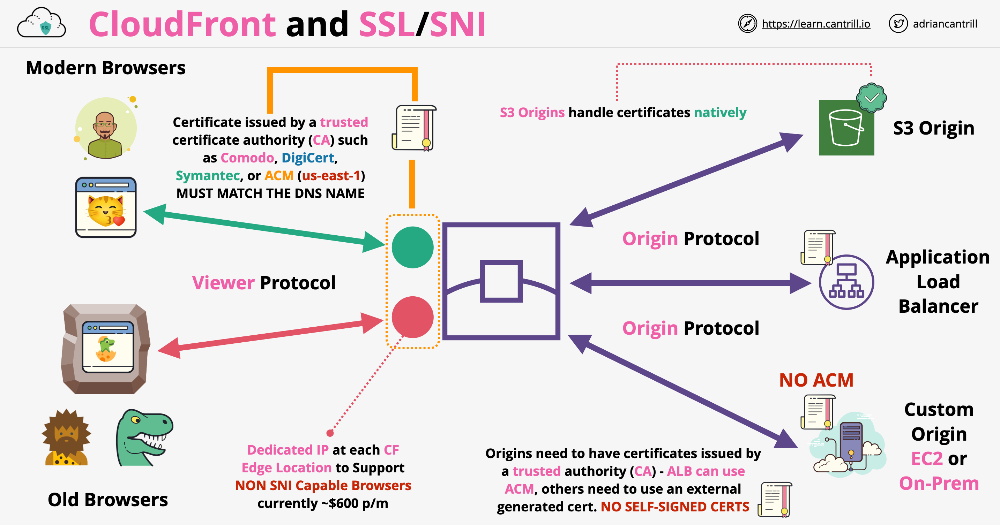
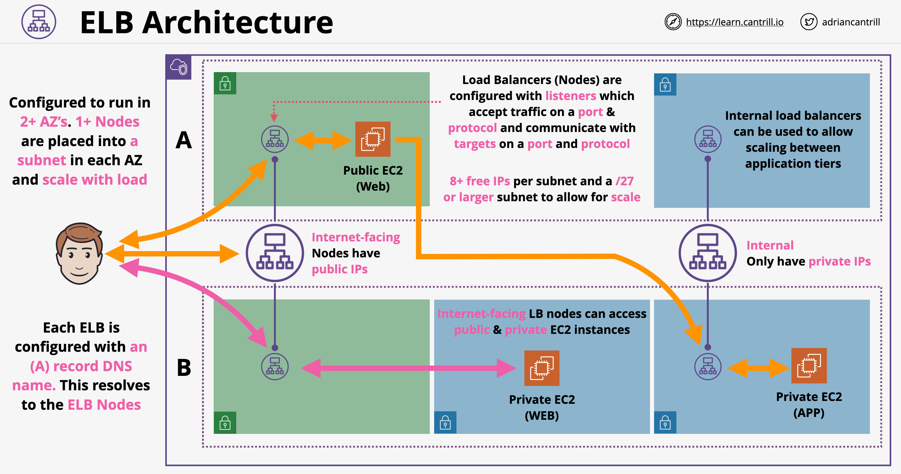

# Notes for Cantrill's SOA-C02 course
## Table of Contents

1. [IAM-Accounts-AWS-Organizations](#1-iam-accounts-aws-organizations)
2. [Simple Storage Service (S3)](#2-simple-storage-service-s3)
3. [Security](#3-security)
4. [EC2](#4-ec2)
5. [Monitoring, Logging & Auditing](#5-monitoring-logging--auditing)
6. [Infrastructure as Code (CloudFormation)](#6-infrastructure-as-code-cloudformation)
7. [Route53 and CloudFront](#7-route53-and-cloudfront)
8. [SQL databases](#8-sql-databases)
9. [Scaling, Load balancing & High Availability](#9-scaling-load-balancing--high-availability)
10. [Advanced Networking](#10-advanced-networking)
11. [Systems Manager](#11-systems-manager)
12. [Application Services, Event-Driven & Serverless](#12-application-services-event-driven--serverless)
13. [Elastic Beanstalk](#13-elastic-beanstalk)

_____________

### Topics not in Cantrill's course

1. [AWS Backup](#1-aws-backup)
2. [Service and Personal Health Dashboard](#2-service-and-personal-health-dashboard)
3. [AWS Budgets](#3-aws-budgets)
4. [RDS Proxy](#4-rds-proxy)
5. [EC2Rescue](#5-ec2rescue)

# 1. IAM-Accounts-AWS-Organizations

[IAM from SAA-C02](../SAA-C02.md#13-iam-accounts-aws-organizations)

## 1.1. AWS Service Catalog

* Regional service
* Self-service portal for users to launch (pre-defined by admins) products
* Can control end-user permissions

### 1.1.1. How it works

1. Admins define products and portfolios using CFN templates and Service Catalog config
2. Deploy portfolio to any service enabled regions
3. Service Catalog users review portfolios they have permissions on and launch product(s) into service enabled regions
4. Service catalog launches infrastructure using defined templates. Service catalog users don't need infrastructure permissions, only launch permissions.

### 1.1.2. Exam notes

* Need for end users/customers to deploy infrastructure with tight controls in a self-service way, use Service Catalog.
* Can be configured to automatically tag resources when created.

## 1.2. Cost Explorer

* Used for exploring costs for AWS account/organisation or any particular AWS user.
* Can be used to evaluate whether reserved instances or any other service options will benefit you cost wise
* Also show you cost breakdowns by cost tags.
* Can forecast future costs based on current utilisation
* Also recommend costs savings based on switching to Reserved Instances.

## 1.3. Cost Allocation Tags

* Enabled individually per account or master account for AWS Orgs.
* AWS-generated eg. **aws:createdBy** (which identity created a resource) or **aws:cloudformation:stack-name**
* Added to resources after enabled by AWS ie. **cannot** be enabled retroactively
* User-defined tags can also be enabled **user:something**
* Both visible in cost reports and can be used as filter
* Can take up to 24 hours to be visible and active

### 1.3.1 Tag examples

```
aws:createdBy
Root:12345678
```

## 1.4 SAML 2.0 Identity Federation

### 1.4.1. Introduction

* Security Assertion Markup Language (SAML) 2.0
* Open standard used by many identity providers (eg. Microsoft AD Federation Services)
* AWS services require AWS credentials
* Enterprise Identity Provider SAML 2.0 compatible.
* Uses IAM roles and AWS temporary credentials (12 hr validity)

#### Exam notes

* If question mentions Web identity logins (Google, FB, Apple, Twitter etc) or anything that suggests SAML 2.0 not supported, don't choose this.
* SAML 2.0 tends to be used in larger enterprises especially Windows-based identity providers.

### 1.4.2. SAML API

1. Application requests access with identity provider (eg. AD FS)
2. ID provider authenticates requests and identifies roles for app
3. ID provider gives a SAML assertion to the app
4. App uses SAML assertion with `STS:AssumeRoleWithSAML ` with STS.
5. STS accepts the role and passes temporary AWS credentials to Catagram.
6. App uses creds to access AWS resources eg. DynamoDB.

Note: Whole process requires bi-directional trust between ID-P and IAM


### 1.4.3. SAML Identity Federation (Console)

Console access is similar

1. Bob browses to ID-P portal (with URL)
2. ID-P authenticates request and identifies roles for user
3. ID-P returns SAML assertion to Web client
4. Web client sends SAML assertion to sign-in URL to SAML endpoint.
5. SAML endpoint receives assertion to STS on your behalf and generates AWS temp creds.
6. Web client creates a console sign-in URL with credentials for user
7. User gets redirected to AWS management console with URL.


### 1.5 AWS Single Sign-On (SSO)

#### 1.5.1. Introduction

* Manages SSO access with AWS Accounts/Organisation and External Applications
* Flexible Identity Store
  * Once configured Identity Store, functionality of SSO same for all different types of ID store.
  * Also has in-built Identity Store
* Can use either AWS managed AD or on-prem AD with 2-way trust or AD connector
* Preferred by AWS for traditional "workforce" identity federation (**default choice** unless otherwise)
* Handles identity federation, all accounts in your organisation and also external applications.
* Can import identities and groups from the ID provider and use them within SSO to manage permissions across AWS resources.
* A **permission set** is a collection of administrator-defined policies that AWS SSO uses to determine a user’s effective permissions to access a given AWS account. Permission sets can contain either AWS managed policies or custom policies that are stored in AWS SSO. Policies are essentially documents that act as containers for one or more permission statements. These statements represent individual access controls (allow or deny) for various tasks that determine what tasks users can or cannot perform within the AWS account.


**Exam notes:**

* Customer identities -> Web app, Twitter, FB , Google or Web identity => AWS Cognito
* Enterprise/workplace identities -> AWS SSO

**Notes from demo:**

* No associated costs with using it, so leave it there

# 2. Simple Storage Service (S3)

## 2.1 Cross-Origin Resource Sharing (CORS)

* Either Simple requests or Preflight requests (more complicated requests)
  * Preflight request need to be done in advance to the other origins. Browser sends HTTP request to the other origin to check if request is safe to send.

### 2.1.1 Types of headers

* `Access-Control-Allow-Origin` - Indicates whether the response can be shared with requesting code from the given origin.
* `Access-Control-Max-Age` - Indicates how long the results of a [preflight request](https://developer.mozilla.org/en-US/docs/Glossary/Preflight_request) (that is the information contained in the [`Access-Control-Allow-Methods`](https://developer.mozilla.org/en-US/docs/Web/HTTP/Headers/Access-Control-Allow-Methods) and [`Access-Control-Allow-Headers`](https://developer.mozilla.org/en-US/docs/Web/HTTP/Headers/Access-Control-Allow-Headers) headers) can be cached (and you need to do another preflight again)
* `Access-Control-Allow-Methods` -  Specifies the HTTP methods allowed when accessing the resource in response to a [preflight request](https://developer.mozilla.org/en-US/docs/Glossary/Preflight_request).
* `Access-Control-Allow-Headers` - Used in response to a [preflight request](https://developer.mozilla.org/en-US/docs/Glossary/Preflight_request) which includes the [`Access-Control-Request-Headers`](https://developer.mozilla.org/en-US/docs/Web/HTTP/Headers/Access-Control-Request-Headers) to indicate which HTTP headers can be used during the actual request.
  * Eg. `Access-Control-Allow-Headers: X-Custom-Header, Upgrade-Insecure-Requests`
* Eg

```json
{
    "AllowedHeaders": ["*"],
    "AllowedMethods": ["PUT", "POST", "DELETE"],
    "AllowedOrigins": ["http://catagram.io"],
    "ExposeHeaders": []
}
```

## 2.2 S3 Access Points

* Allows access to S3 bucket with an endpoint with a custom bucket policy; can create multiple.
* Each access point has its own endpoint address
* Created with eg. `aws s3control create-access-point --name secretcats --account-id 1234567 --bucket catpics`
* Bucket policies can be used but become very large and unwieldy quickly.
* Based on eg below. Allows custom access for various teams.
* Each access point has a unique DNS address accessing it, and this address is passed to users.
* Can also be accessed via a VPC gateway endpoint.
* Needs to have either
  * Matching bucket policy
  * Permissions delegation of bucket policy to access point (bucket just takes whatever is specified in access point)


## 2.3 S3 Inventory

* Generates storage inventory report of objects and various fields
* Fields include Encryption, Size, Last Modified, Storage Class, Version ID, Replication Status, Object lock etc.
* Can't generate reports on-demand; can only be scheduled either daily or weekly only.
  * Takes up to 48 hrs to generate first report.
* Available formats: CSV, ORC, Parquet
* Multiple inventories can be setup, and they go to a target bucket - Needs bucket policy for permissions.

### 2.3.1. Notes from demo

* Generate inventory configuration
* Can choose which bucket to store reports in
  * Destination bucket needs bucket policy to allow report to be stored; will be automatically added while setting up inventory configuration ie `s3:PutObject`

## 2.4 S3 Object Lock

### 2.4.1. Features

* Can be enabled only for new buckets (enabling on existing ones need support ticket)
* Versioning automatically enabled. This is irreversible.
* Store objects using a *write-once-read-many* (WORM) model. Object Lock can help prevent objects from being deleted or overwritten for a fixed amount of time or indefinitely. You can use Object Lock to help meet regulatory requirements that require WORM storage, or to simply add another layer of protection against object changes and deletion.

Object retention via 2 methods

* Retention period
* Legal hold

Can use both of these, 1 or none.

### 2.4.2. Retention period

* Specify duration in days & years.
* Two modes: Compliance and Governance

#### 2.4.2.1 Compliance mode

* Objects can't be adjusted, deleted or overwritten during the period.
* Retention period can't be changed, retention mode can't be adjusted, even for **root users**.
* Use cases: Financial, medical history records

#### 2.4.2.2. Governance mode

* Special permissions can be granted allowing lock settings to be adjusted
* Grant permissions `s3:BypassGovernanceRetention` to users and specify header `x-amz-bypass-governance-retention:true` (console default) to allow changes.

### 2.4.3. Legal hold

* Set on an object version: ON/OFF.
* No retention period; active until removed.
* Can't delete or modify object
* To add/remove legal hold, need `s3:PutObjectLegalHold` permission.
* Use cases: Prevent accidental deletion of critical object versions.

# 3. Security

## 3.1. Policy Interpretation

Example of `NotAction` [statement](https://docs.aws.amazon.com/IAM/latest/UserGuide/reference_policies_examples_aws_deny-requested-region.html)

```json
{
    "Version": "2012-10-17",
    "Statement": [
        {
            "Sid": "DenyAllOutsideRequestedRegions",
            "Effect": "Deny",
            "NotAction": [
                "cloudfront:*",
                "iam:*",
                "route53:*",
                "support:*"
            ],
            "Resource": "*",
            "Condition": {
                "StringNotEquals": {
                    "aws:RequestedRegion": [
                        "eu-central-1",
                        "eu-west-1",
                        "eu-west-2",
                        "eu-west-3"
                    ]
                }
            }
        }
    ]
}
```

This denies actions to everything but those 4 global services in the list outside of the listed regions. These 4 global services run out of us-east-1 region. Will need an allow statement to mean anything.

## 3.2. Permissions Evaluation

### 3.2.1. Policy evaluation logic

Policies are evaluated in this order

1. Explicit deny
2. SCPs (deny only)
3. Resource policy (allow only)
4. Permissions boundary (deny only)
5. Session policy (deny only)
6. Identity policy (deny or allow)

### 3.2.2. Multi-account

Account A might allow something but account B also needs to allow it too or it gets denied (ie. A accessing a bucket in B)

## 3.2. AWS Inspector

* Scans EC2 instances and **instance OS**.
* Checks for vulnerabilities and deviations against best practices.
* Provides a report of findings ordered by priority.

### 3.2.1 Network Reachability package [[Ref](https://docs.aws.amazon.com/inspector/latest/userguide/inspector_network-reachability.html)]

* Network assessment works without agent, but can install agent for additional details.
* Checks reachability and accessibility of ports end-to-end. Works for EC2, ALB, DX, ELB, ENI, IGW, ACLs, RTs, SGs, subnets, VPCs, VGWs, & VPC Peering
  * **RecognizedPortWithListener** – A recognized port is externally reachable from the public internet through a specific networking component, and a process is listening on the port.
  * **RecognizedPortNoListener** – A port is externally reachable from the public internet through a specific networking component, and there are no processes listening on the port.
  * **RecognizedPortNoAgent** – A port is externally reachable from the public internet through a specific networking component. The presence of a process listening on the port can't be determined without installing an agent on the target instance.

* **Exam notes:** Look for keywords such as
  * *Host assessments*, *agent required*.
  * Common vulnerabilities and exposures (CVE) - will flag CVEs found on instance ports
  * Center for Internet Security (CIS) Benchmarks 
  * **Security best practices** for Amazon Inspector

## 3.3. GuardDuty

* Continuous security monitoring service.
* Learns patterns of what occurs normally within any managed accounts.
* Uses AI/ML with updated threat intelligence feeds 
* Configured to notify or event-driven protection/remediation
* Supports multiple accounts (**Master** and **Member**)
* Takes logs from
  * DNS logs
  * VPC flow logs
  * CloudTrail Event logs
  * CloudTrail Management Events
  * CloudTrail S3 Data Events
* Findings can trigger CW Events or EventBridge to send notifications to SNS or Lambda invocation

## 3.4. Trusted Advisor

* Compares your current settings with what you should have for best practices
* Account level service, needs no agents to work.
* Does cost optimisation, performance, security, fault tolerance and service limits.
  * AWS Limit Monitor leverages on  Trusted Advisor's Service Limits track usage and issue notifications as you approach limits.
* Mostly **not free**, except for **basic** or **developer** 7 core checks
* Anything more requires Business or Enterprise plans

### 3.4.1. Basic 7 core checks

1. S3 bucket permissions - **not** objects
2. Security groups - Specific ports for unrestricted access (ie. 0.0.0.0/0 or ::/0)
3. IAM use
4. MFA on Root Account - checks whether MFA enabled for root.
5. EBS public snapshots - checks for EBS snapshots marked for public access
6. RDS public snapshots - same but for RDS snapshot
7. 50 most common service limit - checks whether you're over 80% of these

### 3.4.2. Business and Enterprise support

* 115 further checks (covering costs, security, fault, tolerant, performance and service limit)
* Also covers AWS Support API programmatically
  * Get details of TA checks
  * Refresh TA checks
  * Checks status of TA checks, individually or all
  * Open a support ticket, search cases by dates and case identifiers
  * Add email comms to existing cases and resolve cases

* CloudWatch integration: Define event-driven actions if one TA checks surface issues

# 4. EC2

## 4.1. EC2 instance connect

* [List](https://ip-ranges.amazonaws.com/ip-ranges.json) of AWS address IP ranges for for EC2 instance connect.

## 4.2. EC2 savings plan

* Hourly commitment for 1 or 3 year term ($20 per hour for 3 years)
* General compute dollar amts
  * Eg. Compute products EC2, Fargate, Lambda have on demand rate but also have savings plan rate.
  * Service is billed at discounted savings plan rate until finished, then revert to normal on-demand rate.
  * Used to transition away from EC2 to Fargate, then to Lambda

## 4.3. EC2 termination shutdown protection and shutdown

* Protects EC2 instances from termination by sloppy admin.
* Right-click -> Instance settings -> Change termination protection -> Enable
* Now termination requires `disableApiTermination` attribute to terminate EC2.
* Can segregate permissions to allow only senior admins to terminate
* Can also change shutdown behaviour to either stop/terminate when shutdown from inside OS.
  * Right-click -> Instance settings -> Change shutdown behaviour

## 4.4. EC2 test notes

### 4.4.1. Instance goes from pending to terminated after starting

If your EC2 instance goes from the `pending` state to the `terminated` state immediately after restarting then it could be caused by one of the following reasons:

- You've reached your EBS volume limit.
- An EBS snapshot is corrupt.
- The root EBS volume is encrypted and you do not have permissions to access the KMS key for decryption.
- The instance store-backed AMI that you used to launch the instance is missing a required part (an image.part.xx file).

### 4.4.2 EC2 monitoring

Enabling detailed monitoring on EC2 instances allows for

* Aggregating statistics across instances
* Provides data in 1-min interval (basic is just every 5 min)

# 5. Monitoring, Logging & Auditing

## 5.1 CloudWatch - Architecture Concepts

* Public service - public space endpoints
* AWS service integration - management plane
* Agent integration - Provides richer metrics from within EC2 
* On-premises integration via Agent/API
* Application integration via Agent/API
* View data via console UI, CLI, API, dashboards & anomaly detection
* Alarms - react to metrics, can be used to notify or perform actions
* On-premises VMs and Internet apps, VPC applications

## 5.2 CloudWatch - Data

* **Namespace** = container for metrics eg. AWS/EC2 & AWS/Lambda
* **Datapoint** Fields: Timestamp, Value, unit of measure
* **Metric**: Time series of data points
  * Eg. For EC2: **CPUUtilisation**, **Networking**, **DiskWriteBytes**
* Every metric has a Metric Name (eg. CPUUtilisation) and a Namespace (eg. AWS/EC2)
* **Dimension**: Name/Value pair (Because metric itself not granular enough to differentiate between eg. EC2 sources)
  * Eg. Name = InstanceId, Value = i-11111111 (cat)
  * Eg. ASGName, InstanceId, InstanceType
* **Resolution** - Minimum time period you can get one particular data point for. Eg. Standard (60s), High (1s)
  * 60s - Data retained for 15 days
  * 5 min - Data retained for 63 days
  * 1 hr - Data retained for 455 days
* As data ages, its aggregated and stored for longer with lower resolution
* **Statistics** - Aggregation over a period (eg. Min, Max, Sum, Average...)
  * Percentile - Eg. 95th, 75th percentile

## 5.3 CloudWatch Alarm

* Alarm - watches a metric over a time period
* In two states: Alarm or OK.
* Set value of metric vs threshold over time
* Can configure one or more actions once alarm triggered such as reboot EC2 instance
* **Test note:** Can create a CW Alarm which monitors the EC2 instance metric `StatusCheckFailed_System`[[ref](https://systemcenter.wiki/?GetElement=Amazon.AmazonWebServices.Rule.AmazonEC2InstanceMetric.StatusCheckFailed_System&Type=Rule&ManagementPack=Amazon.AmazonWebServices&Version=2.5.0.0)] and [automatically recovers once impaired](https://docs.aws.amazon.com/AmazonCloudWatch/latest/monitoring/UsingAlarmActions.html#AddingRecoverActions) (due to HW failure or one which requires AWS to repair). Excluding terminated instances which can't be recovered, a recovered instance is identical to the original instance, including the instance ID, private IP addresses, Elastic IP addresses, and all instance metadata.

## 5.4 CloudWatch Logs

* **Public service** - Store, monitor, access logging data
* Install CW Agent for system or custom application logging
* Sources: 
  * AWS, on-premises, IOT or any application
  * VPC flow logs
  * CloudTrail
  * Elastic beanstalk, ECS container logs, API GW, Lambda execution logs
  * Route53 - Log DNS requests
* **Exam note:** Default logging endpoint for AWS.

### 5.4.1. CloudWatch Logs - Subscription filters

* Log stream is a sequence of log events that share the same source. Each separate source of logs in CloudWatch Logs makes up a separate log stream.
* Log group is a group of log streams that share the same retention, monitoring, and access control settings

* Real-time logging:
  * AWS managed Lambda function allows logging data to be delivered realtime to AWS Elasticsearch
* Near real-time logging:
  * Custom Lambda function can be used to export data 
  * Can use subscription filters - Eg. Kinesis data firehose allows *near realtime* delivery of logging to S3

* Can aggregate logs from various sources into Kinesis data streams, data firehose into S3


### 5.4.2 CloudWatch Logs - Exam notes

* Default for any log management scenarios
  * On-premises and AWS
* Export to S3 with `CreateExportTask` - 12 hours, not real time
* Near-realtime or persist logs - Kinesis firehose
* Firehose for any "firehose destinations"
* Realtime - Lambda (delivers to almost anything) or Kinesis Data stream (KCL consumers)
* Metric filter - scan log data, generate CloudWatch metric which you can set alarms on
* **Test note [SOA-C02]:** **CloudWatch metric math** can be used to aggregate and transform metrics from multiple accounts and Regions. Metric math enables you to query multiple CloudWatch metrics and use **math expressions** to create new time series based on these metrics. You can visualize the resulting time series on the CloudWatch console and add them to dashboards. Using AWS Lambda metrics as an example, you could divide the `Errors` metric by the `Invocations` metric to get an error rate. Then add the resulting time series to a graph on your CloudWatch dashboard.
  * This requires detailed monitoring to be enabled

## 5.5 AWS X-Ray

* Takes data from many AWS services and gives you single overview of session flow - Distributed tracing
* **Components:**
  * **Tracing header** - Generated by first service with unique trace ID, used to track request through application
  * **Segments** - Data blocks - host/IP, request, response work done, issues encountered
  * **Subsegments** - More granular version of above, calls to other services as part of a segment (endpoints etc)
  * **Service graph** - Generates a JSON doc detailing services and resources which make up the application
  * **Service map** - Visual representation of service graph (eg. below)


How it collects:

* EC2 - Installed X-Ray agent
* ECS - Agent installed as part of any tasks running in the service
* Lambda - Enable X-ray data collection option
* Beanstalk - Agent pre-installed
* API Gateway - Enabled on per-stage basis
* SNS & SQS - Can be enabled to send data to X-ray

* All of these require IAM permissions

# 6. Infrastructure as Code (CloudFormation)

## 6.1 Template and Pseudo Parameters

### 6.1.1. Template parameters

* Template parameters accept input via console/CLI/API when a stack is created/updated
* Can be referenced from within Logical Resources 
* Can be configured with Defaults, AllowedValues, Min and Max length & AllowedPatterns, NoEcho & Type


### 6.1.2. Pseudo parameters

* Pseudo parameters are similar to template parameters only are provided by AWS based on environment when creating the stack.
  * **AWS::Region** will always reflect the region the stack is being created in.
  * **AWS::StackName** and **AWS::StackId** will match the specific Stack being created
  * **AWS::AccountId** will be set by AWS to the actual account ID the stack is being created within.

## 6.2. Intrinsic Functions

### 6.2.1. **Ref** & Fn::**GetAtt**

Reference a resource you created, such as a VPC so that a subnet can be created inside.

* `!Ref` Instance points to the ID of the instance created. When used with logical resources, the physical ID is usually returned.
  * Eg. i-12345679acfgsd0
* `!GetAtt LogicalResource.Attribute` can be used to retrieve any attribute associated with the resource.
  * Eg. PublicIP 54.91.129.183, PublicDNSName ec2-54-91-129-183.compute-1.amazonaws.com

### 6.2.2. Fn::**GetAZs** & Fn::**Select**

* GetAZs "us-east-1" or "" (current region) - Returns a list of AZs from a Region
  * ["us-east-1a", "us-east-1b", "us-east-1c", "us-east-1d"]
* Assuming default VPC or its subnets are not modified
* `AvailabilityZone: !Select [ 0, !GetAZs, '' ]` - Returns an object from a list of object. Lists start at index 0.

### 6.2.3. Fn::**Join** & Fn::**Split**

* `!Split [ "|", "roffle|truffles|penny|winkie"]` returns a list ["roffle","truffles","penny", "winkie"] 

* Join can be used to concatenate a Web path to the DNS name of a public EC2 instance for people to use.
* !Join [delimiter, ["value1", "value2" ... "valueN"]]
  * `Value: !Join [ '', [ 'http://', !GetAtt Instance.DNSName ] ]` - Adds http:// to the DNS name of the EC2 instance

### 6.2.4. Fn::Base64 & Fn::Sub

* Fn::**Base64** - Base64 used for providing user-data to EC2 instances for automated builds. 

* Fn::**Sub** - Allows you to substitute things within text based on runtime information

* Fn::Base64: !Sub | 

  ```yaml
  Fn::Base64: !Sub | 
    #!/bin/bash -xe
    yum -y update
    echo "something ${Instance.InstanceId}" >> /var/www/html/index.html
  ```
* `${Instance.InstanceId}` can't do self-reference, only other instance IDs. Note the above is invalid.

### 6.2.5. Fn::Cidr

* Used to generate a number of smaller CIDR ranges from a larger PC range

```yaml
VPC:
  Type: AWS::EC2::VPC
  Properties: 
    CidrBlock: "10.16.0.0/16"
Subnet1:
  Type: AWS::EC2::Subnet
  Properties:
    CidrBlock: !Select [ "0", !Cidr [ !GetAtt VPC.CidrBlock, "16", "12" ]]
    VpcId: !Ref VPC
```

* Here we are telling CFN we want 16 subnets and the size (12) of each subnet. This outputs a list of subnets to use.

Conditions (Fn::**IF**, **And**, **Equals**, **Not** & **Or**) - Typical conditions, if X do Y else

## 6.3. CloudFormation Mappings

Structure: `!FindInMap [ MapName, TopLevelKey, SecondLevelKey ]`

Given this

```yaml
Mappings:
  RegionMap:
    us-east-1:
      HVM64: "ami-0ff8a915034f43254"
      HVMG2: "ami-0a3ed46234422bcee"
    us-east-2:
      HVM64: "ami-0ed3a4567c4f43423"
      HVMG2: "ami-066ee5fd4a9ef77f1"
```

`!FindInMap [ "RegionMap", !Ref 'AWS::Region',"HVM64"] `

* Looks for RegionMap in CFN template
* Finds the current region in the console
* Returns value for key "HVM64"

## 6.4. CloudFormation Output

* Optional, may not be present
* Values declared in this section are visible using CLI or console UI
* Accessible from a parent stack when using **nesting**
* Can be exported allowing cross-stack references

```yaml
Outputs:
  WordpressURL:
    Description: "Instance Web URL"
    Value: !Join [ '', [ 'http://', !GetAtt Instance.DNSName ] ]
```

* Description visible from CLI and console UI and passed back to parent stack when nested stacks are used

## 6.5. CloudFormation Conditions

* Created in optional Conditions section of template
* Evaluated to TRUE or FALSE.
* Processed **before** resources are created, associated with logical resources to control if they're created or not.
  * Eg. Create different number of resources based on ONEAZ, TWOAZ

Example:

Here if EnvType is not "prod", then only "Wordpress" EC2 instance is created. If EnvType is "prod" then in addition, Wordpress2, MyEIP, MyEIP2 is also triggered. Another EC2 instance is created, and both are assigned Elastic IPs.


## 6.6. CloudFormation DependsOn

* CFN tries to efficient, tries to do things in parallel (create, update and delete resources)
* Determines a dependency order (VPC -> Subnet -> EC2)
* **DependsOn** lets you explicitly define dependencies so CFN will not build that resource until dependencies are met.

```yaml
InternetGatewayAttachment:
  Type: 'AWS::EC2::VPCGatewayAttachment'
  Properties:
    VpcId: !Ref VPC
    InternetGatewayId: !Ref InternetGateway
```

* This creates an implicit dependency on `VPC` and `InternetGateway`. It works without specifying `DependsOn`.
* However Elastic IP doesn't work, there's no `!Ref` in the template:

```yaml
WPEIP:
  Type: AWS::EC2::EIP
```

* Will encounter errors if 
  * CFN tries to create EIP before attaching IGW
  * CFN tries to delete attached IGW before EIP

* Adding **DependsOn** fixes the issue

```yaml
WPEIP:
  Type: AWS::EC2::EIP
  DependsOn: InternetGatewayAttachment
  Properties:
    InstanceId: !Ref WordpressEC2
```

## 6.7 CloudFormation WaitCondition, CreationPolicy & `cfn-signal`

### 6.7.1. CloudFormation Signal

* Configure CloudFormation to hold, waits for 'X' number of success signals.
* Waits for Timeout H:M:S for those signals (Max 12 hrs)
* If success signals received sent by `cfn-signal`, CREATE_COMPLETE.
* If failure signal received, creation fails.
* Using `CreationPolicy` or `WaitCondition`

#### 6.7.1.1. **CreationPolicy** example of provisioning 3 EC2 instances in an ASG:

```yaml
CreationPolicy:
  ResourceSignal:
    Count: '3'
    Timeout: PT15M
..
LaunchConfig:
  Type:
  AWS::AutoScaling::LaunchConfiguration
  Properties:
  ... (stuff here)
  User Data:
    "Fn::Base64":
      !Sub |
        #!/bin/bash -xe
        yum update -y aws-cfn-bootstrap
        ...
        /opt/aws/bin/cfn-signal -e $? --stack ${AWS::StackName} --resource AutoScalingGroup --region ${AWS::Region}
```

* Here CreationPolicy applies signal requirement (3) and timeout (15m).
* ASG provisions 3 EC2 instances each signalling once with `cfn-signal`

#### 6.7.1.2. **WaitCondition** example:

```yaml
WaitCondition:
  Type: AWS::CloudFormation::WaitCondition
  DependsOn: "someresource"
  Properties:
    Handle: !Ref "WaitHandle"
    Timeout: "300"
    Count: '1'
```

JSON data passed back in signal response

```yaml
WaitHandle:
  Type: AWS::CloudFormation::WaitConditionHandle
```

Assuming this is the JSON data passed back by an external system

```json
{
    "Status": "SUCCESS",
    "Reason": "Something Important",
    "UniqueId": "ID1337",
    "Data": "Something amazing has happened"
}
```

* Can use `!GetAtt WaitCondition.Data` to get JSON data sent back eg. `{"Signal1":"Something amazing has happened"}`

AWS recommends CreationPolicy for most cases due to simplicity. Might have need for WaitCondition if you need data from external systems.

### 6.7.2 CFN UpdatePolicy

* `UpdatePolicy` triggers [rolling update to an ASG](https://cloudonaut.io/6-unknown-cloudformation-features-you-should-know-about/), to execute changes in small batches. See eg. [here](https://cloudonaut.io/rolling-update-with-aws-cloudformation/)
* Used together with `WaitOnResourceSignals` to wait for `cfn-signal` to signal when update is completel


## 6.8 CloudFormation Nested Stacks

### 6.8.1. Why nested stacks?

* Stacks have a limit of 500 resources
* Can't easily reuse resources
* Not easy to reference resources (eg. VPC) in other stacks which want to use it
* `!Ref` only works to reference resource in same stack; stacks are isolated can be deleted all at once.

### 6.8.2. Definitions ([ref](https://docs.aws.amazon.com/AWSCloudFormation/latest/UserGuide/using-cfn-nested-stacks.html))

* **Root stack** - Top level stack to which all nested stacks belong
* **Parent stack** - Stack which create the current stack

Can define CFN stack as a logical resource

```yaml
VPCSTACK:
  Type: AWS::CloudFormation::Stack
  Properties: 
    TemplateURL: http://someurl.com/template.yaml
    Parameters:
      Param1: !Ref SomeParam1
      Param2: !Ref SomeParam2
      Param3: !Ref SomeParam3
```

* This stack in the URLs requires 3 parameters as inputs or it'll fail.
* Stack in URL can be used by multiple other stacks.
* When created the outputs of this stack can be referenced with VPCSTACK.Outputs.XXXX
* Next the ADSTACK takes the output from VPCSTACK which it depends on.
* Next stack created by root stack is APPSTACK which depends on ADSTACK.
* After all 3 are created, then the root stack is marked as create complete.

### 6.8.3 **When to use:**

* Overcome 500 resource limit of single stack
* Allows you to reuse templates but not resources.
* Simplifies installation process
* Nested stack generally used when all infrastructure that you create form part of same solution; life-cycle linked.

## 6.9. Cross-stack References

### 6.9.1. Why cross-stack references?

* Stacks by designed are isolated and self-contained.
* Outputs are normally not visible from other stacks
* Can't use nested stacks because you might want some resources eg. VPCs to outlive others eg. applications

### 6.9.2. How it works:

* Cross-stack references allow you to reuse actual resources. 
* Stack outputs can be exported making them visible to other stacks

* Exports must have a **unique name** in the region.
* Use `Fn::ImportValue` instead of `!Ref`.

### 6.9.3. Example

```yaml
Outputs:
  SHAREDVPC:
    Description: Shared Services VPC
    Value: !Ref VPC
    Export:
      Name: SHAREDVPCID
```

This gets exported as

| Export Name | Export Value |   Stack Name    |
| :---------: | :----------: | :-------------: |
| SharedVPCID |  vpc-123456  | Stack-SharedVPC |

* Can be imported in same region, same account only. Not cross-region or cross-account.
* Import value in another stack with `!ImportValue SharedVPCID`

## 6.10. CloudFormation StackSets

* Allows you to deploy CFN stacks across **many accounts** and **regions**
* StackSets are containers in an admin account containing stack instances which themselves are references for individual stacks in a region in an account.
* Templates are just normal CFN templates.
* Permissions granted via self-managed IAM roles or service-managed within an AWS organization. 


### 6.10.1. Terms

* **Concurrent accounts**: How many accounts StackSets can deploy resources into at any one time eg. Of 10 target accounts, we can have 5 sets of 2 each cycle. More concurrent accounts -> Faster deployments.
* **Failure tolerance:** Amount of individual deployments which can fail before StackSet is counted as failed.
* **Retain Stacks:**  Set this so you can remove stack instances from target accounts and regions without also removing stacks there.

### 6.10.2. Scenarios for use

* Enable AWS Config across multiple accounts
  * Enable MFA authentication, Elastic IPs, EBS encryption
* Create IAM roles for cross-account access

## 6.11. CloudFormation Deletion Policy

### 6.11.1. What its for

* Deleting a logical resource from a template or a stack also removes the physical resources causing data loss.
* Deletion policy allows you to define on each resource 
  * **Delete** (default)
  * **Retain**
  * **Snapshot** (if supported, eg. EBS volumes, ElastiCache, Neptune, RDS, Redshift). Snapshot of resource is taken just before deletion.
* Only applies to deletion, not replacement of logical resources

## 6.10. CloudFormation Stack Roles

* Be default uses CFN uses permissions of the **logged in** identity to create resources.
* CFN can assume a role to gain permissions
* Identity creating the stack doesn't need resource permissions only `PassRole`
* Account role can only be used by CFN to create, update and delete stacks and nothing else.

### 6.10.1. Exam notes

* Used to give accounts permissions for CFN only and nothing outside it.

## 6.11. CloudFormation Init (cfn-init)

### 6.11.1. Features

* Not **how** (user-data) but desired state what to accomplish (cfn-init)
* Idempotent; running `cfn-init` when changes already made, then nothing happens
  * Eg. Apache won't be installed if it already is, services won't start if they are already running
* Accessed via `/opt/aws/bin/cfn-init`


### 6.11.2 Example of cfn-init from demo

Instead of 

```yaml
      UserData:
        Fn::Base64: !Sub |
          #!/bin/bash -xe
          yum -y update
          yum -y upgrade
          # simulate some other processes here
          sleep 300
          # Continue
          yum install -y httpd
          systemctl enable httpd
          systemctl start httpd
          echo "<html><head><title>Amazing test page</title></head><body><h1><center>${Message}</center></h1></body></html>" > /var/www/html/index.html
          /opt/aws/bin/cfn-signal -e $? --stack ${AWS::StackId} --resource Instance --region ${AWS::Region}
```

We have

```yaml
      'AWS::CloudFormation::Init':
        config:
          packages:
            yum:
              httpd: []
          files:
            /var/www/html/index.html:
              content: !Sub |
                <html><head><title>Amazing test page</title></head><body><h1><center>${Message}</center></h1></body></html>
          commands:
            simulatebootstrap:
              command: "sleep 300"
          services:
            sysvinit:
              httpd:
                enabled: "true"
                ensureRunning: "true"
                files:
                  - "/var/www/html/index.html"
...
      UserData:
        Fn::Base64: !Sub |
          #!/bin/bash -xe
          /opt/aws/bin/cfn-init -v --stack ${AWS::StackId} --resource Instance --region ${AWS::Region}
          /opt/aws/bin/cfn-signal -e $? --stack ${AWS::StackId} --resource Instance --region ${AWS::Region}
```

The CFN template has to be written in a way not to write shell commands but use the EC2 internal APIs to target the final state.

## 6.12. CloudFormation cfn-hup

* `cfn-init` is run once as part of bootstrapping (user-data)
* If CloudFormation::Init is updated it **isn't rerun**
* `cfn-hup` helper is a daemon that can be installed
* Detects changes in resource metadata, runs configurable actions when change is detected.

### 6.12.1. Steps

1. CFN template is updated
2. `UpdateStack` is called.
3. `cfn-hup` checks metadata periodically
4. When it detects updates, calls `cfn-init`
5. `cfn-init` applies new configuration

### 6.12.2. Notes from demo

```yaml
          files:
            /etc/cfn/cfn-hup.conf:
              content: !Sub |
                [main]
                stack=${AWS::StackName}
                region=${AWS::Region}
                interval=1
                verbose=true
              mode: '000400'
              owner: 'root'
              group: 'root'
            /etc/cfn/hooks.d/cfn-auto-reloader.conf:
              content: !Sub |
                [cfn-auto-reloader-hook]
                triggers=post.update
                path=Resources.Instance.Metadata.AWS::CloudFormation::Init
                action=/opt/aws/bin/cfn-init -v --stack ${AWS::StackId} --resource Instance --region ${AWS::Region}
                runas=root
              mode: '000400'
              owner: 'root'
              group: 'root'
            /var/www/html/index.html:
              content: !Sub |
                <html><head><title>Amazing test page</title></head><body><h1><center>${Message}</center></h1></body></html>
```

* **cfn-hup.conf** specifies that the stack and region that is monitored as well as the monitoring frequency interval.
* **cfn-auto-reloader.conf** determines when and where the update occurs. Here it triggers when update is done, path tells you what is being monitored and action tells you what is done when it detects changes.
* The part below tells it to update **${Message}** with the updated parameter

## 6.13. CloudFormation demo

Notes:

* Any changes made to stack and updated will cause resources to be stopped and re-created again - with disruption.
* User-data runs just once, even updating the stack and resources get stopped doesn't cause it to re-run
* When you use `cfn-init` the log files of commands run are stored in **/var/log/cfn-init-cmd.log** instead of **/var/log/cloud-init-output.log**
* **/var/log/cloud-init-output.log** - Good for diagnosing problems bootstrapping with user-data
* **/var/log/cfn-init-cmd.log** and **/var/log/cfn-init.log** for diagnosing problems with `cfn-init`
* **/var/log/cfn-hup.log** - For troubleshooting problems with cfn-hup

## 6.14 CloudFormation Change sets

* Allows you to preview the changes between two CFN templates when configured without applying changes.
* Can integrate as part of an AWS Organisation change management process.

## 6.15. CloudFormation Custom Resources

* Allows CFN to integrate with anything it doesn't yet or doesn't natively support
* Used, for example to integrate with a Lambda function to delete S3 bucket's contents before deleting S3 bucket itself.

## 6.16. CloudFormation Stack Policy

* To protect selected stack resources from update actions, define a stack policy and then set it on your stack. 

* A stack policy is a JSON document that defines thestack update actions that AWS CloudFormation users can perform and the resources that the actions apply to. 

* You set the stack policy when you create a stack, by specifying a text file that contains your stack policy or typing it out. 

* When you set a stack policy on your stack and allow all, any update not explicitly allowed is denied by default.

  ```json
  {
    "Statement" : [
      {
        "Effect" : "Allow",
        "Action" : "Update:*",
        "Principal": "*",
        "Resource" : "*"
      },
      {
        "Effect" : "Deny",
        "Action" : "Update:*",
        "Principal": "*",
        "Resource" : "LogicalResourceId/ProductionDatabase"
      }
    ]
  }
  ```

# 7. Route53 and CloudFront

## 7.1. CloudFront architecture

* Cache behaviour sits in between origin and edge locations
* Distribution are configured via behaviours not the distributions themselves.


## 7.2 CloudFront Behaviour

### 7.2.1 General tab

* Can select lower priced class to deploy content to only specific edge locations but cause poor performance to visitors outside these edge locations.
* Able to associate L7 WAF ACL to CloudFront edge distribution.
* Can configure SSL SNI for edge distribution.
* Select different TLS versions (note newer TLS versions may not be supported on older browsers)

### 7.2.2. Behaviour tab

* A distribution can have multiple behaviours
* Viewer protocol policy:
  * HTTP or HTTPS
  * Redirect HTTP to HTTPS
  * HTTPS only
* Allowed HTTP methods
* Restrict Viewer Access - CF distribution accessible with signed URLs/cookies only.
* Trusted Signers - Select accounts that can generate signed URLs/cookies
* Associate Lambda function

## 7.3 TTL and Invalidations

* When object at edge location expires (exceeds TTL), it fetches again from origin.
  * If object is current, origin returns **304 Not Modified** to edge location
  * If not current, the new object is returned with **200 OK**
* Default TTL = 24 hrs
* Can set Minimum and Maximum TTLs - Values are used if the objects' TTLs are set below/above these figures.

### 7.3.2 Origin headers

* Used to control how long objects stay in the edge cache
  * `Cache-Control max-age` 
  * `Cache-Control s-maxage` 
  * `Expires` - Specifies a specific date/time when object will expire.

* Can be set with Custom Origin or S3 (via object metadata)

### 7.3.3. Cache invalidation

* Performed on a distribution
* Applies to all edge locations but takes time to take effect
* Eg. of paths to invalidate
  * /images/whiskers1.jpg - Specific file invalidation
  * /images/whiskers* - File wildcard invalidation
  * /images/* - Everything under path
  * /* - invalidate everything
* Consider alternative of versioned file name eg. whiskers1_v2.jpg. Requires application to point to different filename
  * Logging more effective since you know the exact object used.
  * Exam note: If versioning is mentioned and cost efficacy is desired then versioned file names is likely the answer.

## 7.3. CloudFront and SSL

* CloudFront default domain name (CNAME)
  * https://d313132.cloudfront.net with 
* SSL supported by default for *.cloudfront.net
* If you want alternate domain names eg. cdn.catagram, generate or import in ACM per each region
* For global services, certificate needs to be created/added in **us-east-1**
* Two SSL connections; both need valid public certificates
  * Viewer to CloudFront
  * Cloudfront to origin

* Historically, SSL-enabled site needed its own IP address.
* CF supports SNI, but for older browsers that don't CF charges extra for dedicated IP address.

### 7.3.1. CloudFront SNI architecture

* Certificate hosted by the CF distribution needs to be issued by a trusted CA eg. DigiCert, Comodo or ACM.
  * If you use ACM the cert needs to be created in **us-east-1**.
  * The public cert needs to match the DNS name of the CF distribution its applied to.
  * No self-signed certs allowed.
* Certificate hosted by the origin also need to be issued by a trusted CA
  * S3 origins handles certificates natively
  * Origin-hosted certificate need to match DNS name of whatever distribution is used to contact origin.
  * ALB can use ACM, others need to use an external generated cert.
  * Also no self-signed cert.



## 7.4 Origin Types and Architecture

* Origin groups - Used to group origins together, can be configured as CF targets for resilience.
* S3 static website hosting - CF treats it as a website when configured as origin.

### 7.4.1. S3 origin options

* Can configure origin access identity to prevent accessing origin directly
* Origin path - Configure such that CloudFront accesses a bucket path instead of the default top level bucket paths
* Protocols are matched on both sides (client to distribution matches distribution to origin) HTTP to HTTP

### 7.4.2. Custom origin options

* Custom origin options
  * Can set minimum origin SSL protocol TLS version 
* Origin protocol policy - HTTP only, HTTPS only or match viewer
* Custom headers - Respond to HTTP requests only if custom headers provided (which CF can provide)
  * Can be used to get CF to serve different content due to different User-Agent eg. mobile browser.
* Custom HTTP/HTTPS ports

## 7.5. CloudFront Security OAI

### 7.5.1 Securing S3 origins with OAI

* OAI is a type of identity that can be associated with CF distributions.
* OAI can be used in S3 bucket policies
* Deny all (implicit) but the specific OAI's from accessing origins with a bucket policy.
* Best practice to create 1x OAI per CF distribution

### 7.5.2. Securing custom origins

1. **Custom headers** Origin requires custom headers if not request will not be served; injected at edge locations, not client browsers

2. **Allowed IP ranges** Firewall around custom origins only allow IPs from edge locations to access

* Can use either one or both to secure.

## 7.6 CloudFront Private Distribution

* Allow only signed cookies or signed URLs to access.
* Multiple behaviours - Each either public or private.
* Enable with **CloudFront Key** - created by Account Root user
  * Tied to AWS account, not specific user in that account
  * Account added as **trusted signer** - typical keyword for private distribution. Application can now generate signed cookies
  * Once trusted signer is added to CF distribution, behaviour becomes private -> Require signed cookies/URLs
* Need to generate signed cookies/URL. Either application in EC2, container or Lambda or anything with code.

### 7.6.1. Signed cookies vs URLs

Prefer signed URLs if:

* Legacy RTMP distributions can't use cookies
* URLs when your client doesn't support cookies

Prefer signed cookies if

* URL provide access to just 1 object; cookies provide access to groups of objects or all of one type.
* Need to maintain URLs

### 7.6.2. Example

* After signing in, the Lambda signer generates signed cookies, sets it on the mobile client
* The mobile client now sends those cookies to edge distribution, which allows it to load private images in S3 bucket.


## 7.7. CloudFront Geo-Restriction

### 7.7.1 Principles

* Two choices Geo Restriction or 3rd party geolocation

**Geo-Restriction**

* Whitelist/blacklist by **country-level only**, nothing else
* Works with specific country codes ~ 99.8% accuracy

**3rd party geolocation**

* Completely customisable, can filter based on many other attributes eg. username, purchases, attributes
* Needs private CF distribution to work 

### 7.7.2 Geo-Restriction workflow

1. Clients interact with app
2. App requests object via Internet, directed to closest edge location
3. CF edge checks with distribution if Geo Restriction is enabled
4. If yes, the edge checks with GeoIP database if the IP location is whitelist/blacklisted
5. Returns 403 Forbidden or object depending on blacklist/whitelist

### 7.7.3 3rd-party geolocation

1. Clients interact with app
2. App requests object via Internet, directed to app server or compute source
3. App server responds based on discretionary criteria, may include geolocation DB, returns signed cookies/URL to app.
4. App uses signed cookies/URL to access edge distribution
5. CF edge checks authorization with private CF distribution using signed cookies/URL
6. CF edge replies to client with either 403 Forbidden or object.


## 7.8 CloudFront Field-Level encryption

* HTTPS secures the data only in transit till its termination point, origin Web server. Client <=> Origin
* Field-level encryption happens at the edge, separate from HTTPS tunnel.
* Private key needed to decrypt individual fields
* Possible to store data in DB still encrypted and later retrieved by another application to decrypt for use.
* Edge uses public key to encrypt data, and only private key can decrypt later


## 7.9 CloudFront monitoring user access and data

* Possible to view statistics, charts on website viewer access and data with [CloudFront monitoring](https://aws.amazon.com/cloudfront/reporting/).
  * Can see popular objects, viewers report and top referers.

# 8. SQL databases

## 8.1 Database Migration Services (DMS)

**Steps from demo**

1. Create subnet group for RDS
   1. Select VPC to migrate to
   2. Add target subnets
2. Create Replication Instance
3. Create source endpoint (source DB)
4. Create destination endpoint (destination DB)
5. Create DB migration task
   * **Schema name** = DB name to be migrated

# 9. Scaling, Load balancing & High Availability

## 9.1. Elastic Load Balancer introduction

* 3 types of ELBs available within AWS
* Split among v1 (old) vs v2 (prefer)
* **Classic LB** - v1, introduced 2009
  * Not L7, lacks features, 1 SSL per LB
* **Application LB** - v2, HTTP(S)/Websocket
* **Network LB** - v2, TCP, TLS & UDP
  * Eg. load balancing mail or SSH servers

## 9.2. Elastic LB architecture

* Supports various compute services, not just EC2
* Can operate in IPv4 or dual-stack (including IPv6)

### 9.2.1. Characteristics of ELB

* Each ELB node is placed in one and one-AZ only.
* ELBs are an 'A' record, will resolve to 1+ nodes in AZ.
* Internet-facing or internal (assigned either public and private addresses or just private only)
  * Internet-facing LB can work with both private or public EC2 instances
* Needs 8 or more free IPs in the subnets they're deployed to  
  * /28 subnet minus 5 reserved by AWS = 11 free/subnet
  * AWS recommends at least /27 subnets so the instances can scale.
* Listener config controls what LB does.



## 9.3. ALB vs NLB

### 9.3.1. ALB features

* 1 SSL cert per CLB. CLBs don't scale hence need for ALBs.
* Can understand HTTP(S) but not other L7 protocols (SMTP, SSH, etc)
  * L7 content: cookies, headers, user location, app behaviour
* Doesn't support TCP/UDP/TLS listeners
* HTTP(S) always terminated on ALB (no unbroken SSL) -> Use NLBs instead if forwarding connections required.
* Slower than NLBs because they work on L7.
* Can do application health checks

### 9.3.2. ALB rules

* Rules direct connections which arrive at listener to different target groups
* Processed in priority order
* Default rule = catch-all
* **Rule conditions**: Host header, HTTP headers, path patterns, query string and source IP
* **Actions:** Forward, redirect, fixed-response, authenticate-oidc and authenticate-cognito


### 9.3.3. NLB features

* Works at L4 - TCP, UDP, TLS
* No concept of L7
* Can handle millions of requests/sec, achieves 25% of ALB latency
* Health checks limited to ICMP/TCP handshake.
* Can be assigned Elastic IPs - Useful for whitelisting on corporate FW.
* Forward TCP with unbroken encryption to target instances
* PrivateLink -> NLB

## 9.4 Auto-Scaling Groups

### 9.4.1. ASG with Load Balancers

* ASGs can use LB health checks instead of EC2 status checks - Application awareness
* ASGs are free, resources created are billed.
* Cooldowns to avoid rapid-scaling and billing
* Consider smaller instances so granularity can save on costs ie. launching additional small instance instead of larger one
* ASGs define **when** and **where**, LTs define **what** is launched

### 9.4.2. Scaling Processes

* `Launch` - If set to Suspend, ASG won't scale if alarms triggered
* `Terminate` - If set to Suspend, ASG won't terminate instances
* `AddToLoadBalancer` - Adds instances to LBs when they're launched, when disabled instances launched but not added to LBs.
* `AlarmNotification` - Set whether ASGs responds to notifications from CW Alarms
* `AZRebalance` - Balances instances evenly across AZs
* `HealthCheck`- Controls whether instance health checks across entire group on/off
* `ReplaceUnhealthy` - Terminate unhealthy instance and replace
* `ScheduledActions` - Set whether ASG will perform any scheduled action
* `Standby` - Set on instances so ASG doesn't control them anymore and you can perform maintenance

### 9.4.3. ASG Lifecycle Hooks [[ref](https://docs.aws.amazon.com/autoscaling/ec2/userguide/lifecycle-hooks.html)]

* **Custom Actions** on instances during ASG actions (eg. instance launch/terminate transitions)
* Instances paused within the flow, waiting until 
  * timeout (default 3600s = 60 min) or
  * Until `CompleteLifecycleAction` process is triggered
* Use cases:
  * Scaling out: Install needed software or register instance with some server before starting
  * Scaling in: Retrieve log data from instance before termination

### 9.4.4. ASG Health Checks [[ref](https://docs.aws.amazon.com/autoscaling/ec2/userguide/healthcheck.html)]

* Checks health of instances in ASG; replaces if unhealthy
* Three types:

  * **EC2** - Unhealthy status: Stopping, Stopped, Terminated, Shutting Down, or Impaired (not 2/2 status and Running)
  * **ELB** - Running and passing ELB health checks, can use L7 checks
  * **Custom** - External system can be used to customise checks on instances
* **Grace period** (default 300s) - Delay before starting checks to allow instance to perform booting, bootstrapping, app startup procedures before health checks
  * Otherwise ASG will start terminating and reprovisioning health checks prematurely

## 9.5. Notes from Advanced Demo

### 9.5.1. Launch templates

* Updating launch template creates and replace existing one. 
* Actions -> Modify template (create new version)
* Version -> 2 (after updating) -> Actions -> Set default versions

#### 9.5.2. Creating ALBs

1. Select Internet facing or Internal
2. Select VPC
   * For each AZ, select the subnets the ALBs will route traffic to.
3. Select security group for ALB
4. Select target group
   1. Target Group: Select Instances, protocol (HTTP), VPC, register instances -> Create Target group
5. Finalise ALB

#### 9.5.3 Creating ASG

1. Select VPC
2. Select subnets so ASG can provision instances into them
3. Attach LB (optional)
   1. Configure health checks (optional). Select either EC2 or ELB.
4. Select group size (capacity) - Set min, max and desired capacity
5. Add SNS notifications (when instances lanched/terminated). Optional

Setting automatic scaling

1. Go to automatic scaling -> Dynamic scaling policy
2. Select scaling type, specify CloudWatch alarm
   1. Select CW metric
   2. EC2 -> By auto-scaling group -> CPUUtilization 
   3. Select threshold value and greater/less
3. Take the action: Add 1 capacity units

#### 9.5.4 Migrating MySQL to Aurora

1. Take RDS snapshot
2. Select VPC, RDS subnet group, security group, 
3. Select migrate

#### 9.5.5. Creating Aurora read replicas

1. Select database cluster in RDS, Actions -> Add reader
2. Can select AZ or let AWS automatically select to ensure HA

#### 9.5.6. Notes

* When updating parameter store, use instance refresh in ASG to have the instances pull down the updated parameters.

# 10. Advanced Networking

## 10.1 Advanced VPC Routing

### 10.1.1. Principles of routing

* Subnets have 1 route table only.
* If not associated with RT, it gets the VPC main route table.
* Route tables can be associated with an IGW or VGW.
* IPv4/IPv6 handled separately within a route table.
* Route table has max 50 static routes and 100 dynamic routes

### 10.1.2. Routing priority (in order)

1. Longest prefix wins. /32 beats /24
2. Static routes prioritised above dynamic
3. Propagated routes priority
   1. DX
   2. VPN Static
   3. VPN BGP
   4. `AS_PATH` used to break ties. Shorter prioritised

### 10.1.3. Dealing with overlapping CIDRs

* Assign route tables to specific subnets instead of entire VPC
* Specify a longer prefix route so it gets selected instead.

### 10.1.4. Advanced VPC Routing (Ingress)

* Assign route table to IGW so incoming Internet traffic to App subnet gets routed to Sec subnet first.
* Outgoing traffic from App to Internet directed to Sec by subnet route table


## 10.2. Accelerated Site-to-Site VPN

### 10.2.1. Why use accelerated site-to-site VPN

* Site-to-site VPNs introduce jitter or variable latency due to riding on the Internet
* Alternative of public VIF over DX too costly

### 10.2.2. Architecture of accelerated site-to-site VPN

* VPN connection between customer gateway (CGW) and global accelerator edge locations.
  * This short hop still has jitter but is minimised.
* Can enable acceleration using only TGW VPN attachment **not** a VGW.
* Once inside AWS network via the edge locations it goes to TGW via efficient and direct paths
* Charges:
  * Fixed accelerator fees
  * Transfer fee
* Prefer transit gateway over VGW and enable accelerated site-to-site VPN.


## 10.3. Advanced VPC DNS & DNS Endpoints

### 10.3.1. Why VPC DNS endpoints

* Route53 resolver in VPC at .2 in every subnet
* Can't handle hybrid resolution pointing to on-prem infra
* Old solution was to deploy an EC2-based DNS server to handle DNS forwarding

### 10.3.2. VPC DNS endpoint architecture

* VPC interfaces accessible over VPN or DX.
  * **Inbound** - Allow DNS forwarding from on-prem to R53 resolver
  * **Outbound** - DNS forwarding from R53 resolver to on-prem DNS servers
* Rules control what requests are forwarded
  * corp.animals4life.org -> Forwarded to on-prem DNS servers

* Inbound R53 endpoints (ENI) created within the VPC, accessible from on-prem over DX/VPN
* Outbound R53 endpoints forward requests which match the rule to DX/VPN


### 10.3.2. Notes from DNS Demo

**Creating a VPC peering connection**

1. VPC -> Peering connection
2. Select Requester VPC and Acceptor VPC
3. Accept VPC peering request
4. Add routes in each RT to route to the other VPC

**Creating inbound endpoints**

1. Route 53 -> Configure endpoints -> Inbound only
2. Select VPC where endpoints are to be placed
3. Specify AZs, subnets in which to create the endpoints (min. two)
4. When created, check the two IPs created for the inbound endpoints
5. SSH into on-prem DNS servers, edit **/etc/named.conf** to add in the DNS forwarders from step 4
6. Restart running DNS service
7. SSH in to the non-DNS app servers
8. Edit the DNS server config files **/etc/sysconfig/network-scripts/ifcfg-eth0** to add in the DNS servers for DNS resolution
9. Reboot

**Creating output endpoints**

1. Route53 -> Outbound endpoints
2. Select VPC where endpoints are to be placed
3. Specify AZs, subnets in which to create the endpoints (min. two)
4. When created, check the two IPs created for the outbound endpoints (note these aren't used, unlike inbound endpoints)
5. Go to R53 -> Resolver -> Rules -> Create rule for outbound traffic
6. Configure domain name and VPCs to which this rule applies
7. Select outbound endpoint
8. Add IP addresses of on-prem DNS servers to Target IP addresses
9. Submit to create rule

# 11. Systems Manager

## 11.1 Introduction

* View and control AWS and on-premises infrastructure
* Agent-based - Installed on most Windows/Linux AMIs by default
  * Can install agents manually on custom AMIs
* Manages inventory and patch assets
  * Installed programs
  * Files on instance
  * Network config
  * OS patches
  * Instance hardware
  * Running services
* Can run commands and manage desired state (ie. keep ports closed) on instances
* **Parameter store** - Stores configuration and secrets
  * Can be used to [query latest AMI ID](https://aws.amazon.com/blogs/compute/query-for-the-latest-amazon-linux-ami-ids-using-aws-systems-manager-parameter-store/) for a region; can be integrated with CFN.
* **Session manager** - Connect to EC2 instances in private VPCs
* Systems manager endpoint runs in AWS Public Zone; reachable via interface endpoints in private VPCs
* **Test note:** SM supports the Raspbian OS, which runs on Raspberry Pi devices.

### 11.1.1 Make instances managed [[ref](https://docs.aws.amazon.com/systems-manager/latest/userguide/sysman-managed-instance-activation.html)]

* This allows SSM to manage on-prem servers
* Known as [managed-instance activation](https://docs.aws.amazon.com/systems-manager/latest/userguide/sysman-managed-instance-activation.html)
* Need EC2 instance IAM role assigned and connectivity (IGW or interface endpoint) to Public Zone where SM endpoint located
* To configure SM to manage on-prem infra:
  * Need IAM role to receive permissions
  * Each activation will receive **Activation Code** and **Activation ID**
  * Then SM endpoint can connect to on-prem servers


## 11.2. SSM Run command

* Allows you to run commands on Command document from SM Document Store for agents on managed instances to execute it.
* No SSH/RDP protocol required on managed instances
* Can group managed instances by Tags or Resource Groups 
* Command documents used to run simple commands or complicated ones (eg. set up DC)
  * SSM, EventBridge, Console, CLI use command documents & targets together with parameters
* Rate control options
  * **Concurrency** - Define simultaneous number of managed instances to run commands on
  * **Error threshold** - How many individual commands running on instances can fail before whole command fails
* Output - S3, can send notifications via SNS
* EventBridge rule can be used to Run Command

## 11.3. SSM Documents

* JSON/YAML documents
* Stored in SSM Document Store
* Asks for Parameters and include Steps
* **Command Document** - Run Command, State Manager & Maintenance Windows
* **Automation Document** 
  * Common maintenance and deployment tasks such as creating/updating AMI
  * **State Manager** - Uses document to apply configuration to instances or keep instances or on-prem servers in a defined state.
  * **Test note:** Can create custom runbooks or use pre-defined runbooks maintained by AWS. Action types [supported for runbooks](https://docs.aws.amazon.com/systems-manager/latest/userguide/automation-documents.html) let you automate a wide variety of operations in your AWS environment. For example, using the `executeScript` action type, you can embed a python or PowerShell script directly in your runbook.
* **Package Document** 
  * Distributor uses this to include compressed software to install on instances

## 11.4. AWS SM Patch Manager

* Patch **Baseline** - Determines what patches, hot fixes get installed (Various OS, can create your own)
  * Linux - **AWS-[OS]DefaultPatchBaseline** : explicitly define patches
    * AWS-AmazonLinux2DefaultPatchBaseline 
    * AWS-UbuntuDefaultPatchBaseline - Includes critical security updates. Approved 7 days after released by this.
  * Windows - **AWS-DefaultPatchBaseline** - Critical and security updates
    * **AWS-WindowsPredefinedPatchBaseline-OS** : Same as above, different name
    * **AWS-WindowsPredefinedPatchBaseline-OS-Applications** : Above + Microsoft app updates
* Patch **Groups** - Which groups of resources you want to patch
* Maintenance **Windows** - Defines time slots where patching can take place
* **Run Command** - The command used to actually run the patching process
* **Concurrency** - Number of instances patched at any time
* **Error threshold** - Number of errors tolerated before patching halted
* **Compliance** - Checked by SM inventory to ensure instances are patched

### 11.4.1. Patching Architecture

1. Define patch baseline to determine what is installed
2. Create patch groups which act as targets for patch tasks
3. Maintenance windows define a schedule, duration, targets and tasks
4. **AWS-RunPatchbaseline** runs with a baseline and specified targets
5. Systems Manager Inventory keeps track of configuration, state of OS and hardware and patches


## 11.5 Things Systems Manager can do on EC2 Instances

- Build automations to configure and manage instances and AWS resources.
- Create custom runbooks or use pre-defined runbooks maintained by AWS.
- Receive notifications about Automation tasks and runbooks by using Amazon EventBridge.
- Monitor Automation progress and details by using the AWS Systems Manager console.

# 12. Application Services, Event-Driven & Serverless

## 12.1. AWS Lambda

* Deployment packages are installed in a created runtime environment
* Custom runtimes such as Rust can be created with **Lambda layers**
* **Exam note:** Docker not supported
* Usage:
  * Serverless apps - S3, API Gateway, Lambda
  * File processing - S3, S3 Events, Lambda
  * Database triggers - DynamoDB, Streams + Lambda
  * Serverless cronjobs - EventBridge/CWEvents + Lambda
  * Realtime stream data processing - Kinesis + Lambda

### 12.1.1. Lambda Runtime Environment

* You can define the memory used for runtime: 128 MB to 3 GB, in 64 MB steps.
* CPU can't be specified but scales with memory in use
  * 1792 MB -> 1 vCPU
* 512 MB allocated to **/tmp**

## 12.2. Public Lambda

* By default has access to AWS public services eg. SQS, DynamoDB, S3  and Internet
* Lambda has no access to resources in VPC unless they have public IPs and allowed access
* Inside a VPC, Lambda has the same permissions of all other objects in the VPC; losing public access and needs VPC endpoint to access public services.

## 12.3. Private Lambda

* VPC Lambdas don't actually run from within a VPC
* Lambda functions run from within **Lambda Service VPC**; ENIs created in your VPC
  * AWS analyzes all of the functions running in a region in an account and build up a set of unique combinations of SGs and subnets.
  * All share SG but not subnet -> Creates one ENI per subnet
  * All share SG and subnet -> One ENI for all Lambda functions
  * ENIs created in 90s when Lambda is being configured, done just once, if networking config is unchanged.

## 12.4. Lambda Security

* Lambda gets permissions from attached IAM roles
* Also has resource policy to control what services and accounts can invoke the Lambda function
  * External services eg. SNS, S3
  * External accounts
  * Can only be modified via CLI/API but not console.

## 12.5. Lambda Logging

* Lambda uses **Cloudwatch**, **Cloudwatch Logs** & **X-Ray**
* Logs from Lambda executions - CloudWatch Logs
  * Metrics - Invocation success/failure, retries, latency stored in CloudWatch
  * Need IAM role for Lambda to log information into CW Logs (otherwise nothing logged)
  * By default logs to log group in CW logs same name as Lambda function eg. /aws/lambda/EC2Protect
* Lambda integrated with X-Ray for distributed tracing

## 12.6. Lambda Invocation

### 12.6.1. Invocation - Synchronous 

* Client invoke Lambda function, waits for results to be returned
* Error/retries needs to be handled by the client

### 12.6.2. Invocation - Asynchronous

* AWS services invoke Lambda function
  * Eg. S3 Events invoking Lambda functions
* Doesn't wait for Lambda processing to complete
* Lambda function needs to be **idempotent** - be applied multiple times without changing the result beyond the initial application
* Lambda can send failed events which it can't process to **Dead Letter Queue** for troubleshooting
* Events processed by Lambda can be delivered to another destination regardless of success/failure
  * Eg. SQS, SNS, another Lambda function or EventBridge
* Lambda *doesn't* need permissions if the event which triggers it provides all the required data for execution.

### 12.6.3. Invocation - Event Source Mapping 

* Used on streams/queue which don't support event generation to invoke Lambda
  * Eg. Kinesis, DynamoDB streams, SQS

* Polls a queue/stream in batches
  * Batches are processed together. The job fails/pass as an entire source batch.
  * Failed batches can be sent to SNS queue, SNS or DLQ for analysis
* **Exam note:** Event source mapping needs read permissions from Lambda execution role to access source service

### 12.6.4. Invocation mechanics

* **Cold start** - Lambda execution context takes time to provision, including code download ~ 100ms
* **Warm start** - Lambda functions executed with execution context already created by previous invocations ~ 1-2ms
  * Possible for repeated invocations to reuse contexts but may also not
* If need Lambda to execute immediately without cold start, **provisioned concurrency** can be used to create and keep X contexts.
  * Can be used for scheduled periods of forecasted heavy use
* Can also use **/tmp** to predownload required files
* Objects declared [outside of the function's handler method](https://docs.aws.amazon.com/lambda/latest/dg/runtimes-context.html) remain initialized eg. database connection. Can be reused for future invocations.
  * Best to assume that execution context is fresh and Lambda function needs to create/establish things
  * However you can optimise by using this if needs to

## 12.7. Lambda Versioning

* Functions can be versioned
* Version is code + configuration of Lambda function
* Each version is immutable with its own ARN
* `$Latest` always points at latest version
* Aliases can point at a specific version, these can be changed to point to later ones.

## 12.8 API Gateway

### 12.8.1. Refresher

* Endpoint for applications
* Sits between client apps and integrations with AWS services
* Highly available, scalable, handles authorisation, throttling, caching, CORS, transformations, OpenAPI
* Public service, can connect to AWS services or on-prem
* Logs available on CW logs
* API Gateway Cache can be used to reduce the number of calls made to backend integrations and improve client performance

### 12.8.2. Authentication

* Can authenticate with Cognito and receive token


### 12.8.3. Endpoint Types

* **Edge-optimized**
* Routed from API-GW to CF point-of-presence (POP)
* **Regional**, doesn't use CF network for users in same region
* **Private** - Accessible only within a VPC via interface endpoint

### 12.8.4. Stages

* APIs are deployed to a stage, can configure different stages for different user groups eg. customers, developers
* Different app versions backed by different Lambda functions can be deployed for different API GW.
* Stages can be enabled for canary deployments. If done, deployments are made to the canary not the stage.
  * Can be configured such that a certain amount of traffic is sent to canary for testing. 
  * Can promote canary so it becomes base stage.
  * Also can remove the canary so it reverts to base stage


### 12.8.5 Errors

* **4XX Client error** - Invalid request on client side
  * 400 Bad request - Generic client error, not specific
  * 403 Access denied - Authorizer denied, WAF filtered
  * 429 API-GW throttled - Client exceeded throttle limit
* **5XX Server error** - Valid request, backend problem
  * 502 Bad gateway exception - Invalid output returned by service
  * 503 Service unavailable - Endpoint is offline, not responding
  * 504 Integration failure/timeout - Lambda endpoint response time > 29s even though it can run up to 15 min.

### 12.8.6. Caching

* Responses can be cached to reduce load to endpoints, improve latency
  * Calls made to endpoints only  for cache misses
* Cache TTL default 300s, min 0s max 3600s
* Can be encrypted
  * Size: 500 MB to 237 GB

## 12.8. Kinesis Data Firehose

### 12.8.1. Refresher

* Fully-managed service loads data for data lakes, stores and analytics
* Delivery service for Kinesis streams
* Auto-scaling, fully serverless, resilient
* Near-realtime (not realtime) ~ 60s delay
* Supports transformation of data on fly with Lambda - can add latency
* Billing based on data volume 

### 12.8.2. Architecture

* Possible destinations: HTTP endpoints, Splunk, Redshift, ElasticSearch, S3 bucket etc.
* Integrated with Kinesis streams (which can't persist or send data streams to any other service)
* Firehose can be used without Kinesis to draw data from sources
* Receives data in realtime but doesn't deliver in realtime
* Waits for 1 MB or 60s of data
  * Low-volume data sources will make it wait for 60s
  * High-volume sources will deliver to destination every MB received

* **Exam note:** 
  * ~200ms is realtime, 60s isn't.
  * If realtime is required, skip Firehose and use Lambda to work directly with Kinesis streams
* Can send data to Lambda functions created from Blueprints to transform. Transformed data is then delivered to endpoints
  * Optionally can send unmodified (untransformed data) to S3 bucket for backup


## 12.9 Kinesis Data Analytics

* Offers **realtime processing** of data using SQL
* Ingests from Kinesis Data Streams or Firehose
* Destinations: Firehose (and its destinations), Lambda, Kinesis Data Streams
  * Only Lambda or Kinesis Data Streams offer real time

### 12.9.1. Architecture

* Sources: Kinesis streams, Firehose, S3 bucket
* **In-application input streams** created based on inputs
  * If sourced from S3 bucket, reference table created

* Application code processes inputs to produce **in-application output streams**, sent to destination streams
* Errors generated from processing sent to **in-application error stream**
* Billing based on data processed (not cheap)


### 12.9.2. Use cases

* Streaming data which requires **realtime SQL processing**
* Time -series analytics eg. elections, e-sports
* Realtime dashboards eg. leaderboards for games
* Realtime metrics - Security, response teams

# 13. Elastic Beanstalk

## 13.1. Introduction

* PaaS
* Developer-focused, not for end users
* Managed Application Environments
* User provides code and EB handles environment (just gets it up and running easily)
* Allow dev to focus on code, EB takes code and tries to run it with minimal concern to infrastructure required for
  * If end user needs to host application, then likely not solution.
* Fully customisable - Invokes AWS services underneath it to work (creates AWS resources in your account)
* There is no additional charge for AWS Elastic Beanstalk. You pay for AWS resources (e.g. EC2 instances or S3 buckets) you create to store and run your application. 
* Need to tweak application to be supported by EB (technical expertise required)

## 13.2. Supported platforms

* Supports Go, Java SE, Tomcat
* .NET Core (Linux) and .NET (Windows)
* Node JS, PHP, Python, Ruby
* Docker: Single and Multi-container, Preconfigured
  * Preconfigured provides support to runtimes before natively supported (eg. Glassfish Java 8)
* Allows custom platforms like Packer

## 13.3. Architecture

* **EB Application** - Code + infrastructure + versions of physical application
* **Application Version** - Specific labelled version of deployable code for application. Stored in S3 as **source bundles**. 
  * Formats: zip, war
  * Can configure lifecycle policy to limit the number of application versions (by deleting older ones)
* **Environments** - Contains infrastructure and config for specific application version
  * Eg below has PROD, TEST and PROCESSING environments
  * Environment has its own CNAME
  * CNAME swap can be done to switch environments for different users -> blue/green deployment


## 13.4. Summary

* Great for small devt teams - automated infrastructure, dev require minimal infra skills
* Can use docker for anything EB doesn't currently supported
* Databases should be created **outside** of EB if not will be lost if environment deleted eg. blue-green deployments
  * RDS can be created within environments though

## 13.5. EB Deployment Policies

* **All at once** - Deploy application to all instances at same time, causes brief outages, no way to handle failures
* **Rolling** - Deploy in rolling batches, pass health checks then returned to service.
  * However it removes instances from service during deployment, then returned when done
* **Rolling with additional batch** - Extra batch to maintain existing capacity during process, with 2 app versions running
* **Immutable** - New ASG created with instances with app deployed. Once instances pass health check, moved to original ASG, original instances terminated, and temporary ASG deleted.
  * Expensive since uses double number of instances at any time
* **Traffic splitting** - New ASG with instances with app deployed, but allows traffic sharing between original and new applications

## 13.5.1. Blue-green deployment

* Maintain two separate environments
* One with app v1, another with app v2
* Use R53 to direct some app testers to green environment
* When ready, modify DNS to point to new environment
* Doesn't rely on EB to orchestrate deployment
* Also retains original environment to revert as needed

## 13.6. Elastic Beanstalk and RDS

* Can create RDS instance **within** EB environment, linked to it.
* Environment deleted -> RDS deleted (data loss)
* Different environments = Different RDS = different data
* **Environment properties**: `RDS_HOSTNAME`, `RDS_PORT`, `RDS_DB_NAME`, `RDS_USERNAME`, `RDS_PASSWORD`
* Can also create RDS instance outside of EB - data not affected by environment changes
  * Add environment properties to point at RDS instance
* Decoupling RDS within EB environment from it
  1. Create an RDS snapshot
  2. **Enable Delete Protection** on RDS instance
  3. Create **new EB environment** with same app version
  4. Ensure new environment can connect to the DB (point environment properties to RDS instance)
  5. Swap environment (CNAME or DNS)
  6. Terminate the old environment
     1. Will fail because RDS snapshot has Delete Protection enabled
     2. Choose to retain RDS instance and delete the stack
     3. Will delete successfully

## 13.7. Advanced Customisation vs .ebextensions

* Underneath the hood EB uses CFN to create the stacks.
* Modifications to EB environment will cause EB to do Update Stack to CFN template.

* Ebextensions can be used to EB environment
  * Inside source bundle (zip, war file) there is `.ebextensions` folder
  * Add YAML/JSON file with **.config** file extension will be treated as .ebextensions
  * Uses CFN format to create additional resources
  * **options_settings** allows you to set options of resources
  * Resources allows entirely new resources

## 13.8 Elastic Beanstalk and HTTPS

* Apply SSL cert to Load Balancer directly with EB console

  * Environment -> LB Configuration

* Or via `.ebextensions/securelistener-[alb|nlb].config` , also remember to configure SG to allow LB to connect to instances on those ports

  * ```yaml
    option_settings:
    aws:elbv2:listener:443:
      ListenerEnabled: 'true'
      Protocol: HTTPS
      SSLCertificateArns: arn:...
    ```

  * ```yaml
    Resources:
      sslSecurityGroupIngress:
        Type: AWS::EC2::SecurityGroupIngress
        Properties:
          GroupId: {"Fn::GetAtt" : [ "AWSEBSecurityGroup", "GroupId"] }
          IpProtocol: tcp
          ToPort: ...
          FromPort: ...
          SourceSecurityGroupName: {"Fn::GetAtt" : ["AWSEBLoadBalancer", "SourceSecurityGroup.GroupName"]}
    ```

## 13.9. Elastic Beanstalk Cloning

* Create new environment by cloning an existing one
  * Eg. Copy Prod-Env to a new Test-Env
  * New version of platform branch
  * Copies options, env variables, resources and other settings
* Includes RDS in environment but **no data** is copied
* **Unmanaged changes** (made outside EB, CLI or API) not included
* Done with console UI, API or `eb clone EXISTING_ENVNAME`

## 13.10 Elastic Beanstalk and Docker

### 13.10.1. Single container Docker

* One container only per environment

* EC2 with docker, **not ECS**

* 3 ways to run it
  1. Provide a `Dockerfile`
  2. `Dockerrun.aws.json` (v1) - Specifies Docker image, ports, volumes and other Docker attributes
  3. `docker-compose.yml`

### 13.10.2. Multi-container Docker

* Creates ECS cluster with EC2 provisioned and ELB for HA
  * Provide `Dockerrun.aws.json` (v2) in the app source bundle
  * Container images to be stored in a registry such as ECR

# Topics not in Cantrill's course

# 1. AWS Backup

Found in TD's exam labs. Notes based [on this](https://aws.amazon.com/backup/faqs/)

## 1.1. Introduction

* Centralised backup service for AWS services
  * Centralised console
  * Automatic backup scheduling
  * Backup monitoring and alerting
* Works with EBS, RDS snapshots, DynamoDB tables, EFS file systems, Storage Gateway volumes
* Encryption
  * Some like EFS, have encryption functionality built on AWS Backup independent of source service
  * Others like EBS uses the same encryption method as the source service eg. EBS.

## 1.2. Concepts

* Backup plan - Define when and how to backup AWS resources. Comprise of backup rules

  * Backup schedule - Backup frequency and window
  * Lifecycle rule - Specify when transition from one storage tier to another and when to expire
  * Backup vault - Where to place created recovery points in, for organization


# 2. Service and Personal Health Dashboard

Encountered in TD exams

* [Service Health dashboard](https://status.aws.amazon.com/) displays the health of AWS services by Region.
* Personal Health Dashboard offers an account-specific view of AWS services health status
  * Can be integrated with CloudWatch Events which in turn can trigger Lambda events for remediation.
  * Also known as AWS Health.

# 3. AWS Budgets

* Using AWS Budgets, you can set a budget that alerts you when you exceed (or are forecasted to exceed) your budgeted cost or usage amount. You can also set alerts based on your RI or Savings Plans Utilization and Coverage using AWS Budgets.
* Filtering dimensions (i.e., AWS Service, Availability Zone, and Member Account), and allows you to create budgets that are tracked on a monthly, quarterly, or yearly cadence

# 4. RDS Proxy

## 4.1 What use cases does RDS proxy address?

- Applications with unpredictable workloads
- Applications that frequently open and close database connections
- Applications that keep connections open but idle
- Applications requiring availability through transient failures
- Improved security and centralized credentials management

Amazon RDS Proxy allows applications to pool and share connections established with the database, improving database efficiency and application scalability.

# 5. EC2Rescue

* For diagnosing and troubleshoot possible problems on both Windows and Linux.
* Collects log files from Windows Server or syslog from Linux
* [Windows](https://docs.aws.amazon.com/AWSEC2/latest/WindowsGuide/Windows-Server-EC2Rescue.html) or [Linux](https://docs.aws.amazon.com/AWSEC2/latest/UserGuide/Linux-Server-EC2Rescue.html) variants.